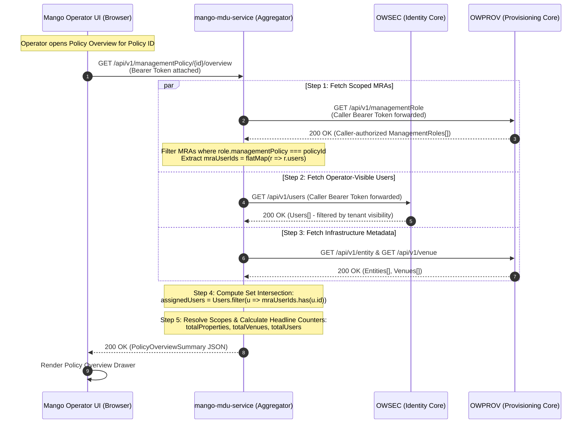

# Users & Access Technical Specification

**Document Status:** Normative Technical Specification  
**System Layer:** Mango Cloud Operator UI (Users & Access Feature Area)  
**Authoritative Downstream Services:** OpenWifi Security Service (`OWSEC`), OpenWifi Provisioning Service (`OWPROV` V1 & V2), Mango MDU Service (`mango-mdu-service`)  
**Implementation Scope:** Unified Two-Tab Delivery (Users Directory & Scoped Access + Standalone Policies Catalog, Resource Permissions Inspector & Root-Only Policy Creation)  
**Target Path:** `mango-operator-ui/docs/Users_and_Access_Technical_Specification.md`  
**Architecture Reference:** Pragmatic Hybrid Architecture (Direct Upstream OpenWifi V1/V2 CRUD + Targeted Policy Aggregation)

---

## 1. Purpose

This document provides the definitive, production-grade technical specification for the **Users & Access** module of the Mango Cloud Operator UI.

The Users & Access module delivers a unified administrative console organized into two primary tabs:
1. **Users Tab:** Complete platform identity lifecycle, authentication configurations, coarse system roles, avatar and audit notes management, and granular per-user **Scoped Access** assignments across multi-tenant Property and Venue infrastructure.
2. **Policies Tab:** Centralized operational **Management Policies** catalog, headline KPI usage metrics, deep Policy Overview inspection (usage summaries and assigned operator rosters), interactive Resource Permissions matrix visualizer, and a dedicated **Root-Only Policy Creation and Customization** workflow.

The Mango Operator UI operates on a **Pragmatic Hybrid Integration Architecture**:
1. **Direct Upstream OpenWifi Integration (Native CRUD & Session Discovery):**
   * Aligned with `ra-wlan-cloud-owprov-ui`, the UI performs session authentication and dynamic service endpoint discovery directly against **OpenWifi Security Service (`OWSEC`)** via `GET /api/v1/systemEndpoints`.
   * Standard administrative CRUD operations hit authoritative OpenWifi microservices directly using standard JWT Bearer token authentication (`Authorization: Bearer <token>`):
     - **`OWSEC` (Security):** User identity lifecycle, credentials, coarse platform roles, account suspension/reactivation/deletion, avatars, administrative notes, and MFA resets via `/api/v1`.
     - **`OWPROV` V1 Client (`axiosProv` / `/api/v1`):** Filtered Management Role listing (`GET /api/v1/managementRole?userId={userId}`), Management Policy catalog read and root CRUD operations (`GET/POST/PUT/DELETE /api/v1/managementPolicy`), Entity (Property) metadata, and Venue hierarchies.
     - **`OWPROV` V2 Client (`axiosProvV2` / `/api/v2`):** Dedicated Management Role Assignment (MRA) lifecycle CRUD operations (`POST /api/v2/managementRole/0`, `GET /api/v2/managementRole/{id}`, `PUT /api/v2/managementRole/{id}`, `DELETE /api/v2/managementRole/{id}`) matching the OpenWifi Provisioning Model V2 specification (`owprov-v2.yaml`).
2. **Clean Downstream Connection for Policy Usage & Aggregation:**
   * For the **Policy Overview** inspection and KPI summaries, the UI connects downstream via a simple, structured model:
     - In direct microservice mode, the UI computes usage statistics and set intersections in client memory from cached `OWPROV` MRAs and `OWSEC` users.
     - Alternatively, if a backend aggregator (`mango-mdu-service`) is deployed, the UI calls `GET /api/v1/managementPolicy/{id}/overview`, which executes upstream queries over internal service links, computes the set intersection, and delivers a consolidated overview payload in a single round trip.

---

## 2. Scope

This specification strictly governs:
- **Session & Endpoint Discovery:** Dynamic discovery of OpenWifi service base URLs via `OWSEC` `GET /api/v1/systemEndpoints` executed directly by the browser client at session initialization, dynamically deriving `axiosProvV2` base URL as `<owprov-uri>/api/v2`.
- **User Identity Management (Direct OWSEC):** Listing, filtering, searching, paginating, viewing, creating, updating, suspending, reactivating, and deleting platform users directly against `OWSEC`.
- **Headline KPI Metric Cards (Users Tab):** Rendering real-time aggregate cards: `Total Users`, `Active`, `Suspended`, and `MFA Enabled`.
- **User Security Operations (Direct OWSEC):** Resetting Multi-Factor Authentication (`resetMFA`), sending password reset emails (`forgotPassword`), and resending verification emails (`email_verification`) directly from the user context menu.
- **Self-Account Exclusion:** Filtering out the currently logged-in operator's own record from the administrative directory to prevent accidental self-tampering, delegating personal account configuration to the top-navigation Profile view.
- **Avatar Lifecycle Management (Direct OWSEC):** Binary retrieval with authorization headers, multipart upload, deletion, client-side memory caching, and initials fallback matching `owprov-ui`.
- **Administrative Notes (Direct OWSEC):** Timestamped internal audit notes history in the User Profile drawer with append popover capabilities.
- **User Creation Modal (Direct OWSEC):** Modal dialog capturing User Details (Name, Email, System Role with no preselected default and strictly excluding `subscriber`, Description, Note) and Authentication settings (Password with show/hide toggle and complexity helper, Force password change toggle, Email validation toggle).
- **Scoped Access Control (Direct OWPROV V2):** Split-view side panel under "Scoped Access" displaying 1:1 backend MRA cards under "Access Assignments", policy-only card editing, single-item MRA revocation, and inline expandable assignment forms with batch multi-venue scoping (`venueIds: []`) via `POST /api/v2/managementRole/0`.
- **Consistent V2 Response Enveloping:** Strict enforcement of the normalized `{ "roles": [...] }` envelope (`ManagementRoleList`) returned by `POST /api/v2/managementRole/0` across all scoping scenarios (single venue, multi-venue batch, or property-wide).
- **MRA Scope Immutability:** Strict enforcement that Property (`entity`), Venue (`venue`), and Assigned User (`users`) are immutable on existing MRAs; changing spatial scope requires revoking the old assignment (`DELETE /api/v2/managementRole/{id}`) and creating a new one (`POST /api/v2/managementRole/0`).
- **Policies Catalog Management (Direct OWPROV V1):** Dedicated Policies tab featuring headline KPI metric cards (`Total Policies`, `Built-in`, `Custom`, `Active Assignments`), searchable and filterable policies table (Policy Name, Type, Used By count, Modified timestamp).
- **Policy Detail Split Panel:** Responsive split-view panel displaying:
  - **Overview Sub-tab:** Usage summary mini-cards (Users, Scoped assignments, Properties, Venues), Policy details (Type, Preset, Status, Last modified, Created by, Description), built-in policy protection notice, and "Users with this policy" roster with direct infrastructure badges.
  - **Permissions Sub-tab:** Policy preset dropdown, interactive Resource Permissions matrix table (Property, Venue, Device, Configuration, Configuration Profile x Read, Create, Update, Delete), policy impact warning banner, and Cancel / Save policy actions.
- **Root-Only Policy Creation Workflow:** Top-action `+ Create policy` button restricted strictly to `root` platform role (`userRole === 'root'`), opening policy creation workflow to define custom policy names, descriptions, preset templates, and resource permission matrices, persisting directly via `POST /api/v1/managementPolicy/0`.
- **Orphan Prevention & Policy Deletion Protection:** UI presentation guards preventing deletion of built-in policies and in-use custom policies, reinforced by authoritative microservice enforcement in `OWPROV` (rejecting in-use deletion with `400 Bad Request` and `StillInUse`), guaranteeing that management roles never hold dangling/orphaned policy references.
- **Contracts, Mappings, Validation, and Verification:** Authoritative REST API contracts, TypeScript data mappings, validation rules, error handling, test scenarios, acceptance criteria, and architectural decisions.

---

## 3. Out of Scope

The following areas are explicitly outside the boundary of this document:
- **Other UI Modules:** Dashboard, Fleet Device Inventory, Device Telemetry, Live Gateway Deployment, Gateway Default Configurations, VariableBlock Configuration Profiles, Firmware Management, and Tenant Operator Creation workflows.
- **Authorization Enforcement Computation:** The Mango Operator UI does not compute permissions, evaluate hierarchy inheritance trees, or calculate policy precedence. All authorization decisions are strictly enforced by upstream microservices (`OWSEC` for user access; `OWPROV` for operational entity/venue access).
- **Proactive MRA Cleanup on User Deletion:** In accordance with downstream OpenWifi behavior, deleting a user in `OWSEC` does not initiate cascading MRA deletions in `OWPROV`.
- **Billing & Reseller Subscriptions:** Billing accounts, invoicing, payment gateways, and commercial reseller tiers.
- **Subscriber Self-Service:** Resident self-service captive portals, end-user Wi-Fi credentials, personal SSIDs, and PPSK/MPSK key generation.

---

## 4. Terminology

| Term | Definition |
| :--- | :--- |
| **User** | A human operator, administrative engineer, or support personnel registered in the identity store (`OWSEC`). Identified uniquely by a UUID and email address. |
| **Platform Role (`userRole`)** | A coarse platform classification stored in `OWSEC` (e.g., `root`, `admin`, `csr`, `noc`, `installer`). Governs top-level service visibility in `OWSEC` (e.g., only `root` and `admin` can list or create users). In the UI, it determines access to the Policy editor (strictly `root`). Displayed as "System Role" in the UI. |
| **Management Policy (`managementPolicy`)** | An authoritative operational permission ruleset stored in `OWPROV`. Defines allowed API actions (`CREATE`, `READ`, `MODIFY`, `DELETE`, `FULL`) across system resources (`property`, `venue`, `device`, `configuration`, `configuration profile`, `inventory`, `operator`, `subscriber`). Policies are global templates (`entity: ""`, `venue: ""`). |
| **Built-in Policy** | System baseline management policies auto-seeded into `OWPROV` on startup as standard presets (e.g., `Administrator`, `Network Operator`, `Installer`, `CSR`, `Read Only`). Built-in policies are protected from deletion in the UI and backend. |
| **Custom Policy** | Operational policies created and customized by operators with `root` platform role (`userRole === 'root'`). Can be deleted only if not actively assigned to any infrastructure scopes (`inUse === 0`). |
| **Resource Permissions Matrix** | An interactive grid mapping system resources (`Property`, `Venue`, `Device`, `Configuration`, `Configuration Profile`) against operational verbs (`Read`, `Create`, `Update`, `Delete`). |
| **Management Role Assignment (MRA)** | A scoped binding record stored in `OWPROV` (`managementRole`). Binds a single User (`users: [userId]`) to a Management Policy (`managementPolicy: policyId`) across an explicit administrative Scope (`entity` with optional `venue`). |
| **OWPROV V2 Management Role API** | The versioned REST interface (`/api/v2/managementRole/{id}`) dedicated to MRA lifecycle operations. Guarantees normalized `{ "roles": [...] }` response envelopes on creation, enforces scope immutability, validates assignable user privileges, and manages resource cleanup. |
| **Property (`entity`)** | A customer top-level organizational boundary modeled in `OWPROV` (`entity`). Serves as the root anchor for physical Venues, managed inventory, and entity-wide role assignments. |
| **Venue (`venue`)** | A physical subdivision within a Property (e.g., building, tower, floor, common area) modeled in `OWPROV` (`venue`). |
| **Assignment Scope** | The spatial boundary of an MRA. An assignment is either **Property-wide** (`entity` set, `venue` empty) or **Venue-specific** (`entity` set, `venue` set to a child venue ID). |
| **Multi-Venue Assignment** | The workflow where the UI submits an MRA payload containing `venueIds: [id1, id2, ...]`, triggering `OWPROV` V2 backend to generate individual venue-scoped MRAs in a single batch, returning `{ "roles": [...] }`. |
| **Downstream Aggregator (BFF)** | The optional backend service (`mango-mdu-service`) that provides composite endpoints for cross-service multi-system aggregation (e.g., Policy Overview) while standard CRUD routes hit OpenWifi services directly. |

---

## 5. High-Level Architecture & Downstream Connection

The Mango Operator UI implements a **Pragmatic Hybrid Integration Architecture** with a simple, direct connection to downstream services:

```
+-----------------------------------------------------------------------------------+
|                            Mango Operator UI (Browser)                            |
|                                                                                   |
|  1. Session & Endpoint Discovery: Directly against OWSEC GET /systemEndpoints     |
|                                                                                   |
|  2. Users Tab Operations:                                                         |
|     - User Directory & Lifecycle  -> Direct REST to OWSEC (axiosSec /api/v1)      |
|     - Avatars, Passwords & MFA    -> Direct REST to OWSEC (axiosSec /api/v1)      |
|     - Scoped Access (List MRAs)   -> Direct REST to OWPROV (axiosProv /api/v1)    |
|     - Scoped Access (MRA CRUD)    -> Direct REST to OWPROV (axiosProvV2 /api/v2)  |
|                                                                                   |
|  3. Policies Tab Operations:                                                      |
|     - Policy Catalog & Read       -> Direct REST to OWPROV (axiosProv /api/v1)    |
|     - Create Policy (Root Only)   -> Direct REST to OWPROV (axiosProv /api/v1)    |
|     - Edit/Delete Policy (Root)   -> Direct REST to OWPROV (axiosProv /api/v1)    |
|     - Policy Overview & Usage     -> Direct REST joins or mango-mdu-service BFF   |
+-----------------------------------------------------------------------------------+
        |                         |                         |                       |
        | Direct HTTPS            | Direct HTTPS            | Direct HTTPS          | Direct HTTPS
        | (Bearer JWT)            | (Bearer JWT)            | (Bearer JWT)          | (Bearer JWT)
        v                         v                         v                       v
+------------------+     +------------------+     +------------------+     +------------------+
|      OWSEC       |     |  OWPROV (V1 API) |     |  OWPROV (V2 API) |     | mango-mdu-service|
| (Identity Core)  |     | (Provision V1)   |     | (Provision V2)   |     |  (BFF Aggregator)|
|------------------|     |------------------|     |------------------|     |------------------|
| • Login / Auth   |     | • Role Listing   |     | • MRA Batch Create|    | • Policy Overview|
| • systemEndpoints|     |   (GET /api/v1)  |     |   (POST /api/v2) |     |   Aggregation    |
| • Users (CRUD)   |     | • Policy Catalog |     | • Single Role GET|     |   (Optional BFF  |
| • Avatars/Notes  |     |   (GET/POST/PUT) |     | • MRA Update/Del |     |    endpoint)     |
| • MFA / Resets   |     | • Entities/Venues|     |   (PUT/DELETE)   |     |                  |
+------------------+     +------------------+     +------------------+     +------------------+
```

### Architectural Guarantees & Simple Downstream Integration
1. **Dynamic Service Discovery:** The browser initializes by querying `OWSEC` `GET /api/v1/systemEndpoints` to acquire the active base URIs for `owsec` and `owprov`. The UI dynamically configures `axiosProv` with `<owprov-uri>/api/v1` and `axiosProvV2` with `<owprov-uri>/api/v2`.
2. **Direct CRUD Efficiency:** Standard administrative workflows (creating a user, assigning an MRA, creating a custom policy) execute directly against authoritative OpenWifi microservices using standard HTTP Bearer tokens.
3. **Dedicated V2 Scoped Access Contract:** Role assignment creation, modification, and single-item revocation use the dedicated `OWPROV` V2 API (`/api/v2/managementRole/{id}`) with normalized `{ "roles": [...] }` envelopes and strict scope immutability enforcement.
4. **Clean Policy Management:** The Policies catalog, presets, and root-only policy modifications connect directly to `OWPROV` V1 (`/api/v1/managementPolicy`).
5. **Flexible Usage Calculation (Direct vs. BFF):**
   - **Direct Microservice Calculation:** The UI can calculate Policy Overview KPIs (Total Users, Scoped Assignments, Properties, Venues, and the Assigned Users list) purely client-side from cached `managementRoles` (`OWPROV`) and `users` (`OWSEC`).
   - **BFF Aggregation:** Alternatively, if `mango-mdu-service` is enabled, the UI calls `GET /api/v1/managementPolicy/{id}/overview`, which handles upstream joins server-side and returns a single pre-calculated payload.
6. **Unified Authentication:** The browser attaches the single JWT Bearer token acquired from `OWSEC` login to all requests across `OWSEC`, `OWPROV`, and optional BFF endpoints.

---

## 6. Source of Truth / Data Ownership

| Data Domain | Authoritative Service | Storage Entity | UI Access Path | UI Client |
| :--- | :--- | :--- | :--- | :--- |
| **Service Endpoints** | `OWSEC` | Internal config | `GET /api/v1/systemEndpoints` | Direct `axiosSec` |
| **User Identity & Credentials** | `OWSEC` | `Users` table | `GET /api/v1/users`, `POST /api/v1/user/0`, `PUT/DELETE /api/v1/user/{id}` | Direct `axiosSec` |
| **System Role (`userRole`)** | `OWSEC` | `userRole` column | `user.userRole` | Direct `axiosSec` |
| **User Avatars** | `OWSEC` | User avatar binary | `GET /avatar/{id}`, `POST /avatar/{id}`, `DELETE /avatar/{id}` | Direct `axiosSec` |
| **User Administrative Notes** | `OWSEC` | `notes` array in User | `PUT /api/v1/user/{id}` | Direct `axiosSec` |
| **Management Policies (Catalog)** | `OWPROV` | `ManagementPolicies` table | `GET /api/v1/managementPolicy` | Direct `axiosProv` |
| **Policy Creation & Mutation (Root Only)** | `OWPROV` | `ManagementPolicies` table | `POST /api/v1/managementPolicy/0`, `PUT/DELETE /api/v1/managementPolicy/{id}` | Direct `axiosProv` |
| **Scoped Access Grants (List)** | `OWPROV` | `ManagementRoles` table | `GET /api/v1/managementRole?userId={userId}` | Direct `axiosProv` |
| **Scoped Access Grants (CRUD)** | `OWPROV` | `ManagementRoles` table | `POST /api/v2/managementRole/0`, `GET/PUT/DELETE /api/v2/managementRole/{id}` | Direct `axiosProvV2` |
| **Property & Venue Metadata** | `OWPROV` | `Entities`, `Venues` tables | `GET /api/v1/entity`, `/api/v1/venue` | Direct `axiosProv` |
| **Policy Overview & Usage Stats** | `OWPROV` + `OWSEC` | Computed join / Aggregated view | Client memory join or `GET /api/v1/managementPolicy/{id}/overview` | Direct `axiosProv`/`axiosSec` or `axiosMdu` |

---

## 7. Users Feature

The Users feature provides complete administration of operator, engineering, and support identities directly through `OWSEC`, paired with scoped infrastructure access through `OWPROV`.

### 7.1 Users View Layout & Visual Presentation

The Users tab presents a unified management console featuring top-level KPI metrics, a searchable operator directory, and a responsive split-view detail panel:

- **Conceptual Header Banner:**  
  Renders an explanatory architectural flow banner:  
  `[Shield] System Role: Determines platform-wide capabilities` $\longrightarrow$ `[Building] Scoped Access: Determines which properties and venues those capabilities apply to`
- **Headline KPI Metric Cards:**  
  Four real-time summary cards displayed directly above the directory table:
  1. **Total Users:** Total count of platform operators registered in `OWSEC` (e.g., `18`).
  2. **Active:** Count of enabled operators (`suspended: false`, e.g., `16`).
  3. **Suspended:** Count of locked operators (`suspended: true`, e.g., `2`).
  4. **MFA Enabled:** Count and ratio of operators with active multi-factor authentication (`user.mfa?.enabled === true`, e.g., `15 of 18`).
- **Top Action Bar:**  
  - Refresh Button (`↻`): Invalidates `['users']` and `['managementRoles']` to trigger an immediate background refetch.
  - Primary Action (`+ Create user`): Solid green button opening the Create User modal.

### 7.2 Users Directory Table

The left panel renders the master operator table populated directly via `useGetUsers` against `OWSEC`:

- **Self-Account Exclusion:** The table automatically filters out the currently authenticated operator's own account (`user.id !== currentSession.userId`). Operators cannot accidentally suspend, delete, or alter their own active account, delegating personal settings to the top-nav Profile view.
- **Search & Filter Controls:**
  - **Search Users:** Debounced input (300ms) matching `name`, `email`, and `description`.
  - **System Role Filter:** Dropdown filtering by operational role (`All Roles`, `Network Operator`, `Administrator`, `Installer`, `CSR`, `Read Only`).
  - **System Role Filter:** Dropdown filtering by backend system role (`All Roles`, `admin`, `noc`, `csr`, `installer`, `root`).
  - **Status Filter:** Dropdown filtering by account state (`All Status`, `Active`, `Suspended`).
- **Table Columns:**
  - `User`: Circular avatar badge (with fallback 2-letter uppercase initials, e.g., `AS`), Full Name (bold primary text), and Email Address (muted secondary text).
  - `System Role`: Standardized badge reflecting the operator's coarse platform capability (`Network Operator`, `Administrator`, `Installer`, `CSR`, `Read Only`).
  - `System Role`: Standardized badge reflecting the operator's platform capability (`admin`, `noc`, `csr`, `installer`, `root`).
  - `Scoped Access`: Human-readable summary badge indicating assigned physical boundaries (e.g., `"2 properties"`, `"3 venues"`, `"All properties"`), computed client-side from active MRAs.
  - `Status`: Pill badge (`Active` [Green] vs. `Suspended` [Orange]).
  - `Last Login`: Relative timestamp (e.g., `"12 min ago"`, `"1h ago"`) or formatted date (`"18 Aug 2026"`).
  - Selection Indicator: Chevron (`>`) indicating the active row loaded in the right detail panel.
- **Pagination:** Responsive pagination controls (e.g., `Showing 1-5 of 18`, `< 1 2 3 4 >`).

### 7.3 User Details Split Panel

Selecting any user row in the table opens the comprehensive **User Details Panel** on the right side of the screen:

- **Panel Header:**
  - User Initials Avatar circle, Full Name, Email Address, and Account Status badge (`Active`).
  - Context Actions Menu (`...`) offering:
    - *Reset MFA* (`PUT /api/v1/user/{id}?resetMFA=true`)
    - *Send Password Reset Email* (`PUT /api/v1/user/{id}?forgotPassword=true`)
    - *Resend Verification Email* (`PUT /api/v1/user/{id}?email_verification=true`)
    - *Suspend / Reactivate User* (`PUT /api/v1/user/{id}` with `{ "suspended": boolean }`)
    - *Delete User* (`DELETE /api/v1/user/{id}`)
- **Sub-Tab Navigation:**
  - **Tab 1: Profile** (Identity, credentials, and notes)
  - **Tab 2: Scoped Access** (Infrastructure property and venue assignments)

#### 7.3.1 Profile Sub-Tab
Provides identity editing and administrative controls:
- **Profile Information Form:**
  - `Email *`: User's primary email address (read-only or editable by root).
  - `Name *`: Full display name.
  - `System Role *`: Dropdown selector with helper caption: *"Controls platform capabilities."*
  - `Password`: Masked input field with `Show` toggle and helper: *"Leave unchanged to keep the current password. View password policy."*
  - `Description`: Multi-line textarea describing the user's operational responsibilities.
- **Action Buttons:** `Cancel` and `Save profile` (solid green button calling `PUT /api/v1/user/{id}` on `OWSEC`).

#### 7.3.2 Scoped Access Sub-Tab
Provides fine-grained physical infrastructure scoping for the selected operator:
- **System Role Anchor:** Displays the active platform role with helper: *"Controls platform capabilities."*
- **Access Assignments Section:**
  - Section Header: `"Access Assignments"` with a badge showing total active assignments (e.g., `(2)`).
  - **1:1 Assignment Cards List:**
    - Each active MRA is rendered as an individual card with a building icon, Property Name (bold), Venue Scope (`"All venues"` or specific venue name), assigned Policy Pill Badge (e.g., `Network Operator`, `Read Only`), Edit Icon (pencil), and Revoke Icon (trash bin).
  - **`+ Assign access` Dashed Button:** Expands an inline form to assign new properties or venues.
  - **Effective Access Callout Banner:**
    An informative summary callout explaining combined operational authority:  
    `[i] Effective access: Network operations for Sunrise Apartments; read-only access to Building A at Oakwood Housing.`
  - **Action Buttons:** `Cancel` and `Save access` (solid green button).

### 7.4 Create User Workflow (Modal Dialog)

Clicking `+ Create user` opens a focused modal dialog:

- **Modal Header:** Icon with user-plus, Title: `"Create user"`, Subtitle: `"Create an account and configure its initial authentication settings."`, and close button (`X`).
- **Section 1 — User Details:**
  - `Email *`: Required input, placeholder `"name@company.com"`. Validated for RFC 5322 syntax and checked for uniqueness in `OWSEC`.
  - `Name *`: Required input, placeholder `"Enter full name"`.
  - `System role *`: Required dropdown. **No default value is preselected.** Offers exclusively operational roles: `Network Operator`, `Administrator`, `Installer`, `CSR`, `Read Only` (plus `root` if created by root). `subscriber` is strictly excluded.
  - `System role *`: Required dropdown. **No default value is preselected.** Offers backend operational roles: `admin`, `noc`, `csr`, `installer` (plus `root` if creator is root). Note: `Read Only` is an `OWPROV` management policy, not an `OWSEC` user role.
  - `Description`: Optional input, placeholder `"Describe this user's responsibility"`.
  - `Note`: Optional textarea, placeholder `"Add an internal administrative note"`.
- **Section 2 — Authentication Settings:**
  - `Password *`: Password input with `Show`/`Hide` visibility toggle and helper: *"Minimum 12 characters with uppercase, lowercase, number, and symbol. View password policy."*
  - `Password *`: Password input with `Show`/`Hide` visibility toggle and helper: *"Minimum 8 characters with uppercase, lowercase, number, and symbol. View password policy."*
  - `Force password change`: Switch toggle with caption *"Require a new password at first sign-in."* (`changePassword: true`).
  - `Email validation`: Switch toggle with caption *"Require the user to verify their email address."* (`emailValidation: true`, appending `?email_verification=true`).
- **Modal Footer Actions:** `Cancel` (dismisses modal) and `Create user` (solid green button dispatching `POST /api/v1/user/0` to `OWSEC`).

### 7.5 Edit User & Lifecycle Operations

- **Metadata Updates:** Submits `PUT /api/v1/user/{id}` to `OWSEC` updating `name`, `description`, or `userRole`.
- **Account Suspension & Reactivation:** Triggers confirmation dialog before submitting `PUT /api/v1/user/{id}` with `{ "suspended": true }` or `{ "suspended": false }`.
- **User Deletion:** Triggers a high-friction confirmation dialog requiring email confirmation before executing `DELETE /api/v1/user/{id}` directly against `OWSEC`.
- **Administrative Notes:** Appends timestamped audit notes to `user.notes` array via `PUT /api/v1/user/{id}` with `{ "notes": [{ "note": noteText, "created": 0 }] }`.
- **Tenancy Boundary:** In accordance with `OWSEC` multi-tenant rules, `admin` operators only retrieve and manage identities belonging to their delegated tenant tree, while `root` operators have full global visibility.

---

## 8. Scoped Access (Management Role Assignments)

Scoped Access is the authoritative mechanism in OpenWifi that grants a user operational permissions over specific physical infrastructure. It is managed directly via `OWPROV`'s `managementRole` resource, utilizing the dedicated **OWPROV V2 Management Role API** (`/api/v2/managementRole/{id}`) for creation, retrieval, modification, and revocation, while filtered listing operations use the V1 endpoint (`GET /api/v1/managementRole?userId={userId}`).

### 8.1 Management Role Assignment (MRA) Model
An MRA binds:
$$	ext{MRA} = \langle 	ext{User ID}, 	ext{Property (Entity ID)}, 	ext{Venue ID (Optional)}, 	ext{Management Policy ID} 
angle$$
$$\text{MRA} = \langle \text{User ID}, \text{Property (Entity ID)}, \text{Venue ID (Optional)}, \text{Management Policy ID} \rangle$$

In `OWPROV` V2 (`owprov-v2.yaml`), `managementRole` records are modeled as:
```json
{
  "id": "uuid",
  "name": "Generated or custom role name",
  "description": "Optional description",
  "managementPolicy": "policy-uuid",
  "users": ["user-uuid-1"],
  "entity": "entity-uuid",
  "venue": "venue-uuid-or-empty",
  "inUse": [],
  "tags": [],
  "created": 1718000000,
  "modified": 1718000000
}
```
*(Constraint: `users` contains exactly one user UUID; `entity`, `venue`, and `users` are immutable; `inUse`, `created`, and `modified` are server-managed).*

### 8.2 Scope Levels
1. **Property-Wide Scope:**
   - `entity`: Valid Property UUID.
   - `venue`: `""` (empty string) or omitted.
   - Grants the policy over the entire Property and all existing and future child venues.
2. **Venue-Specific Scope:**
   - `entity`: Valid Property UUID.
   - `venue`: Valid Venue UUID.
   - Restricts policy permissions exclusively to the specified venue within the property.

### 8.3 Multi-Venue Batch Assignment (V2 API)
When scoping an operator across multiple venues within a property (or granting entity-wide scope), the UI submits `venueIds: string[]` in a single `POST` request directly to `OWPROV` V2 via `axiosProvV2`:
- **Target Endpoint:** `POST /api/v2/managementRole/0`
  - Using `/0` as the path ID delegates UUID generation to the backend, eliminating client-side UUID generation.
- **Request Body (`ManagementRoleCreateV2`):**
```json
{
  "name": "Sunrise Towers - Network Operator",
  "description": "Building-level technician access",
  "entity": "entity-uuid-1234",
  "venueIds": ["venue-uuid-001", "venue-uuid-002", "venue-uuid-003"],
  "managementPolicy": "policy-uuid-5678",
  "users": ["user-uuid-9999"]
}
```
- **Normalized Response Envelope (`ManagementRoleList`):**
  - Resolving earlier polymorphic response variations, the V2 endpoint **always returns a consistent `{ "roles": [...] }` envelope** regardless of venue count:
```json
{
  "roles": [
    {
      "id": "mra-uuid-1",
      "name": "Sunrise Towers - Network Operator",
      "description": "Building-level technician access",
      "managementPolicy": "policy-uuid-5678",
      "users": ["user-uuid-9999"],
      "entity": "entity-uuid-1234",
      "venue": "venue-uuid-001",
      "created": 1718000000,
      "modified": 1718000000
    },
    {
      "id": "mra-uuid-2",
      "name": "Sunrise Towers - Network Operator",
      "description": "Building-level technician access",
      "managementPolicy": "policy-uuid-5678",
      "users": ["user-uuid-9999"],
      "entity": "entity-uuid-1234",
      "venue": "venue-uuid-002",
      "created": 1718000000,
      "modified": 1718000000
    },
    {
      "id": "mra-uuid-3",
      "name": "Sunrise Towers - Network Operator",
      "description": "Building-level technician access",
      "managementPolicy": "policy-uuid-5678",
      "users": ["user-uuid-9999"],
      "entity": "entity-uuid-1234",
      "venue": "venue-uuid-003",
      "created": 1718000000,
      "modified": 1718000000
    }
  ]
}
```
- **Batch Processing & Atomicity:** The `OWPROV` V2 backend processes `venueIds`, manages existing and new role assignments, and rolls back newly created or updated records if any step in the batch fails.

### 8.4 Access Assignments Card Layout & UI Specification
The Scoped Access drawer provides a dedicated, card-based interface designed for hierarchy-scoped access management.

- **Header Section:** Displays the target User's Full Name, Email Address, and Platform Role.
- **Access Assignments Section:**
  - **Section Title:** `"Access Assignments"` with an adjacent count badge (e.g., `(2)`).
  - **1:1 Backend MRA Representation:** Each `managementRole` record returned by `OWPROV` is rendered directly as an individual card. Cards are not artificially merged or collapsed client-side, ensuring deterministic synchronization with backend endpoints.
  - **Assignment Cards:** Each active MRA is rendered as a clean, rounded, border-contained card:
    - **Building Icon:** Displayed on the left (`Building` icon) as the physical infrastructure anchor.
    - **Property / Entity Name:** Bold primary label (e.g., `"Sunrise Apartments"`), resolved client-side from `role.entity` via cached entities (`useGetEntities`).
    - **Venue Scope Subtitle:** Muted secondary label underneath the property name:
      - When `venue === ""` or empty: Displays `"All venues"` (Property-wide access).
      - When `venue` is a specific UUID: Displays the resolved Venue Name (e.g., `"Building A"`).
    - **Policy Pill Badge:** Pill-shaped badge displaying the assigned policy name (e.g., `"Network Operator"`, `"Read Only"`, `"CSR"`).
      - **Dynamic Policy Ingestion:** The UI dynamically resolves the policy name by matching `role.managementPolicy` against `useGetManagementPolicies()`. All policies returned by `OWPROV` are supported without client-side hardcoding.
    - **Edit Action (Pencil Icon):** Inline icon button allowing an operator to switch the assigned policy for this scope.
    - **Revoke Action (Trash Bin Icon):** Inline icon button to trigger single-item revocation.

- **Policy-Only Card Editing & Scope Coordinate Immutability:**
  - Clicking the pencil icon on an assignment card switches the card into an inline edit state.
  - **Locked Fields:** The Property (`entity`) and Venue (`venue`) fields are permanently locked/read-only because altering infrastructure boundaries represents a different scoping grant.
  - **Editable Field:** The Policy dropdown is editable, allowing the operator to select a new policy.
  - **Contextual Helper Hint:** The UI displays helper text: *"To change property or venue scope, revoke this assignment and create a new one."*
  - **V2 Mutation Payload:** Submitting sends only mutable properties via `PUT /api/v2/managementRole/{id}`:
    ```json
    {
      "name": "Sunrise Towers - Support Access",
      "description": "Updated tier 2 access",
      "managementPolicy": "new-policy-uuid"
    }
    ```
  - Scope fields (`entity`, `venue`, `users`) and server metadata (`id`, `inUse`, `created`, `modified`) are read-only and excluded. If submitted with altered scope coordinates, `OWPROV` rejects the request with `400 Bad Request`.
  - On success: Invalidates `['managementRoles']`, `['managementRoles', userId]`, and `['managementRole', roleId]`, shows a success toast, and updates the card badge.

### 8.5 MRA Attribute Mutability Matrix
To prevent frontend/backend interpretation differences, the mutability boundary for existing Management Role Assignments is formally specified:

| MRA Field | Mutable In-Place (`PUT /api/v2/managementRole/{id}`)? | Requires Revoke & Re-create (`DELETE` + `POST`)? | Enforcement & Technical Rationale |
| :--- | :---: | :---: | :--- |
| **`managementPolicy`** | **YES** | **No** | **Primary In-Place Mutable Field.** Represents privilege escalation, de-escalation, or tuning for the existing user on their established physical boundary. Backend validates policy exists and updates in-place. |
| **`name` / `description`** | **YES** | **No** | Non-authoritative administrative metadata; does not alter security or spatial boundaries. |
| **`notes` / `tags`** | **YES** | **No** | Administrative audit history and categorization; updated in-place via V2 PUT. |
| **`entity` (Property)** | **NO (IMMUTABLE)** | **YES** | **Physical Tenant Anchor.** An MRA's existence is anchored to an organizational Entity. Moving properties requires revoking old access and provisioning new access to preserve audit logs and multi-tenant partition boundaries. Backend rejects alteration with `400 Bad Request`. |
| **`venue` (Venue Scope)** | **NO (IMMUTABLE)** | **YES** | **Spatial Perimeter Anchor.** An assignment is either Property-wide (`venue: ""`) or pinned to a specific physical Venue (`venue: venueUuid`). Changing venue coordinates alters the spatial perimeter and backend uniqueness keys `(entity, venue, user)`. Backend rejects alteration with `400 Bad Request`. |
| **`users` (Assigned Operator)** | **NO (IMMUTABLE)** | **YES** | **Identity Anchor.** In the User Scoped Access view, the card belongs exclusively to that operator (`users: [userId]`). Scoped access cannot be transferred between operators in-place on the same MRA UUID. Backend rejects alteration with `400 Bad Request`. |

- **Single-Item Revocation (V2 API):**
  - Revocation is handled strictly on an individual card basis via the Trash Bin icon.
  - Clicking Trash displays a confirmation prompt: `"Revoke access for [User Name] on [Property Name - Venue Scope]?"`.
  - On confirmation, executes `DELETE /api/v2/managementRole/{roleId}` directly against `OWPROV` via `axiosProvV2`.
  - The backend removes the role, revokes associated infrastructure permissions, and invalidates active session cache entries.
  - On success: Invalidates `['managementRoles']`, `['managementRoles', userId]`, and `['managementRole', roleId]` and removes the card from the UI.

- **Inline Expandable Assignment Form (`+ Assign access`):**
  - Displayed directly beneath the assignment cards as a full-width button with a dashed border.
  - Clicking this button expands the **Inline Assignment Form**:
    - **`Entity *` (Dropdown, Required):** Populated via `useGetEntities()` (`GET /api/v1/entity`). Displays all available Properties.
    - **`Venues` (Dropdown, Optional):** Populated via `useGetVenues()` and filtered to show venues under the selected Entity. Leaving unselected creates a Property-wide scope (`"All venues"`, `venue: ""`). Selecting specific venues enables single or multi-venue batch assignment (`venueIds: []`).
    - **`Policy *` (Dropdown, Required):** Dynamically populated from `OWPROV` `GET /api/v1/managementPolicy`. Lists all available policies returned by the backend. Includes an info icon `(i)` with a tooltip describing the policy.
    - **Form Controls:**
      - **`Save` (Button, Solid Blue):** Validates required selections and submits `POST /api/v2/managementRole/0` directly to `OWPROV` V2 via `axiosProvV2`.
      - **`Cancel` (Button, Plain Text):** Resets form state and collapses the inline assignment view.

---

## 9. Policies Feature (Management Policies)

The Policies feature provides a centralized **Policy Definition Catalog, Resource Permissions Inspector, and Root-Only Policy Creation Console** directly integrated with `OWPROV`.

### 9.1 Policies View Layout & Visual Presentation

The Policies tab delivers a master-detail administrative interface structured identically to the Users console:

- **Conceptual Header Banner:**  
  Renders an explanatory architectural flow banner:  
  `[Shield] Policies define permitted actions: Assign policies to properties or venues through a user's scoped access. [Policy Icon] Policy` $\longrightarrow$ `[Building Icon] Scoped Access`
- **Headline KPI Metric Cards:**  
  Four real-time summary cards displayed directly above the policies table:
  1. **Total Policies:** Total count of all management policies in `OWPROV` (e.g., `8`).
  2. **Built-in:** Count of baseline auto-seeded system policies (e.g., `5`).
  3. **Custom:** Count of operator-created custom policies (e.g., `3`).
  4. **Active Assignments:** Total number of active Management Role Assignments across the entire system referencing any policy (e.g., `27`).
- **Top Action Bar:**  
  - Refresh Button (`↻`): Triggers immediate background refetch of `['managementPolicies']` and `['managementRoles']`.
  - Primary Action (`+ Create policy`): Solid green button opening the Policy Creation workflow. **Strictly rendered and enabled for operators with `userRole === 'root'`.** Non-root operators (`admin`, `csr`, `noc`, `installer`) have this action hidden or disabled.

### 9.2 Policies Catalog Table (Left Panel)

The left panel displays the master catalog of operational policies populated directly via `useGetManagementPolicies` against `OWPROV`:

- **Search & Filter Controls:**
  - **Search Policies:** Debounced text input matching `name` and `description`.
  - **Type Filter:** Dropdown filtering by policy classification (`All Types`, `Built-in`, `Custom`).
- **Table Columns:**
  - `Policy`: Icon representing policy type + Policy Name (bold primary text, e.g., `Administrator`, `Network Operator`, `Installer`, `CSR`, `Read Only`).
  - `Type`: Badge indicating classification (`Built-in` [Blue] vs. `Custom` [Orange]).
  - `Used By`: Badge showing total operators assigned to this policy (e.g., `"6 users"`, `"9 users"`), computed client-side or retrieved via aggregation.
  - `Modified`: Formatted modification date (e.g., `"1 Sep 2026"`, `"2 Sep 2026"`).
  - Selection Indicator: Chevron (`>`) highlighting the active policy loaded in the right detail panel.
- **Pagination:** Responsive pagination controls (e.g., `Showing 1-5 of 8`, `< 1 2 >`).

### 9.3 Policy Details Split Panel (Right Panel)

Selecting any policy row in the catalog displays the **Policy Details Panel** on the right side of the screen:

- **Panel Header:**
  - Policy Icon, Policy Name (e.g., `"Network Operator"`), Type Badge (`Built-in` or `Custom`), Subtitle Description (`"Monitor devices and manage network configuration."`), and Context Menu (`...`).
  - Context Menu (`...`):
    - For Built-in Policies: "Edit Permissions" (Root only). (Deletion is permanently disabled).
    - For Custom Policies: "Edit Policy" (Root only) and "Delete Policy" (Root only, enabled only when active assignments count is `0`).
- **Sub-Tab Navigation:**
  - **Tab 1: Overview** (Usage statistics, policy details, and assigned users roster)
  - **Tab 2: Permissions** (Resource permissions matrix visualizer and policy impact analysis)

#### 9.3.1 Overview Sub-Tab
Presents high-level operational metrics and the roster of platform operators governed by this policy:

1. **Usage Summary Cards (4 Mini-Cards):**
   - **Users:** Distinct count of platform operators assigned to this policy (e.g., `9`).
   - **Scoped assignments:** Total count of active MRAs referencing this policy (e.g., `14`).
   - **Properties:** Distinct count of customer organizational entities bound to this policy (e.g., `6`).
   - **Venues:** Distinct count of specific physical venues bound to this policy (e.g., `8`).
2. **Policy Details Section:**
   - `Type`: `Built-in` or `Custom`.
   - `Preset`: Policy template designation (e.g., `Network Operator`).
   - `Status`: `Active` (green pill badge).
   - `Last modified`: Formatted date (e.g., `2 Sep 2026`).
   - `Created by`: `System` for auto-seeded presets, or creator email for custom policies.
   - `Description`: Full textual explanation of operational capabilities.
   - **Built-in Protection Callout:** For built-in policies, renders an informational lock notice:  
     `[Lock] Built-in policies cannot be deleted.`
3. **Users with this Policy Section:**
   - Header with count badge: `"Users with this policy (9)"`.
   - Responsive user list displaying:
     - User circular avatar (with initials, e.g., `AS`, `DO`, `MJ`).
     - Operator Full Name (e.g., `Anita Sharma`, `David Okafor`, `Meera Joshi`).
     - Property Name (e.g., `Sunrise Apartments`, `Oakwood Housing`, `Lakeview Residences`).
     - Venue Scope Badge (e.g., `All venues`, `Building A`, `2 venues`).
   - Footer Link: `"View all 9 users"` (expands list or navigates to filtered Users directory).

#### 9.3.2 Permissions Sub-Tab
Provides an interactive visual inspection and editing matrix for operational capabilities:

1. **Policy Preset Selector:**
   - Dropdown showing the active preset template (`Network Operator`).
   - Helper text: *"Built-in presets are protected from deletion."*
2. **Resource Permissions Table:**
   - Renders a clean, 2-dimensional grid mapping system resources against operational verbs:
     | Resource | Read | Create | Update | Delete |
     | :--- | :---: | :---: | :---: | :---: |
     | **Property** | ✓ | — | — | — |
     | **Venue** | ✓ | — | — | — |
     | **Device** | ✓ | — | ✓ | — |
     | **Configuration** | ✓ | ✓ | ✓ | — |
     | **Configuration Profile** | ✓ | ✓ | ✓ | — |
   - Checkmark (`✓`) indicates granted permission; dash (`—`) indicates omitted permission.
   - Renders an interactive, 2-dimensional grid mapping system resources against operational verbs (normatively serialized per [§14.4](#144-permission-matrix-mapping--serialization-rules)):
     | Resource (UI Display) | Backend Resource Identifier | Read (`READ`) | Create (`CREATE`) | Update (`MODIFY`) | Delete (`DELETE`) |
     | :--- | :--- | :---: | :---: | :---: | :---: |
     | **Property** | `entity` | ✓ | — | — | — |
     | **Venue** | `venue` | ✓ | — | — | — |
     | **Device** | `inventory` | ✓ | — | ✓ | — |
     | **Configuration** | `configuration` | ✓ | ✓ | ✓ | — |
     | **Configuration Profile** | `configuration` | ✓ | ✓ | ✓ | — |
     | **Operator** | `operator` | — | — | — | — |
     | **Subscriber** | `subscriber` | — | — | — | — |
   - Checkmark (`✓`) indicates granted permission; dash (`—`) indicates omitted permission (`NOACCESS`).
   - **Serialization Note:** The UI column **Update** is serialized strictly as **`MODIFY`** in the backend `access: string[]` array (never as `"Update"` or `"UPDATE"`). The UI resource **Device** is serialized strictly as **`inventory`**.
3. **Policy Impact Alert Banner:**
   - Informative blue callout box computing the real-time blast radius of changes:  
     `[i] Policy impact: 9 users across 14 scoped assignments will be affected by permission changes.`
4. **Action Controls:**
   - `Cancel`: Discards any uncommitted permission edits.
   - `Save policy`: Solid green action button. Enabled strictly for operators with `root` platform role (`userRole === 'root'`). Submits updated permission entries via `PUT /api/v1/managementPolicy/{id}` directly on `OWPROV`. For non-root operators, this button is hidden or disabled.

### 9.4 Create Policy Workflow (Root-Only Console)

Clicking `+ Create policy` opens the dedicated policy creation workflow (modal or drawer):

- **Access Guard:** Strictly restricted to `root` platform role (`userRole === 'root'`). For non-root users (`admin`, `csr`, `noc`, `installer`), the button is hidden from the UI. Direct API requests from non-root tokens are rejected by `OWPROV` with `403 Forbidden`.
- **Form Configuration:**
  - `Policy Name *`: String (1–64 characters, required, unique across `OWPROV`).
  - `Description`: String (optional, explaining the operational tier or target technicians).
  - `Policy Preset Base`: Optional dropdown allowing the root operator to clone permissions from an existing preset (`Network Operator`, `Administrator`, `Installer`, `CSR`, `Read Only`) or start with a blank matrix.
  - `Resource Permissions Grid`: Interactive, checkable matrix allowing the operator to toggle `Read`, `Create`, `Update`, `Delete` across system resources (`Property`, `Venue`, `Device`, `Configuration`, `Configuration Profile`, `Inventory`, `Subscriber`).
  - `Resource Permissions Grid`: Interactive, checkable matrix allowing the operator to toggle `Read`, `Create`, `Update`, `Delete` across system resources (`Property` $\to$ `entity`, `Venue` $\to$ `venue`, `Device` $\to$ `inventory`, `Configuration` $\to$ `configuration`, `Operator` $\to$ `operator`, `Subscriber` $\to$ `subscriber`, `Contact` $\to$ `contact`, `Location` $\to$ `location`). Serialization strictly adheres to [§14.4](#144-permission-matrix-mapping--serialization-rules) (e.g., `Update` maps to `MODIFY`).
  - `entity` and `venue`: Enforced automatically as empty strings `""` by the UI client to maintain global template architecture.
- **Submission:**
  - Dispatches `POST /api/v1/managementPolicy/0` directly to `OWPROV` via `axiosProv`.
  - On success: Invalidates `['managementPolicies']`, triggers a success toast notification, and automatically selects the newly created custom policy in the catalog.

### 9.5 Built-in vs. Custom Policies & Deletion Protection

To guarantee operational stability and prevent orphaned references:

1. **Built-in System Policies:**
   - Baseline policies auto-seeded by `OWPROV` on service up (`service up`).
   - Hardened with a permanent deletion guard: The UI displays `[Lock] Built-in policies cannot be deleted`, and context menu deletion actions are suppressed.
   - Root operators retain full authority to customize their resource permissions via `PUT /api/v1/managementPolicy/{id}`.
2. **Custom Operator Policies:**
   - Created by root operators for specialized roles (e.g., "Tier 2 Wi-Fi Troubleshooter").
   - Can be modified by root operators at any time.
3. **In-Use Deletion Protection (Zero Orphan Guarantee):**
   - **Client-Side Guard:** A custom policy can only be deleted if its active assignments count is `0`. If any active MRAs exist (`managementRoles.filter(r => r.managementPolicy === policy.id).length > 0`), the delete button is disabled with tooltip: `"Cannot delete policy: Currently assigned to one or more active management roles."`
   - **Authoritative Backend Enforcement:** If client-side validation is bypassed, `OWPROV` independently and authoritatively verifies policy usage upon receiving `DELETE /api/v1/managementPolicy/{id}`. If any active Management Role references the policy, the operation is immediately rejected with `400 Bad Request` (`StillInUse`). This guarantees that Management Role Assignments can never hold dangling or orphaned policy references.
   - **Execution:** For unassigned custom policies, the UI calls `DELETE /api/v1/managementPolicy/{id}` directly against `OWPROV`. On success: invalidates `['managementPolicies']` and removes the policy from the catalog.

---

## 10. Data Orchestration, Caching & Aggregation Architecture

The Mango Operator UI operates on a **Pragmatic Hybrid Integration Architecture** combining direct browser-to-microservice CRUD with targeted backend aggregation:

1. **Direct Microservice Operations (`OWSEC` & `OWPROV`):**
   - **Endpoint Discovery:** At session initialization, the browser directly queries `OWSEC` `GET /api/v1/systemEndpoints` to discover dynamic microservice base URIs (matching `ra-wlan-cloud-owprov-ui`).
   - **Native CRUD:** User identity lifecycle (`OWSEC`), avatar uploads/retrieval (`OWSEC`), administrative notes (`OWSEC`), user security actions (`OWSEC`), management role assignments (`OWPROV`), and policy definitions (`OWPROV`) are called directly by the browser with standard Bearer JWT authentication.
   - **Client Cache Management:** TanStack Query (React Query) manages in-memory caching, stale-time invalidation, and optimistic state updates for all direct microservice queries.

2. **Targeted Backend Aggregation (`mango-mdu-service`):**
   - **Policy Overview Aggregation:** Rather than forcing the browser to issue multiple parallel HTTP queries across ports and perform heavy joins client-side, the UI calls `mango-mdu-service` (`GET /api/v1/managementPolicy/{id}/overview`).
   - The MDU service executes upstream requests over internal service connections, performs the authoritative **Set Intersection** between MRA assignees and operator-visible users from `OWSEC`, resolves infrastructure scopes, and returns a single unified payload.

```
+-----------------------------------------------------------------------------------+
|                        TanStack React Query Cache Layer                           |
|                                                                                   |
|  ['systemEndpoints']                 -> Base service URIs from OWSEC              |
|  ['users']                           -> Direct user directory from OWSEC          |
|  ['managementRoles', userId]         -> Direct user MRAs from OWPROV              |
|  ['managementRole', roleId]          -> Direct single MRA from OWPROV V2          |
|  ['managementPolicies']              -> Direct global policies from OWPROV        |
|  ['entities']                        -> Direct property metadata from OWPROV      |
|  ['venues']                          -> Direct venue hierarchy from OWPROV        |
|  ['policyOverview', policyId]        -> Aggregated overview from mango-mdu-service|
+-----------------------------------------------------------------------------------+
```

### 10.1 User Directory & Avatar Query Flow (Direct OWSEC)
1. **Fetch Users:** Call `axiosSec.get('users?offset=0&limit=500&withExtendedInfo=true')`.
2. **Self-Account Exclusion:** Automatically filter out the authenticated operator (`user.id !== currentSession.userId`).
3. **Fetch Avatars:** For each user with an avatar ID, asynchronously request arraybuffer image data via `GET /avatar/{userId}?cache={timestamp}` and cache as base64 data URIs.
4. **MRA Count Enrichment:** In the main users table, MRA counts can be lazy-loaded on row expansion or prefetched for visible rows using `useGetManagementRoles(user.id)` from `OWPROV`.

### 10.2 Scoped Access Client Resolution Flow (Direct OWPROV)
When the Scoped Access drawer opens for a user:
1. UI executes `useGetManagementRoles(userId)` -> direct call to `OWPROV` `GET /api/v1/managementRole?userId={id}`.
2. UI reads `['entities']` from cache (or triggers `useGetEntities()`) to map `role.entity` -> `Entity.name`.
3. UI reads `['venues']` from cache (or triggers `useGetVenues()`) to map `role.venue` -> `Venue.name`.
4. UI reads `['managementPolicies']` from cache (or triggers `useGetManagementPolicies()`) to map `role.managementPolicy` -> `ManagementPolicy.name`.
5. The table renders fully resolved, human-readable records directly using cached metadata.

### 10.3 Policy Overview Aggregation via `mango-mdu-service` (Server-Side Intersection)
Instead of forcing the browser to orchestrate multiple HTTP queries across ports and services, the Policy Overview is executed by `mango-mdu-service` on the backend.

#### Multi-Service Orchestration Flow


#### Step-by-Step Server-Side Pipeline:
1. **Step 1 — Scoped Role Filtering (`OWPROV`):**
   - Fetches MRAs visible and authorized for the caller from `OWPROV` (forwarding caller's Bearer token) and filters assignments matching `policyId`:
     $$	ext{filteredMRAs} = \{ r \in 	ext{Caller-Authorized ManagementRoles} \mid r.	ext{managementPolicy} = 	ext{policyId} \}$$
     $$\text{filteredMRAs} = \{ r \in \text{Caller-Authorized ManagementRoles} \mid r.\text{managementPolicy} = \text{policyId} \}$$
   - Collects distinct user UUIDs assigned to this policy:
     $$	ext{mraUserIds} = 	ext{Set}\left( igcup_{r \in 	ext{filteredMRAs}} r.	ext{users} 
ight)$$
     $$\text{mraUserIds} = \text{Set}\left( \bigcup_{r \in \text{filteredMRAs}} r.\text{users} \right)$$
2. **Step 2 — Operator-Visible Users Query (`OWSEC`):**
   - Calls `OWSEC` `GET /api/v1/users` forwarding the calling operator's JWT Bearer token.
   - `OWSEC` authoritatively applies its tenant visibility filter, returning strictly the subset of users that the calling operator is permitted to see.
3. **Step 3 — Mathematical Set Intersection (True Policy Users):**
   - Computes the strict set intersection:
     $$	ext{Assigned Policy Users} = \{ u \in 	ext{OWSEC Visible Users} \mid u.	ext{id} \in 	ext{mraUserIds} \}$$
     $$\text{Assigned Policy Users} = \{ u \in \text{OWSEC Visible Users} \mid u.\text{id} \in \text{mraUserIds} \}$$
   - **Guarantees:**
     - Only authentic assignees holding active MRAs for this policy are included.
     - Synthetic platform-role mappings are completely eliminated.
     - Calling operators never see users from other tenants or administrators outside their authorization hierarchy.
4. **Step 4 — Infrastructure Scope Resolution & Headline Counters:**
   - Aggregates unique Property UUIDs (`entity`) and Venue UUIDs (`venue`) from `filteredMRAs`.
   - Resolves display names via `OWPROV` entity and venue tables.
   - Computes headline summary metrics:
     $$	ext{totalProperties} = |	ext{distinctEntityIds}|, \quad 	ext{totalVenues} = |	ext{distinctVenueIds}|, \quad 	ext{totalUsers} = |	ext{Assigned Policy Users}|$$
     $$\text{totalProperties} = |\text{distinctEntityIds}|, \quad \text{totalVenues} = |\text{distinctVenueIds}|, \quad \text{totalUsers} = |\text{Assigned Policy Users}|$$
5. **Step 5 — Response Delivery & Client Caching:**
   - Returns the consolidated [`PolicyOverviewSummary`](#13-data-mapping--type-definitions) response.
   - The UI caches this result under `['policyOverview', policyId]` with a 5-minute stale time.

### 10.4 Policy In-Use Determination Flow
To determine whether a policy is active (to gate root deletion and display the `In Use` status badge):
1. The UI evaluates `filteredMRAs.length > 0` directly from cached management roles (`['managementRoles']`).
2. This calculation is evaluated client-side from cached state. Policies marked `isPolicyInUse === true` have their delete button disabled with a tooltip: `"Cannot delete policy: Currently assigned to infrastructure scopes."`

### 10.5 Cache Invalidation Strategy
| Mutation Action | Target Service & Endpoint | Invalidated React Query Keys |
| :--- | :--- | :--- |
| **Create User** | `POST OWSEC /api/v1/user/0` | `['users']` |
| **Update User Profile** | `PUT OWSEC /api/v1/user/{id}` | `['users']`, `['users', id]` |
| **Suspend / Reactivate User** | `PUT OWSEC /api/v1/user/{id}` | `['users']`, `['users', id]` |
| **Delete User** | `DELETE OWSEC /api/v1/user/{id}` | `['users']` |
| **Assign Scoped Access** | `POST OWPROV /api/v2/managementRole/0` | `['managementRoles']`, `['managementRoles', userId]`, `['managementRole', roleId]`, `['policyOverview']` |
| **Update Scoped Access Policy** | `PUT OWPROV /api/v2/managementRole/{id}` | `['managementRoles']`, `['managementRoles', userId]`, `['managementRole', roleId]`, `['policyOverview']` |
| **Revoke Scoped Access** | `DELETE OWPROV /api/v2/managementRole/{id}` | `['managementRoles']`, `['managementRoles', userId]`, `['managementRole', roleId]`, `['policyOverview']` |
| **Create Policy (Root)** | `POST OWPROV /api/v1/managementPolicy/0` | `['managementPolicies']` |
| **Update Policy (Root)** | `PUT OWPROV /api/v1/managementPolicy/{id}` | `['managementPolicies']`, `['policyOverview', policyId]` |
| **Delete Policy (Root)** | `DELETE OWPROV /api/v1/managementPolicy/{id}` | `['managementPolicies']` |

---

## 11. Downstream Service Dependencies & Connection Guide

To ensure transparent integration without exposing internal microservice mechanics, this section outlines exactly how the Mango Operator UI connects to downstream OpenWifi services.

### 11.1 The Downstream Connection Model

```
[ Operator Browser Client ]
           │
           ├── (1) Initial Session Discovery ──────────────► OWSEC (GET /api/v1/systemEndpoints)
           │
           ├── (2) Users Tab Operations:
           │        ├── Identity & Credentials ────────────► OWSEC (GET/POST/PUT/DELETE /api/v1/user*)
           │        ├── Avatars (Auth Stream) ─────────────► OWSEC (GET/POST/DELETE /avatar/*)
           │        └── Scoped Access (MRAs) ──────────────► OWPROV (V1 List / V2 CRUD /api/v2/managementRole*)
           │
           └── (3) Policies Tab Operations:
                    ├── Policy Catalog & Presets ──────────► OWPROV (GET /api/v1/managementPolicy)
                    ├── Policy Creation & Edits (Root) ────► OWPROV (POST/PUT/DELETE /api/v1/managementPolicy/*)
                    └── Usage & Scope Overview ────────────► Direct Client Join or mango-mdu-service BFF
```

### 11.2 Master Downstream API Interaction Matrix

| Tab / View | Feature Action | Downstream Service | HTTP Method & Path | Primary Request Input | Expected Success Response | HTTP Status |
| :--- | :--- | :--- | :--- | :--- | :--- | :---: |
| **Session** | Discover Service Base URLs | `OWSEC` | `GET /api/v1/systemEndpoints` | None (`Authorization: Bearer <token>`) | `{ "endpoints": [...] }` | `200 OK` |
| **Users** | Render User Directory Table | `OWSEC` | `GET /api/v1/users?offset=0&limit=500` | None | `{ "users": [ User, ... ] }` | `200 OK` |
| **Users** | Create User Modal Submit | `OWSEC` | `POST /api/v1/user/0` | `{ name, email, userRole, currentPassword, ... }` | Created `User` JSON | `200 OK` |
| **Users** | Save Profile Edits | `OWSEC` | `PUT /api/v1/user/{id}` | `{ name, description, userRole }` | Updated `User` JSON | `200 OK` |
| **Users** | Suspend / Reactivate User | `OWSEC` | `PUT /api/v1/user/{id}` | `{ "suspended": true / false }` | Updated `User` JSON | `200 OK` |
| **Users** | Delete User Confirmation | `OWSEC` | `DELETE /api/v1/user/{id}` | None | `{}` | `200 OK` |
| **Users** | Reset MFA Action | `OWSEC` | `PUT /api/v1/user/{id}?resetMFA=true` | None | Updated `User` JSON | `200 OK` |
| **Users** | Send Password Reset Email | `OWSEC` | `PUT /api/v1/user/{id}?forgotPassword=true` | None | Updated `User` JSON | `200 OK` |
| **Users** | Resend Email Verification | `OWSEC` | `PUT /api/v1/user/{id}?email_verification=true` | None | Updated `User` JSON | `200 OK` |
| **Users** | Fetch User Avatar Stream | `OWSEC` | `GET /avatar/{id}?cache={ts}` | None (`responseType: 'arraybuffer'`) | Binary JPEG/PNG byte stream | `200 OK` |
| **Scoped Access** | List User Scopes | `OWPROV` (V1) | `GET /api/v1/managementRole?userId={id}` | None | `{ "roles": [ ManagementRole, ... ] }` | `200 OK` |
| **Scoped Access** | Get Single Management Role | `OWPROV` (V2) | `GET /api/v2/managementRole/{id}` | None | `ManagementRole` JSON | `200 OK` |
| **Scoped Access** | Inspect Role In-Use References | `OWPROV` (V2) | `GET /api/v2/managementRole/{id}?expandInUse=true` | None | `{ "entries": { ... } }` (`ExpandedUseEntryMapList`) | `200 OK` |
| **Scoped Access** | Fetch Properties (Entities) | `OWPROV` (V1) | `GET /api/v1/entity` | None | `{ "entities": [ Entity, ... ] }` | `200 OK` |
| **Scoped Access** | Fetch Venues Hierarchy | `OWPROV` (V1) | `GET /api/v1/venue` | None | `{ "venues": [ Venue, ... ] }` | `200 OK` |
| **Scoped Access** | Assign Access (Batch / Single) | `OWPROV` (V2) | `POST /api/v2/managementRole/0` | `{ entity, venueIds, managementPolicy, users }` | `{ "roles": [ ManagementRole, ... ] }` | `200 OK` |
| **Scoped Access** | Edit Scope Policy In-Place | `OWPROV` (V2) | `PUT /api/v2/managementRole/{id}` | `{ managementPolicy, name, description }` | Updated `ManagementRole` JSON | `200 OK` |
| **Scoped Access** | Revoke Scope Assignment | `OWPROV` (V2) | `DELETE /api/v2/managementRole/{id}` | None | `{}` | `200 OK` |
| **Policies** | List Operational Policies | `OWPROV` (V1) | `GET /api/v1/managementPolicy` | None | `{ "managementPolicies": [...] }` | `200 OK` |
| **Policies** | Create Custom Policy (Root) | `OWPROV` (V1) | `POST /api/v1/managementPolicy/0` | `{ name, description, entity: "", venue: "", entries }` | Created `ManagementPolicy` JSON | `200 OK` |
| **Policies** | Update Policy Matrix (Root) | `OWPROV` (V1) | `PUT /api/v1/managementPolicy/{id}` | `{ name, description, entries }` | Updated `ManagementPolicy` JSON | `200 OK` |
| **Policies** | Delete Policy (Root Only) | `OWPROV` (V1) | `DELETE /api/v1/managementPolicy/{id}` | None | `{}` (or `400 Bad Request` if in use) | `200 OK` |
| **Policies** | Policy Overview (BFF Option) | `mango-mdu-service` | `GET /api/v1/managementPolicy/{id}/overview` | None (`Authorization: Bearer <token>`) | `{ policy, totalProperties, totalVenues, ... }` | `200 OK` |

### 11.3 Downstream Service Boundary Summary
1. **OWSEC Core Responsibilities:**
   - Identity lifecycle, credential authentication, platform roles, avatar images, and administrative notes.
   - Authoritative for user tenant isolation and permission boundaries.
2. **OWPROV Core Responsibilities:**
   - Physical infrastructure hierarchy (`Entity` and `Venue`).
   - Management Role Assignments (MRAs): creation, policy modification, and revocation via V2 API.
   - Management Policies: operational catalog, auto-seeded baseline presets, root creation/editing, and deletion protection (`StillInUse`).
3. **mango-mdu-service (Optional Aggregation BFF):**
   - Provides composite aggregation endpoints (e.g., `GET /api/v1/managementPolicy/{id}/overview`) for pre-computing cross-service joins server-side if direct client-side joins are not preferred.

---

## 12. API Contracts

### 12.1 System Endpoints Discovery (Direct OWSEC)
`GET /api/v1/systemEndpoints`
- **Headers:** `Authorization: Bearer <token>`
- **Response `200 OK`:**
  ```json
  {
    "endpoints": [
      {
        "id": 1,
        "type": "owsec",
        "uri": "https://sec.openwifi.example.com:16001",
        "authenticationType": "sec"
      },
      {
        "id": 2,
        "type": "owprov",
        "uri": "https://prov.openwifi.example.com:16004",
        "authenticationType": "sec"
      }
    ]
  }
  ```

### 12.2 OWSEC User APIs (Direct OWSEC)

#### 12.2.1 Get Users
`GET /api/v1/users?offset={offset}&limit={limit}&withExtendedInfo=true`
- **Response `200 OK`:**
  ```json
  {
    "users": [
      {
        "id": "user-uuid-1",
        "name": "Alex Smith",
        "email": "alex.smith@example.com",
        "description": "Lead Tier 3 Support Engineer",
        "userRole": "admin",
        "suspended": false,
        "avatar": "avatar-uuid-1",
        "notes": [
          {
            "note": "Onboarded for West Coast property deployment",
            "created": 1718000000
          }
        ],
        "created": 1710000000,
        "modified": 1715000000
      }
    ]
  }
  ```

#### 12.2.2 Create User
`POST /api/v1/user/0` (or `POST /api/v1/user/0?email_verification=true`)
- **Request Body:**
  ```json
  {
    "name": "Jane Doe",
    "email": "jane.doe@example.com",
    "description": "Field Installer Technician",
    "userRole": "installer",
    "currentPassword": "InitialPassword123!",
    "emailValidation": false,
    "changePassword": true
  }
  ```
- **Response `200 OK`:** Returns created `User` object.

#### 12.2.3 Update User
`PUT /api/v1/user/{id}`
- **Request Body:**
  ```json
  {
    "name": "Jane Doe Updated",
    "description": "Senior Field Technician"
  }
  ```
- **Response `200 OK`:** Returns updated `User` object.

#### 12.2.4 Suspend / Reactivate User
`PUT /api/v1/user/{id}`
- **Request Body:** `{ "suspended": true }` (or `false`)
- **Response `200 OK`:** Returns updated `User` object.

#### 12.2.5 Delete User
`DELETE /api/v1/user/{id}`
- **Response `200 OK`:** `{}`

#### 12.2.6 Administrative Security Actions
- **Reset MFA:** `PUT /api/v1/user/{id}?resetMFA=true`
- **Send Password Reset Email:** `PUT /api/v1/user/{id}?forgotPassword=true`
- **Resend Verification Email:** `PUT /api/v1/user/{id}?email_verification=true`

#### 12.2.7 Append Administrative Note
`PUT /api/v1/user/{id}`
- **Request Body:**
  ```json
  {
    "notes": [
      {
        "note": "Completed site certification for Building A",
        "created": 0
      }
    ]
  }
  ```
- **Response `200 OK`:** Returns updated user with note persisted and timestamped.

#### 12.2.8 Avatar APIs
- **Get Avatar:** `GET /avatar/{id}?cache={cacheKey}`
  - **Headers:** `Accept: image/*`
  - **Response `200 OK`:** Binary image data (rendered as Data URI).
- **Upload Avatar:** `POST /avatar/{id}`
  - **Headers:** `Content-Type: multipart/form-data`
  - **Payload:** `file: <binary image>`
  - **Response `200 OK`:** `{}`
- **Delete Avatar:** `DELETE /avatar/{id}`
  - **Response `200 OK`:** `{}`

### 12.3 OWPROV Management Role APIs (Direct OWPROV V1 & V2)

#### 12.3.1 Get Management Roles (V1 Listing API)
`GET /api/v1/managementRole` or `GET /api/v1/managementRole?userId={userId}`
- **Headers:** `Authorization: Bearer <token>`
- **Response `200 OK`:**
  ```json
  {
    "roles": [
      {
        "id": "mra-uuid-1",
        "name": "Alex Smith - Sunrise Apartments",
        "description": "Property-wide operator access",
        "managementPolicy": "policy-uuid-1",
        "users": ["user-uuid-1"],
        "entity": "entity-uuid-1",
        "venue": "",
        "created": 1718000000,
        "modified": 1718000000
      }
    ]
  }
  ```

#### 12.3.2 Create Scoped Access (Direct OWPROV V2 - Batch & Single-Venue Support)
`POST /api/v2/managementRole/0`
- **Headers:** `Authorization: Bearer <token>`
- **Path Parameter:** `0` (indicates new record creation; backend assigns server-side UUIDs).
- **Request Body (`ManagementRoleCreateV2`):**
  ```json
  {
    "name": "Alex Smith - Sunrise Apartments",
    "description": "Technician assignment for Building A & B",
    "entity": "entity-uuid-1",
    "venueIds": ["venue-uuid-1", "venue-uuid-2"],
    "managementPolicy": "policy-uuid-1",
    "users": ["user-uuid-1"]
  }
  ```
  *(Note: For property-wide assignment, `venueIds` is omitted or passed as empty array `[]`).*
- **Response `200 OK` (`ManagementRoleList`):**
  The V2 endpoint **always returns a normalized envelope** containing the list of created roles:
  ```json
  {
    "roles": [
      {
        "id": "mra-uuid-1",
        "name": "Alex Smith - Sunrise Apartments",
        "description": "Technician assignment for Building A & B",
        "managementPolicy": "policy-uuid-1",
        "users": ["user-uuid-1"],
        "entity": "entity-uuid-1",
        "venue": "venue-uuid-1",
        "created": 1718000000,
        "modified": 1718000000
      },
      {
        "id": "mra-uuid-2",
        "name": "Alex Smith - Sunrise Apartments",
        "description": "Technician assignment for Building A & B",
        "managementPolicy": "policy-uuid-1",
        "users": ["user-uuid-1"],
        "entity": "entity-uuid-1",
        "venue": "venue-uuid-2",
        "created": 1718000000,
        "modified": 1718000000
      }
    ]
  }
  ```
- **Response `400 Bad Request` (Validation / Controlled Delegation Failure):**
  ```json
  {
    "ErrorCode": 400,
    "ErrorDescription": "Invalid role configuration or privilege delegation exceeds caller authority"
  }
  ```

#### 12.3.3 Get Single Management Role (Direct OWPROV V2)
`GET /api/v2/managementRole/{id}?expandInUse=true`

##### Standard Role Retrieval:
`GET /api/v2/managementRole/{id}`
- **Headers:** `Authorization: Bearer <token>`
- **Query Parameter:** `expandInUse=true` (optional, returns expanded usage entities referencing this role).
- **Response `200 OK`:**
- **Response `200 OK` (`ManagementRole`):** Returns the complete management role record:
  ```json
  {
    "id": "mra-uuid-1",
    "name": "Alex Smith - Sunrise Apartments",
    "description": "Property-wide operator access",
    "managementPolicy": "policy-uuid-1",
    "users": ["user-uuid-1"],
    "entity": "entity-uuid-1",
    "venue": "",
    "inUse": ["entity-uuid-1"],
    "created": 1718000000,
    "modified": 1718000000
  }
  ```

##### Expanded In-Use Reference Retrieval:
`GET /api/v2/managementRole/{id}?expandInUse=true`
- **Headers:** `Authorization: Bearer <token>`
- **Query Parameter:** `expandInUse=true`
- **Critical Backend Handler Behavior:** In the `OWPROV` V2 handler (`RESTAPI_managementRole_v2_handler`), when `expandInUse=true` is requested, the handler returns early and responds **exclusively** with the expanded references object (`ExpandedUseEntryMapList`). It does **not** include the parent role record attributes (`id`, `name`, `managementPolicy`, `users`, etc.):
- **Response `200 OK` (`ExpandedUseEntryMapList`):**
  ```json
  {
    "entries": {
      "entity": [
        {
          "tag": "entity",
          "symbol": "Sunrise Apartments",
          "id": "entity-uuid-1"
        }
      ]
    },
    "created": 1718000000,
    "modified": 1718000000
    }
  }
  ```

#### 12.3.4 Update Scoped Access (Direct OWPROV V2 - Policy & Metadata Mutation)
`PUT /api/v2/managementRole/{id}`
- **Headers:** `Authorization: Bearer <token>`
- **Mutability Constraint:** Scope coordinates (`entity`, `venue`) and assigned operator identity (`users`) are strictly **immutable**. The V2 PUT request accepts only mutable fields (`name`, `description`, `managementPolicy`, `notes`, `tags`).
- **Request Body (`ManagementRoleUpdateV2`):**
  ```json
  {
    "name": "Alex Smith - Sunrise Apartments (Updated)",
    "description": "Elevated to NOC tier",
    "managementPolicy": "new-policy-uuid-2"
  }
  ```
- **Response `200 OK`:** Returns updated `ManagementRole` record.
- **Response `400 Bad Request` (Scope Immutability Enforcement):**
  If `payload.entity`, `payload.venue`, or `payload.users` are altered in the request, `OWPROV` rejects the mutation:
  ```json
  {
    "ErrorCode": 400,
    "ErrorDescription": "Entity ID, Venue ID, and User ID are immutable. To change scope, delete the existing role and create a new role."
  }
  ```

#### 12.3.5 Revoke Scoped Access (Direct OWPROV V2)
`DELETE /api/v2/managementRole/{id}`
- **Headers:** `Authorization: Bearer <token>`
- **Behavior:** Permanently deletes the role assignment, clears associated infrastructure permissions, and invalidates active session authorization caches.
- **Response `200 OK`:** `{}`

### 12.4 OWPROV Management Policy APIs (Direct OWPROV)

#### 12.4.1 Get Management Policies
`GET /api/v1/managementPolicy`
- **Response `200 OK`:**
  ```json
  {
    "managementPolicies": [
      {
        "id": "policy-uuid-1",
        "name": "Administrator",
        "description": "Full operational management privileges",
        "entity": "",
        "venue": "",
        "entries": [
          {
            "resources": ["entity", "venue", "inventory", "configuration", "operator", "subscriber"],
            "access": ["READ", "CREATE", "MODIFY", "DELETE", "FULL"]
          }
        ]
      }
    ]
  }
  ```

#### 12.4.2 Create Management Policy (Root Only)
`POST /api/v1/managementPolicy/0` (or `POST /api/v1/managementPolicy/{uuid}`)
- **Headers:** `Authorization: Bearer <token>`
- **Request Body:**
  ```json
  {
    "name": "Support Tier 1",
    "description": "Read-only inventory and device telemetry support",
    "entity": "",
    "venue": "",
    "entries": [
      {
        "resources": ["device", "configuration"],
        "resources": ["inventory", "configuration"],
        "access": ["READ"]
      }
    ]
  }
  ```
- **Response `200 OK`:** Returns created `ManagementPolicy` object.

#### 12.4.3 Update Management Policy (Root Only)
`PUT /api/v1/managementPolicy/{id}`
- **Request Body:** Matches policy structure with updated permissions entries.

#### 12.4.4 Delete Management Policy (Root Only)
`DELETE /api/v1/managementPolicy/{id}`
- **Response `200 OK`:** `{}` (when policy is unassigned).
- **Response `400 Bad Request` (In-Use Policy Deletion Rejection & Orphan Prevention):**
  If the policy is currently assigned to one or more Management Roles, `OWPROV` authoritatively rejects deletion:
  ```json
  {
    "ErrorCode": 400,
    "ErrorDescription": "Management policy is currently assigned to one or more management roles"
  }
  ```

### 12.5 Scope Metadata APIs (Direct OWPROV)
- `GET /api/v1/entity`: Returns `{ "entities": [ { "id": "uuid", "name": "Property Name" } ] }`
- `GET /api/v1/venue`: Returns `{ "venues": [ { "id": "uuid", "name": "Venue Name", "entity": "entity-uuid" } ] }`

### 12.6 Mango MDU Aggregation APIs (`mango-mdu-service`)

#### 12.6.1 Get Policy Overview (Aggregated View - Provisional)
`GET /api/v1/managementPolicy/{id}/overview`
*(Note: Provisional route on `mango-mdu-service`; subject to final MDU OpenAPI route definition)*
- **Headers:** `Authorization: Bearer <token>`
- **Behavior:** `mango-mdu-service` fetches caller-authorized MRAs from `OWPROV` (forwarding caller's Bearer token and filtering by `managementPolicy === policyId`), queries `OWSEC` for caller-visible users, executes the **Set Intersection**, resolves Property and Venue display names, and returns the aggregated summary.
- **Response `200 OK`:**
  ```json
  {
    "policy": {
      "id": "policy-uuid-1",
      "name": "Administrator",
      "description": "Full operational management privileges",
      "entity": "",
      "venue": "",
      "entries": [
        {
          "resources": ["entity", "venue", "inventory", "configuration", "operator", "subscriber"],
          "access": ["READ", "CREATE", "MODIFY", "DELETE", "FULL"]
        }
      ]
    },
    "totalProperties": 4,
    "totalVenues": 12,
    "totalUsers": 5,
    "assignedScopes": [
      {
        "entityId": "entity-uuid-1",
        "entityName": "Sunrise Apartments",
        "venueId": "",
        "venueName": "All venues",
        "scopeLevel": "property",
        "assignedOperatorsCount": 3
      }
    ],
    "assignedUsers": [
      {
        "id": "user-uuid-1",
        "name": "Alex Smith",
        "email": "alex.smith@example.com",
        "avatar": "avatar-uuid-1",
        "userRole": "admin",
        "suspended": false,
        "assignedScopesCount": 2,
        "scopes": [
          { "entity": "entity-uuid-1", "venue": "" }
        ]
      }
    ]
  }
  ```

---

## 13. Data Mapping & Type Definitions

```typescript
// --- User Identity (OWSEC) ---
export type UserRole = 'root' | 'admin' | 'csr' | 'noc' | 'installer';

export type Note = {
  note: string;
  created?: number;
};

export type User = {
  id: string;
  name: string;
  email: string;
  description?: string;
  userRole: UserRole;
  suspended: boolean;
  avatar?: string;
  notes?: Note[];
  mfa?: {
    enabled: boolean;
    method?: string;
  };
  created: number;
  modified: number;
  lastLogin?: number;
};

// --- Scoped Access (OWPROV V1 & V2) ---
export type ManagementRole = {
  id: string;
  name: string;
  description?: string;
  managementPolicy: string; // UUID of ManagementPolicy
  users: string[];          // UUIDs of assigned Users (single user in operator scoped access)
  entity: string;           // UUID of Property (Entity) - Immutable
  venue: string;            // UUID of Venue (empty string = Property-wide) - Immutable
  inUse?: string[];         // Entities or venues currently referencing this role
  notes?: Note[];
  tags?: string[];
  created?: number;
  modified?: number;
};

export type ManagementRoleList = {
  roles: ManagementRole[];
};

export type CreateManagementRole = {
  name: string;
  description?: string;
  entity: string;
  venueIds?: string[];      // Array of venue UUIDs for batch creation, or empty/omitted for property-wide
  managementPolicy: string;
  users: string[];          // Target operator UUID [userId]
  notes?: Note[];
  tags?: string[];
};

export type UpdateManagementRole = {
  name?: string;
  description?: string;
  managementPolicy?: string;
  notes?: Note[];
  tags?: string[];
};

export type ExpandedUseEntry = {
  tag: string;
  symbol: string;
  id: string;
};

export type ExpandedUseEntryMapList = {
  entries: Record<string, ExpandedUseEntry[]>;
};

// --- Management Policies (OWPROV) ---
export type PolicyResource =
  | 'entity'
  | 'venue'
  | 'inventory'
  | 'configuration'
  | 'operator'
  | 'subscriber'
  | 'contact'
  | 'location';

export type PolicyAccessVerb =
  | 'READ'
  | 'CREATE'
  | 'MODIFY'
  | 'DELETE'
  | 'FULL'
  | 'NOACCESS'
  | 'UPDATE';

export type PolicyEntry = {
  resources: string[];
  access: string[]; // 'READ' | 'CREATE' | 'MODIFY' | 'DELETE' | 'FULL'
  resources: PolicyResource[] | string[];
  access: PolicyAccessVerb[] | string[];
};

export type ManagementPolicy = {
  id: string;
  name: string;
  description: string;
  entity: string;   // Always ""
  venue: string;    // Always ""
  entries: PolicyEntry[];
};

// --- Scope Metadata (OWPROV) ---
export type EntityInfo = {
  id: string;
  name: string;
};

export type VenueInfo = {
  id: string;
  name: string;
  entity: string;
};

// --- Aggregated Policy Overview Types (mango-mdu-service) ---
export type PolicyAssignedUser = {
  id: string;
  name: string;
  email: string;
  avatar: string;
  userRole: UserRole;
  suspended: boolean;
  assignedScopesCount: number;
  scopes: { entity: string; venue: string }[];
};

export type PolicyAssignedScope = {
  entityId: string;
  entityName: string;
  venueId: string;
  venueName: string; // "All venues" if venueId is empty
  scopeLevel: 'property' | 'venue';
  assignedOperatorsCount: number;
};

export type PolicyOverviewSummary = {
  policy: ManagementPolicy;
  totalProperties: number; // count of distinct entities bound
  totalVenues: number;     // count of distinct venues bound
  totalUsers: number;      // count of distinct operators (intersection of MRA users and visible OWSEC users)
  assignedScopes: PolicyAssignedScope[];
  assignedUsers: PolicyAssignedUser[];
};

// --- Endpoint Discovery (OWSEC) ---
export type EndpointApiResponse = {
  id: number;
  type: string;
  uri: string;
  authenticationType: string;
  vendor?: string;
};
```

---

## 14. Validation Rules

### 14.1 User Form Validation
- **`name`:** Required, 1–128 characters, trimmed.
- **`email`:** Required, valid RFC 5322 email syntax, max 255 characters. Must be unique across `OWSEC`.
- **`userRole`:** Mandatory selection from dropdown. **No default value permitted.** Must be one of `admin`, `csr`, `noc`, `installer` (plus `root` if created by root). The `subscriber` role is strictly excluded.
- **`currentPassword`:** Mandatory if manual password mode is selected. Minimum 8 characters, containing uppercase, lowercase, digit, and special character. Optional if email invitation mode is toggled.

### 14.2 Scoped Access (MRA) Form Validation
- **Creation Mode (`POST /api/v2/managementRole/0`):**
  - **`entity` (Property):** Required. Must be a valid UUID corresponding to an existing Property.
  - **`venues`:** Optional. If empty, creates a Property-wide scope (`venue: ""` or omitted `venueIds`). If selected, must be valid child venue UUIDs of the selected Entity. Single or multi-venue selection passes `venueIds: string[]`.
  - **`managementPolicy`:** Required. Must be a valid UUID corresponding to a policy returned by `GET /api/v1/managementPolicy`.
  - **`users`:** Required. Array containing strictly the single target operator UUID (`[userId]`).
  - **`name`:** Optional or auto-generated by the UI based on `[User Name] - [Property Name] ([Venue Scope])`.
  - **Controlled Delegation Check:** The selected policy must not grant permissions exceeding the platform role capabilities of the assigning operator (enforced downstream).
- **Update Mode (`PUT /api/v2/managementRole/{id}`):**
  - **`managementPolicy`:** Required. Must be a valid, active policy UUID.
  - **`entity` & `venue`:** Strictly immutable. The UI locks these fields and omits them from the mutation payload. Backend rejects any alteration with `400 Bad Request`.
  - **`users`:** Strictly immutable. Omitted from the mutation payload.
  - **`name` / `description` / `notes`:** Optional editable metadata.

### 14.3 Management Policy Form Validation (Root-Only)
- **`name`:** Required, 1–64 characters. Must be unique across all policies in `OWPROV`.
- **`description`:** Optional, max 255 characters.
- **`entries`:** Must contain at least one valid resource permission block.
- **`entity` / `venue`:** UI enforces empty string `""` values to guarantee global template status.

### 14.4 Permission Matrix Mapping & Serialization Rules
To prevent implementers from dispatching UI presentation strings to the backend or misinterpreting backend policy access entries, the frontend must strictly adhere to the following normative mapping and serialization rules:

#### 14.4.1 Resource Identifier Mapping Table
| UI Display Label | Canonical OWPROV Resource Identifier (`PolicyResource`) | Description / Domain Scope |
| :--- | :--- | :--- |
| **Property** | `entity` | Physical organizational entity / property hierarchy |
| **Venue** | `venue` | Sub-entity physical venues, facilities, or buildings |
| **Device** (or **Inventory**) | `inventory` | Device inventory, serial numbers, hardware state |
| **Configuration** (or **Profile**) | `configuration` | Device configuration profiles and templates |
| **Operator** | `operator` | Administrative operators and accounts |
| **Subscriber** | `subscriber` | End-user residential subscriber records |
| **Contact** | `contact` | Technical and administrative contacts |
| **Location** | `location` | Physical geographic coordinates and address records |

> [!IMPORTANT]
> The UI label **Device** MUST always be serialized to backend resource identifier `inventory`. Similarly, **Configuration Profile** MUST serialize to `configuration`, and **Property** MUST serialize to `entity`. Never send display strings (e.g., `"Device"`, `"device"`, `"Property"`, `"Profile"`) directly in the `resources: string[]` array.

#### 14.4.2 Operational Access Verb Mapping Table
| UI Matrix Column Verb | Backend OWPROV Access Enum (`PolicyAccessVerb`) | Serialization Rule (UI $\to$ Payload) | Deserialization Rule (Payload $\to$ UI) |
| :--- | :--- | :--- | :--- |
| **Read** | `READ` | If checked, includes `"READ"` in `access` array | Checked if `access` contains `"READ"` or `"FULL"` |
| **Create** | `CREATE` | If checked, includes `"CREATE"` in `access` array | Checked if `access` contains `"CREATE"` or `"FULL"` |
| **Update** | `MODIFY` | **Mandatory:** `Update` MUST serialize to `"MODIFY"` | Checked if `access` contains `"MODIFY"`, `"UPDATE"`, or `"FULL"` |
| **Delete** | `DELETE` | If checked, includes `"DELETE"` in `access` array | Checked if `access` contains `"DELETE"` or `"FULL"` |
| *(All Selected / Full)* | `FULL` | If all CRUD verbs are checked, UI sends `["FULL"]` | Checks all four columns (`Read`, `Create`, `Update`, `Delete`) |
| *(None Selected)* | `NOACCESS` | If no verbs are checked, UI omits entry or sends `["NOACCESS"]` | Unchecks all columns |

> [!WARNING]
> **UPDATE $\to$ MODIFY Serialization:** The UI column is labeled **Update** for operator clarity, but the authoritative OWPROV OpenAPI specification enum is `MODIFY`. The UI client MUST map `Update: true` $\to$ `"MODIFY"`. When deserializing, the UI client MUST recognize both `"MODIFY"` (standard OpenAPI) and legacy `"UPDATE"` (internal database preset string) as activating the **Update** toggle. Never send `"Update"` or `"UPDATE"` in client mutation requests.

#### 14.4.3 Bidirectional Transformation Code Reference
```typescript
// Mapping constants
export const RESOURCE_UI_TO_API: Record<string, PolicyResource> = {
  'Property': 'entity',
  'Venue': 'venue',
  'Device': 'inventory',
  'Configuration': 'configuration',
  'Configuration Profile': 'configuration',
  'Operator': 'operator',
  'Subscriber': 'subscriber',
  'Contact': 'contact',
  'Location': 'location',
};

export const RESOURCE_API_TO_UI: Record<PolicyResource, string> = {
  'entity': 'Property',
  'venue': 'Venue',
  'inventory': 'Device',
  'configuration': 'Configuration',
  'operator': 'Operator',
  'subscriber': 'Subscriber',
  'contact': 'Contact',
  'location': 'Location',
};

// Serialization: Matrix Row State -> PolicyEntry
export function serializeMatrixRow(
  resourceKey: PolicyResource,
  rowState: { read: boolean; create: boolean; update: boolean; delete: boolean }
): PolicyEntry | null {
  if (rowState.read && rowState.create && rowState.update && rowState.delete) {
    return { resources: [resourceKey], access: ['FULL'] };
  }
  const access: PolicyAccessVerb[] = [];
  if (rowState.read) access.push('READ');
  if (rowState.create) access.push('CREATE');
  if (rowState.update) access.push('MODIFY'); // Mandatory UPDATE -> MODIFY rule
  if (rowState.delete) access.push('DELETE');

  if (access.length === 0) return null;
  return { resources: [resourceKey], access };
}

// Deserialization: PolicyEntry[] -> UI Matrix State
export function deserializePolicyEntries(
  entries: PolicyEntry[]
): Record<PolicyResource, { read: boolean; create: boolean; update: boolean; delete: boolean }> {
  const matrix: Record<string, { read: boolean; create: boolean; update: boolean; delete: boolean }> = {
    entity: { read: false, create: false, update: false, delete: false },
    venue: { read: false, create: false, update: false, delete: false },
    inventory: { read: false, create: false, update: false, delete: false },
    configuration: { read: false, create: false, update: false, delete: false },
    operator: { read: false, create: false, update: false, delete: false },
    subscriber: { read: false, create: false, update: false, delete: false },
    contact: { read: false, create: false, update: false, delete: false },
    location: { read: false, create: false, update: false, delete: false },
  };

  for (const entry of entries) {
    const isFull = entry.access.includes('FULL');
    const hasRead = isFull || entry.access.includes('READ');
    const hasCreate = isFull || entry.access.includes('CREATE');
    const hasUpdate = isFull || entry.access.includes('MODIFY') || entry.access.includes('UPDATE');
    const hasDelete = isFull || entry.access.includes('DELETE');

    for (const res of entry.resources) {
      if (matrix[res]) {
        matrix[res] = {
          read: matrix[res].read || hasRead,
          create: matrix[res].create || hasCreate,
          update: matrix[res].update || hasUpdate,
          delete: matrix[res].delete || hasDelete,
        };
      }
    }
  }
  return matrix as Record<PolicyResource, { read: boolean; create: boolean; update: boolean; delete: boolean }>;
}
```

---

## 15. Authorization Boundary

### 15.1 UI Presentation Guards
- **Create / Edit / Delete Policy:** Mutation buttons are conditionally rendered or enabled strictly for `userRole === 'root'`. Non-root users see read-only matrices and the Policy Overview drawer.
- **Delete Policy In-Use Guard:** Custom and seeded policies currently bound to any active MRA (`filteredMRAs.length > 0`) have the delete action disabled with a tooltip explaining that active assignments exist.
- **Self-Account Action Guard:** The main `/users` table filters out `user.id === currentSession.userId` to eliminate self-deletion or self-demotion risks.

### 15.2 Downstream Microservice Enforcement
- If an operator bypasses UI controls, downstream microservices independently validate the caller's JWT:
  - `OWSEC` rejects unauthorized user creation or role elevation with `403 Forbidden`.
  - `OWPROV` rejects policy creation or updates by non-root callers with `403 Forbidden`.
  - `OWPROV` V2 handlers enforce controlled delegation rules (preventing operators from creating MRAs with policies exceeding their own authority) and reject any attempted modification of immutable scope coordinates (`entity`, `venue`, `users`) with `400 Bad Request`.
  - `OWPROV` policy deletion endpoint authoritatively blocks deletion of in-use policies with `400 Bad Request` (`StillInUse`), preventing orphan role records.
  - `mango-mdu-service` preserves and forwards the caller's Bearer token to `OWSEC` and `OWPROV`, inheriting their respective ACL restrictions.

---

## 16. Error Handling

### 16.1 Error Response Structure
`OWSEC`, `OWPROV`, and `mango-mdu-service` return standard error payloads:
```json
{
  "ErrorCode": 409,
  "ErrorDescription": "A user with this email address already exists"
}
```

### 16.2 Error Mapping Matrix
| HTTP Status | Downstream Scenario | UI Error Presentation |
| :--- | :--- | :--- |
| `400 Bad Request` | Missing required fields, invalid password complexity | Inline field errors or toast error |
| `400 Bad Request` | Policy still assigned to active MRAs (`StillInUse`) | Error toast / modal: `"Cannot delete policy: Currently assigned to one or more active management roles."` |
| `400 Bad Request` | Attempted alteration of immutable scope coordinates (`entity`, `venue`, `users`) | Error toast: `"Scope coordinates and user assignment are immutable. Revoke and create a new assignment."` |
| `400 Bad Request` | Controlled delegation violation (privilege escalation) | Error toast: `"Access Denied: Cannot assign a policy granting permissions higher than your own platform role."` |
| `401 Unauthorized` | Expired or invalid JWT Bearer token | Session termination toast; redirect to login |
| `403 Forbidden` | Non-root operator attempting policy mutation | Error toast: `"Access Denied: Root privileges required."` |
| `404 Not Found` | Target user, policy, or entity not found | Error toast: `"Resource not found."` |
| `409 Conflict` | Duplicate email address in `OWSEC` or duplicate scope | Inline field error: `"Email address is already in use."` |
| `500 Server Error` | Downstream service internal error | Error toast: `"Service temporarily unavailable. Please retry."` |

---

## 17. UI States

### 17.1 Loading States
- **Users Table:** Renders animated skeleton rows while `useGetUsers` is resolving.
- **Scoped Access Drawer:** Displays card skeleton loaders while fetching active MRAs, entities, and venues.
- **Policy Overview Drawer:** Skeleton loaders are displayed across all three tabs while `useGetPolicyOverview(policyId)` resolves from `mango-mdu-service`.

### 17.2 Empty States
- **No Users Found:** Displays search illustration with text: `"No users found matching '[search term]'."`
- **No Access Assignments:** Displays empty card banner: `"No scoped access assigned. Click '+ Assign access' to grant permissions."`
- **Unassigned Policy:** Overview tabs display `"No properties currently assigned to this policy"` and `"No users currently assigned to this policy."`

### 17.3 Error States
- Failed queries display a warning card with an explicit "Retry" button calling React Query's `refetch()`.

---

## 18. Security Posture & Client Hardening

This specification defines the frontend security boundaries and hardening requirements governing the Mango Operator UI. Backend security controls (such as microservice middleware authentication, database transaction isolation, and server-side CORS headers) are managed authoritatively within the respective backend services (`OWSEC`, `OWPROV`, `mango-mdu-service`).

### 18.1 Non-Authoritative UI & Presentation Guards
- **Presentation Layer Only:** UI controls (such as hiding Root-only Policy Edit/Delete buttons or filtering out the current operator's record) are designed strictly for user experience, operational clarity, and error prevention. They do **not** constitute an authorization boundary.
- **Authoritative Upstream RBAC:** The downstream microservices (`OWSEC`, `OWPROV`, `mango-mdu-service`) remain the sole authoritative enforcement engines for authentication, tenant isolation, and RBAC rules.
- **Graceful Error Handling:** The UI shall never assume client-side checks are sufficient. It shall gracefully catch and present upstream `401 Unauthorized` (clearing credentials and redirecting to login) and `403 Forbidden` (rendering localized inline permission warnings) on any API operation.

### 18.2 Content Sanitization & Stored XSS Prevention
- **Strict Text Rendering:** All user-controlled text strings retrieved from downstream databases—including administrative notes (`user.notes`), display names (`user.name`), descriptions (`user.description`, `policy.description`), and role names—shall be rendered strictly as raw text nodes in the React DOM.
- **Zero Raw HTML Injection:** The UI shall **never** use `dangerouslySetInnerHTML` or unescaped HTML injection for any user-supplied content. If markdown rendering is ever enabled for administrative notes in future revisions, it must pass through an authoritative, strict sanitizer (such as `DOMPurify`) with script and iframe tags strictly stripped.

### 18.3 Credential Hygiene & Zero-Leak Logging
- **Header Redaction:** Axios interceptors and application logging utilities shall strictly redact the HTTP `Authorization` Bearer token header in production builds. Bearer tokens shall never be printed to `console.log`, `console.error`, or browser debug consoles.
- **Sanitized Error Presentation:** User-facing error notifications, banners, and toast alerts shall extract only human-readable error descriptions (`error.response.data.ErrorDescription` or standardized status code messages). The UI shall never display or dump raw HTTP request payloads, internal stack traces, or authorization headers into user-visible components or crash reporting logs.

### 18.4 Client-Side File Upload Hardening
- **File Type Restrictions:** The avatar file input component shall enforce `accept="image/png, image/jpeg"`.
- **SVG & Script Rejection:** Scalable Vector Graphics (`.svg`), HTML, executable binaries, and script-containing polyglot files shall be explicitly rejected client-side before any upload request is initiated.
- **Size Pre-Validation:** The UI shall inspect file size prior to dispatching `POST /avatar/{id}` and immediately reject files exceeding 2MB with a descriptive validation error, preventing unnecessary network bandwidth consumption. Authoritative file validation and MIME inspection remain enforced server-side by `OWSEC`.

### 18.5 Destructive Operation Friction
- **Explicit Confirmation Modals:** Destructive or high-impact actions shall require explicit user confirmation to eliminate accidental data loss:
  - **Delete User:** Triggers a modal dialog requiring the operator to review the target identity and explicitly confirm the action (e.g., verifying the target user's email address).
  - **Delete Policy:** Displays a modal explaining that policy deletion is irreversible, verifying that active infrastructure assignments are zero (`isPolicyInUse === false`). In addition, downstream `OWPROV` independently guarantees protection by authoritatively rejecting any deletion of in-use policies with `400 Bad Request` (`StillInUse`).
  - **Revoke Scoped Access:** Displays an explicit confirmation popover or dialog on the specific MRA card before issuing `DELETE /api/v2/managementRole/{id}` to `OWPROV`.

---

## 19. Functional Requirements

### 19.1 Users (FR-USR)
- **FR-USR-01:** The UI shall display all platform users returned by `OWSEC` `GET /api/v1/users`.
- **FR-USR-02:** The UI shall allow searching users by name, email, or description with input debouncing (e.g., 300ms).
- **FR-USR-03:** The UI shall filter users by status (`Active`, `Suspended`), coarse platform role, and scoped assignment status.
- **FR-USR-04:** The UI shall separate user creation from policy assignment. Policy assignment shall occur after user creation.
- **FR-USR-05:** The User Creation form shall not preselect any default role. The role dropdown shall list exclusively operational roles (`admin`, `csr`, `noc`, `installer`, plus `root` if creator is root) and shall strictly exclude `subscriber`.
- **FR-USR-06:** The User Creation form shall support both manual password entry and invitation email verification (`emailValidation: true`, `?email_verification=true`).
- **FR-USR-07:** The User Creation form shall provide a checkbox to force password change on first login (`changePassword: true`).
- **FR-USR-08:** The UI shall allow updating user display name and description via `PUT /api/v1/user/{id}` directly on `OWSEC`.
- **FR-USR-09:** The UI shall allow suspending and reactivating user accounts via `PUT /api/v1/user/{id}` with `{ "suspended": boolean }`.
- **FR-USR-10:** The UI shall allow direct deletion of users via `DELETE /api/v1/user/{id}` without requiring cascading MRA cleanup.
- **FR-USR-11:** The UI shall respect `OWSEC` tenancy rules where `admin` operators only see users within their tenant hierarchy, and `root` operators see all users.
- **FR-USR-12:** The UI user context menu shall provide administrative security actions: Reset MFA (`?resetMFA=true`), Send Password Reset Email (`?forgotPassword=true`), and Resend Verification Email (`?email_verification=true`).
- **FR-USR-13:** The UI shall explicitly filter out the currently authenticated operator's user account from the Users management table (`user.id !== currentSession.userId`).
- **FR-USR-14:** The UI shall support avatar display (with user initials fallback), avatar image uploading via `POST /avatar/{userId}` (`multipart/form-data`), and avatar deletion via `DELETE /avatar/{userId}`.
- **FR-USR-15:** The UI shall support administrative notes in the User Details view, displaying chronological notes history (`notes: Note[]`) and enabling operators to append new notes via `PUT /api/v1/user/{id}` with `{ "notes": [{ "note": string, "created": 0 }] }`.

### 19.2 Scoped Access (FR-SCA)
- **FR-SCA-01:** The UI shall display all MRAs for a selected user in a card-based list layout under "Access Assignments", including building icon, property name, venue scope ("All venues" or specific venue), policy pill badge, and edit/revoke icons.
- **FR-SCA-02:** The UI shall resolve human-readable Property names (`entity`) and Venue names (`venue`) using cached OpenWifi metadata directly from `OWPROV`.
- **FR-SCA-03:** The UI shall dynamically resolve the policy pill badge name by matching `role.managementPolicy` against policies fetched from `useGetManagementPolicies()`.
- **FR-SCA-04:** The UI shall support Property-wide assignments where `venue` is empty string (`""`).
- **FR-SCA-05:** The UI shall support Venue-specific assignments where `venue` contains a valid venue UUID.
- **FR-SCA-06:** The UI shall support single or multi-venue batch assignment by submitting `entity`, optional `venueIds: []`, `managementPolicy`, and `users: [userId]` to `POST /api/v2/managementRole/0` on `OWPROV`, and handling the normalized `{ "roles": [...] }` response envelope.
- **FR-SCA-07:** The UI shall provide an inline expandable assignment form triggered by the `+ Assign access` dashed button.
- **FR-SCA-08:** The UI shall render each backend MRA record 1:1 as an individual card directly in the list, without client-side grouping into synthetic cards.
- **FR-SCA-09:** The UI shall permit editing exclusively the assigned policy and metadata on an MRA card, keeping property, venue, and user scopes permanently locked and omitted from payload, and persisting changes via `PUT /api/v2/managementRole/{id}`.
- **FR-SCA-10:** The UI shall handle scoped access revocation strictly on a single-item basis via the trash bin icon on individual cards calling `DELETE /api/v2/managementRole/{id}` on `OWPROV`.
- **FR-SCA-11 (Split-View Sub-Tab Integration):** The Scoped Access interface shall be seamlessly integrated as a dedicated sub-tab within the User Details split-view panel, providing instant access to infrastructure scoping upon selecting any user in the Users directory table.

### 19.3 Policies (FR-POL)
- **FR-POL-01:** The UI shall display all management policies returned by `OWPROV` `GET /api/v1/managementPolicy`.
- **FR-POL-02:** The UI shall acknowledge that default baseline management policies (e.g., Administrator, Network Operator, Installer, CSR, Read Only) are auto-seeded by `OWPROV` during service startup and have no immutable or fixed permissions.
- **FR-POL-03:** The UI shall allow operators with `userRole === 'root'` to edit any policy, including auto-seeded default policies, via `PUT /api/v1/managementPolicy/{id}` directly on `OWPROV`.
- **FR-POL-04:** The UI shall hide or disable policy creation, modification, and deletion controls for all non-root operators (`admin`, `csr`, `noc`, `installer`).
- **FR-POL-05:** The UI shall render an interactive Permission Matrix Visualizer displaying resource categories against standard CRUD access verbs (`Read`, `Create`, `Update`, `Delete`).
- **FR-POL-05:** The UI shall render an interactive Permission Matrix Visualizer displaying resource categories against standard CRUD access verbs (`Read`, `Create`, `Update`, `Delete`), strictly enforcing normative bidirectional serialization to backend `OWPROV` identifiers per [§14.4](#144-permission-matrix-mapping--serialization-rules) (including `Update` $\to$ `MODIFY` and `Device` $\to$ `inventory`).
- **FR-POL-06:** The UI shall enforce that all created or edited policies have `entity: ""` and `venue: ""` to ensure global template architecture.
- **FR-POL-07:** The UI shall gate policy deletion in the UI based on whether the policy is currently in use (`Used By > 0` or active MRA count $\ge 1$), disabling the delete action with a tooltip when active assignments exist. In addition, downstream `OWPROV` shall authoritatively reject deletion of any policy referenced by active MRAs with `400 Bad Request` (`StillInUse`), completely eliminating orphaned Management Role records.
- **FR-POL-08:** The UI shall display a Policies Catalog tab featuring headline KPI metric summary cards for `Total Policies`, `Built-in`, `Custom`, and `Active Assignments`.
- **FR-POL-09:** Selecting a policy row shall open the Policy Details split panel with **Overview** and **Permissions** sub-tabs.
- **FR-POL-10:** The Policy Overview sub-tab shall display usage summary mini-cards (`Users`, `Scoped assignments`, `Properties`, `Venues`) and a roster of assigned operators with their assigned property and venue scopes.
- **FR-POL-11:** The UI shall provide a `+ Create policy` action button visible and enabled exclusively for `root` operators (`userRole === 'root'`), allowing configuration of custom policy name, description, preset blueprint, and resource permissions matrix, persisting via `POST /api/v1/managementPolicy/0`.
- **FR-POL-12:** Built-in policies shall be permanently protected from deletion in the UI, displaying `[Lock] Built-in policies cannot be deleted`.

### 19.4 Security Hardening (FR-SEC)
- **FR-SEC-01:** The UI shall render all user-controlled text strings (notes, names, descriptions) strictly as safe text nodes without HTML interpretation (zero `dangerouslySetInnerHTML`).
- **FR-SEC-02:** Axios logging and error handling shall redact HTTP `Authorization` Bearer tokens from production console output and toast notifications.
- **FR-SEC-03:** The avatar file uploader shall restrict file selection to JPEG/PNG, explicitly reject `.svg` files, and enforce a client-side file size limit of 2MB.
- **FR-SEC-04:** Destructive operations (Delete User, Delete Policy, Revoke Scoped Access) shall require explicit confirmation modals or popovers before dispatching mutation requests.
- **FR-SEC-05:** The UI shall treat client-side visibility controls as presentation conveniences, handling upstream `401 Unauthorized` and `403 Forbidden` errors gracefully on every API interaction.

---

## 20. Test Scenarios

### 20.1 User Identity Tests
- **TC-USR-001 (List Users & KPI Metrics):** Authenticate as `root`, navigate to `/users`, verify all 4 KPI cards (Total Users, Active, Suspended, MFA Enabled) render accurate counts, and table displays avatar, name, email, platform role badge, and active scope count.
- **TC-USR-002 (Admin Visibility Filter):** Authenticate as `admin-1`, verify only users within `admin-1`'s hierarchy are visible in the table.
- **TC-USR-003 (Self-Account Exclusion):** Log in as `admin-1`, verify `admin-1`'s own account does not appear in the `/users` table.
- **TC-USR-004 (Create User Manual Password):** Fill create user modal with name, email, select role `Network Operator` (no default), enter manual password, toggle `force password change`, submit. Verify `POST /api/v1/user/0` directly to `OWSEC` and table update.
- **TC-USR-005 (Create User Email Invite):** Fill create user modal, toggle `email validation`, select role `CSR`, submit. Verify call to `POST /api/v1/user/0?email_verification=true` on `OWSEC`.
- **TC-USR-006 (Role Dropdown Excludes Subscriber):** Open Create User modal, inspect role dropdown options. Verify operational roles are present, and `subscriber` is absent.
- **TC-USR-004 (Create User Manual Password):** Fill create user modal with name, email, select role `noc` (no default), enter manual password, toggle `force password change`, submit. Verify `POST /api/v1/user/0` directly to `OWSEC` and table update.
- **TC-USR-005 (Create User Email Invite):** Fill create user modal, toggle `email validation`, select role `csr`, submit. Verify call to `POST /api/v1/user/0?email_verification=true` on `OWSEC`.
- **TC-USR-006 (Role Dropdown Excludes Subscriber):** Open Create User modal, inspect role dropdown options. Verify operational roles (`admin`, `noc`, `csr`, `installer`) are present, and `subscriber` is absent.
- **TC-USR-007 (User Profile Split-Tab Save):** In User Details Profile sub-tab, update description, click "Save profile". Verify `PUT /api/v1/user/{id}` directly on `OWSEC`.
- **TC-USR-008 (Avatar Upload & Delete):** In User Details, upload a valid PNG avatar. Verify `POST /avatar/{id}` is sent as multipart form-data to `OWSEC`. Delete avatar and verify `DELETE /avatar/{id}` and fallback to initials.
- **TC-USR-009 (Administrative Security Actions):** Click context menu (`...`) on a user row. Trigger "Reset MFA", "Send Password Reset Email", and "Resend Verification Email". Verify respective query parameters on `PUT /api/v1/user/{id}` directly on `OWSEC`.

### 20.2 Scoped Access Tests
- **TC-SCA-001 (1:1 MRA Card Rendering):** Open Scoped Access sub-tab for a user with 2 distinct MRA records. Verify 2 separate cards render with building icon, property name, venue subtitle, and dynamic policy badge.
- **TC-SCA-002 (Property-Wide Scoping):** Expand `+ Assign access`, select Entity `"Sunrise Towers"`, leave Venues empty, select Policy `"Network Operator"`, save. Verify `POST /api/v2/managementRole/0` directly to `OWPROV` with `entity` set, `users: [userId]`, and omitted `venueIds`. Verify normalized `{ "roles": [ ... ] }` response and single card rendered.
- **TC-SCA-003 (Multi-Venue Batch Scoping):** Expand `+ Assign access`, select Entity, select 3 Venues, select Policy, save. Verify `POST /api/v2/managementRole/0` directly to `OWPROV` with `venueIds: [id1, id2, id3]` and `users: [userId]`. Verify normalized response `{ "roles": [ role1, role2, role3 ] }` and 3 distinct cards rendered.
- **TC-SCA-004 (Policy-Only Card Edit & Scope Immutability):** Click edit icon on an assignment card. Verify Entity and Venue are locked. Select new policy from dropdown, click save. Verify `PUT /api/v2/managementRole/{id}` with updated policy UUID and unchanged scope UUIDs. Verify backend rejects changed entity/venue/users with `400 Bad Request`.
- **TC-SCA-005 (Single-Item Revocation):** Click trash icon on an individual assignment card, confirm prompt. Verify `DELETE /api/v2/managementRole/{id}` directly on `OWPROV` and card removal.

### 20.3 Policy Administration Tests
- **TC-POL-001 (Root Policy Creation & Catalog):** Log in as `root`, navigate to `/policies`. Verify "+ Create policy" button is visible and active. Fill policy name, description, configure permissions matrix, and submit. Verify `POST /api/v1/managementPolicy/0` succeeds and new policy appears in catalog.
- **TC-POL-002 (Root Edit Policy Matrix):** Log in as `root`, select "Network Operator", open "Permissions" sub-tab, adjust resource permissions, and click "Save policy". Verify `PUT /api/v1/managementPolicy/{id}` on `OWPROV` succeeds and changes persist.
- **TC-POL-003 (Non-Root Read-Only Enforcement):** Log in as `admin`, navigate to `/policies`. Verify "+ Create policy" button is hidden, save policy button is hidden/disabled, and policy matrix is strictly read-only.
- **TC-POL-004 (In-Use Deletion Gate & Backend Protection):** Log in as `root`. Attempt to delete a policy that has $\ge 1$ active MRA. Verify delete button is disabled in UI with tooltip. If `DELETE /api/v1/managementPolicy/{id}` is dispatched directly to `OWPROV`, verify backend responds with `400 Bad Request` (`StillInUse`).
- **TC-POL-005 (Built-in Policy Deletion Lock):** Select a built-in policy (e.g., "Network Operator"). Verify UI displays `[Lock] Built-in policies cannot be deleted` and delete option is absent from context menu.
- **TC-POL-006 (Policy Overview & Usage Inspection):** Select a policy, open "Overview" sub-tab. Verify:
  - 4 usage summary cards render accurate counts: Users, Scoped assignments, Properties, Venues.
  - "Users with this policy" roster lists authentic assignees with avatar, name, property, and venue badge.
  - Clicking "View all X users" expands the list or navigates to filtered directory.

### 20.4 Security & Hardening Tests
- **TC-SEC-001 (Stored XSS Mitigation):** In User Details, append an administrative note containing `<script>alert('XSS')</script><b>Bold Note</b>`. Verify the note renders strictly as plain literal text in the DOM and that zero scripts execute.
- **TC-SEC-002 (Bearer Token Redaction):** In a production build, inspect network error handling and toast notifications. Verify that no `Authorization` Bearer tokens are printed to console or displayed in UI alerts.
- **TC-SEC-003 (Avatar File Validation):** Attempt to select an `.svg` file and an oversized 5MB `.png` file in the avatar uploader. Verify client-side rejection before network dispatch.
- **TC-SEC-004 (Destructive Confirmation Modals):** Trigger Delete User, Delete Policy, and Revoke Access. Verify that confirmation dialogs appear and that clicking Cancel aborts the operation without issuing network requests.
- **TC-SEC-005 (Graceful Upstream 403 Handling):** Simulate an unauthorized API mutation. Verify the UI catches the upstream `403 Forbidden` response and displays an appropriate inline notification without application crash.

---

## 21. Acceptance Criteria

- [ ] **Unified Two-Tab Delivery:** Implementation delivers both the **Users** tab (user directory, KPI cards, profile and scoped access split panel, create user modal) and the **Policies** tab (policies catalog, KPI cards, overview metrics, resource permissions matrix, and root-only policy creation).
- [ ] **Headline KPI Metric Cards (Both Tabs):** 
  - Users tab displays: `Total Users`, `Active`, `Suspended`, and `MFA Enabled`.
  - Policies tab displays: `Total Policies`, `Built-in`, `Custom`, and `Active Assignments`.
- [ ] **Endpoint Discovery directly via OWSEC:** UI dynamically discovers OpenWifi service endpoints at session start via `GET /api/v1/systemEndpoints` directly against `OWSEC`, matching `owprov-ui`.
- [ ] **Direct Native OpenWifi CRUD:** User CRUD and identity operations hit `OWSEC` directly; Management Role (MRA) operations hit `OWPROV` directly via V1 listing and V2 CRUD (`POST /api/v2/managementRole/0`, `GET/PUT/DELETE /api/v2/managementRole/{id}`).
- [ ] **Root-Only Policy Creation Workflow:** Top-action `+ Create policy` button is strictly visible and accessible to `root` operators (`userRole === 'root'`), allowing creation of custom global policies persisted directly via `POST /api/v1/managementPolicy/0` on `OWPROV`.
- [ ] **Policy Overview Usage Summary & Assigned Users Roster:** Policy Overview sub-tab displays usage metrics (Users, Scoped assignments, Properties, Venues) and lists authentic assigned operators with their resolved property and venue scopes.
- [ ] **Resource Permissions Matrix Visualizer:** Policies tab renders an interactive 2D grid mapping system resources (`Property`, `Venue`, `Device`, `Configuration`, `Configuration Profile`) against operational verbs (`Read`, `Create`, `Update`, `Delete`).
- [ ] **Resource Permissions Matrix Visualizer:** Policies tab renders an interactive 2D grid mapping system resources (`Property`, `Venue`, `Device`, `Configuration`) against operational verbs (`Read`, `Create`, `Update`, `Delete`), with authoritative bidirectional serialization adhering strictly to §14.4 (including `Update` $\to$ `MODIFY` and `Device` $\to$ `inventory`).
- [ ] **Built-in Policy Deletion Guard:** Built-in policies cannot be deleted in the UI; custom policies can only be deleted if active assignments count is zero.
- [ ] **Authoritative Policy Deletion Protection & Zero Orphans:** Backend `OWPROV` rejects deletion of in-use policies with `400 Bad Request` (`StillInUse`), preventing orphaned MRAs.
- [ ] **Auto-Seeded Default Policies & Root Mutation:** Default policies auto-seeded on service up are fully mutable by `root` operators (`userRole === 'root'`) directly via `OWPROV`.
- [ ] **Non-Root Read-Only Boundary:** Policy creation, modification, and deletion are strictly hidden/disabled for non-root users.
- [ ] **Self-Account Exclusion:** Operators never see their own account in the administrative management table (`user.id !== currentSession.userId`).
- [ ] **No Subscriber in Operator Directory:** Administrative user creation dropdown strictly offers operational roles and explicitly excludes `subscriber`.
- [ ] **No Default Role on Creation:** Role selection in User Creation requires explicit operator choice with no preselected default.
- [ ] **Dual Credential Onboarding:** Supports both manual password entry and email invitation verification flows directly via `OWSEC`.
- [ ] **User Details Split-Panel:** User Details split panel presents Profile information, avatar management, reverse-chronological notes with append functionality, and Scoped Access assignments.
- [ ] **Administrative Security Actions:** User context menu (`...`) provides Reset MFA (`?resetMFA=true`), Send Password Reset Email (`?forgotPassword=true`), and Resend Verification Email (`?email_verification=true`).
- [ ] **1:1 Backend MRA Representation:** Scoped access assignments are rendered 1:1 from backend records in a card-based list titled `"Access Assignments"`.
- [ ] **Policy-Only Card Editing:** Editing an MRA card allows updating exclusively the assigned Policy; Property and Venue fields remain locked and are omitted from `PUT /api/v2/managementRole/{id}`.
- [ ] **MRA Scope Immutability:** Backend `PUT /api/v2/managementRole/{id}` rejects attempts to mutate `entity`, `venue`, or `users` with `400 Bad Request`.
- [ ] **Single Revocation Model:** Revocation is strictly single-item via the card's Trash Bin icon calling `DELETE /api/v2/managementRole/{id}` directly on `OWPROV`.
- [ ] **Dynamic Policy Ingestion:** Policy dropdowns in Scoped Access dynamically ingest all policies returned from `OWPROV` `GET /api/v1/managementPolicy`.
- [ ] **Multi-Venue Batch Scoping & Normalized V2 Envelope:** Assigning multiple venues sends `venueIds: []` directly to `OWPROV` via `POST /api/v2/managementRole/0`, consuming the normalized `{ "roles": [...] }` response envelope.
- [ ] **Direct User Deletion:** Deleting a user calls `DELETE /api/v1/user/{id}` in `OWSEC` without cascading MRA cleanup.
- [ ] **Strict Text Rendering & XSS Protection:** Notes, descriptions, and user names are rendered strictly as safe text nodes with zero `dangerouslySetInnerHTML`.
- [ ] **Bearer Token Redaction:** Production logging and error alerts strictly redact the `Authorization` header.
- [ ] **Avatar Upload Pre-Validation:** UI enforces `image/png, image/jpeg`, blocks `.svg`, and pre-validates file sizes $\le 2\text{MB}$.
- [ ] **Destructive Action Friction:** Explicit modal confirmations are required for User Deletion, Policy Deletion, and Access Revocation.
- [ ] **Non-Authoritative UI & RBAC Resilience:** UI presentation guards gracefully catch and handle upstream `401` and `403` status codes across all features.

---

## 22. Assumptions and Constraints

1. **Service Availability:** `OWSEC`, `OWPROV`, and optional `mango-mdu-service` must be accessible with valid CORS headers.
2. **Unified Bearer Token:** A single JWT Bearer token issued by `OWSEC` is accepted across `OWSEC`, `OWPROV`, and optional BFF endpoints.
3. **Session Endpoint Discovery:** The UI caches discovered service endpoints in memory for the duration of the operator session.
4. **Flexible Aggregation Architecture:** The UI can calculate policy usage metrics and assigned user rosters directly in client memory from cached `OWPROV` and `OWSEC` responses, or consume a dedicated aggregation endpoint on `mango-mdu-service` (`GET /api/v1/managementPolicy/{id}/overview`) if enabled.

---

## 23. Architectural Decisions Log

### Decision 1: Pragmatic Hybrid Architecture (Direct OpenWifi CRUD + Targeted Aggregation)
- **Decision:** The Mango Operator UI communicates directly with `OWSEC` (identity CRUD via `/api/v1`) and `OWPROV` (V1 listing via `GET /api/v1/managementRole`, V2 CRUD via `/api/v2/managementRole/0` and `/api/v2/managementRole/{id}`, and policy management via `/api/v1/managementPolicy`) for native operations and session endpoint discovery (`GET /api/v1/systemEndpoints`), mirroring `ra-wlan-cloud-owprov-ui`.
- **Rationale:** Avoids creating redundant pass-through proxy code for standard OpenWifi operations that already work seamlessly in the browser with bearer JWT authentication, while enabling lightweight client-side joins or optional BFF aggregation where cross-service summaries are needed.

### Decision 2: Decoupled User Creation and Role Assignment
- **Decision:** User creation and policy assignment are two distinct, sequential workflows rather than a combined modal wizard.
- **Rationale:** Prevents multi-service transaction failures (e.g., user created in `OWSEC` but MRA failing in `OWPROV`), allowing independent retry and clearer administrative responsibility.

### Decision 3: No Default Role & Strict Exclusion of Subscriber Role
- **Decision:** The User Creation form does not preselect any default role. The dropdown contains exclusively operational roles (`Network Operator`, `Administrator`, `Installer`, `CSR`, `Read Only`, plus `root` if created by root). The end-user `subscriber` role is strictly excluded.
- **Decision:** The User Creation form does not preselect any default role. The dropdown contains exclusively backend operational user roles (`admin`, `noc`, `csr`, `installer`, plus `root` if created by root). Note: `Read Only` is an `OWPROV` management policy, not an `OWSEC` user role.
- **Rationale:** Prevents accidental high-privilege account creation and maintains clean domain separation between operator identities (`OWSEC` users) and resident subscribers (`OWSUB` subusers).

### Decision 4: Dual Credential Onboarding
- **Decision:** Support both manual password entry and invitation email verification flows (`emailValidation: true` / `?email_verification=true`), alongside force-change-password flags (`changePassword: true`).
- **Rationale:** Accommodates enterprise environments where technicians are provisioned directly with temporary credentials, as well as remote operator onboarding via email verification.
- **Reference:** `ra-wlan-cloud-owprov-ui/src/hooks/Network/Users.ts` (`createUser`).

### Decision 5: Direct User Deletion without Cascading MRA Cleanup
- **Decision:** User deletion calls `DELETE /api/v1/user/{id}` directly in `OWSEC`. Proactive MRA cleanup across `OWPROV` is intentionally decoupled and omitted from the client-side user deletion workflow.
- **Rationale:** Prevents multi-service partial failure states. Downstream authorization layers and the UI gracefully ignore or filter out unreferenced MRAs without blocking the immediate de-provisioning of the user identity.

### Decision 6: Auto-Seeded Default Policies & Root Mutation Authority
- **Decision:** Default baseline policies (e.g., Administrator, Network Operator, Installer, CSR, Read Only) are automatically seeded by `OWPROV` during service startup (`service up`) as initial templates. There are no hardcoded or fixed permissions. Root operators (`userRole === 'root'`) have full authority to edit, modify, or customize any policy, including auto-seeded defaults, via `PUT /api/v1/managementPolicy/{id}` directly on `OWPROV`. Non-root users are restricted to read-only inspection and role assignment.
- **Rationale:** Avoids artificial frontend locks, accommodates enterprise-specific permission tuning, and respects `OWPROV`'s native RBAC model where root possesses authoritative configuration privileges.

### Decision 7: Multi-Venue Batch Assignment (`venueIds`) & Normalized V2 Response Envelope
- **Decision:** Multi-venue assignment within a property passes `venueIds: string[]` to `POST /api/v2/managementRole/0`, delegating iteration and role generation to `OWPROV`. The endpoint always returns a normalized `{ "roles": [...] }` (`ManagementRoleList`) envelope, eliminating previous V1 polymorphic response inconsistencies.
- **Rationale:** Reduces network overhead from $N$ separate HTTP calls to a single batch request, matching `owprov`'s internal batch expansion logic while providing consistent response parsing on the client.
- **Reference:** `ra-wlan-cloud-owprov/openapi/owprov-v2.yaml`, `ra-wlan-cloud-owprov-ui/src/hooks/Network/ManagementRoles.ts`.

### Decision 8: Policy Overview Aggregation & Set Intersection Model
- **Decision:** Policy Overview data can be computed directly in browser memory (filtering cached MRAs and intersecting with operator-visible `OWSEC` users) or retrieved via `GET /api/v1/managementPolicy/{id}/overview` on `mango-mdu-service`.
- **Rationale:** Guarantees that only authentic operational assignees of that policy are displayed, while naturally preserving `OWSEC` tenant boundaries. Synthetic platform-role mappings and artificial source badge tags are completely eliminated.

### Decision 9: Card-Based Access Assignments Layout & Inline Expansion Form
- **Decision:** Scoped Access is presented as a card-based list titled `"Access Assignments"` with building icon, property name, venue scope subtitle (`"All venues"` or specific venue name), dynamic policy badge, edit icon, and trash bin icon. New assignments are created via an expandable dashed button (`+ Assign access`) containing inline dropdowns (`Entity *`, `Venues`, `Policy *`) and Save/Cancel buttons.
- **Rationale:** Matches the approved product UX requirements, providing a visually intuitive, hierarchy-aware scoping experience without nested modal friction.

### Decision 10: Dynamic Policy Ingestion in Scoped Access
- **Decision:** The Policy dropdown in the Access Assignments inline form dynamically fetches all policies returned by `OWPROV` `GET /api/v1/managementPolicy` (`useGetManagementPolicies`). The UI does not hardcode or filter policy templates.
- **Rationale:** Allows root operators to introduce custom policies or modify existing profiles without requiring frontend code changes or redeployments.

### Decision 11: Administrative Security Actions in User Context Menu
- **Decision:** The user row context menu (`...`) exposes dedicated actions for Reset MFA (`?resetMFA=true`), Send Password Reset Email (`?forgotPassword=true`), and Resend Verification Email (`?email_verification=true`).
- **Rationale:** Directly leverages `OWSEC` user lifecycle APIs to support enterprise security operations and troubleshooting from a single interface.
- **Reference:** `ra-wlan-cloud-owprov-ui/src/hooks/Network/Users.ts`.

### Decision 12: Single-Item MRA Revocation Model
- **Decision:** Scoped access revocation is strictly handled on a single-item basis via the trash icon on individual assignment cards (`DELETE /api/v2/managementRole/{id}`). Bulk revocation is intentionally excluded to ensure explicit confirmation friction and fine-grained auditing.
- **Rationale:** Simplifies error boundaries and prevents accidental broad de-provisioning of operational access.

### Decision 13: Self-Account Exclusion from User Management Table
- **Decision:** The main Users table (`/users`) filters out the currently logged-in operator's own identity (`user.id !== currentSession.userId`).
- **Rationale:** Prevents operators from inadvertently disabling, deleting, or altering their own platform role, permissions, or credentials from within the directory. Personal profile configuration (password, MFA, avatar) is accessed through the top navigation bar Profile menu (`/profile`).

### Decision 14: Policy-Only Scoped Access Card Editing & Scope Coordinate Immutability
- **Decision:** MRA in-place editing via `PUT /api/v2/managementRole/{id}` permits modifying exclusively the assigned `managementPolicy`, `name`, `description`, and `notes`. Scope coordinates (`entity`, `venue`) and operator identity (`users`) are strictly immutable and omitted from update requests. Attempting to change property or venue requires revoking (`DELETE`) the old MRA and creating (`POST`) a new one.
- **Rationale:** Directly enforced by `OWPROV` backend API, returning `400 Bad Request` if coordinates are changed. Moving an operator across properties is an authorization lifecycle event (revoking access at Property A and granting access at Property B), not an in-place edit. Preserves multi-tenant isolation, audit trail integrity, and backend indexing.

### Decision 15: 1:1 Backend MRA Card Representation
- **Decision:** Each `managementRole` record fetched from `OWPROV` is rendered as an individual card directly in the Access Assignments list, without client-side merging or grouping into synthetic cards.
- **Rationale:** Guarantees deterministic state synchronization, transparent auditing, and direct mapping between UI card actions (edit, delete) and backend UUID endpoints.

### Decision 16: Avatar Lifecycle and Binary Caching
- **Decision:** Support full avatar management matching `owprov-ui`: binary retrieval (`GET /avatar/{id}?cache={cacheKey}`), multipart file upload (`POST /avatar/{id}`), and deletion (`DELETE /avatar/{id}`). Avatars are cached in memory as base64 Data URIs with initials fallback.
- **Rationale:** Delivers consistent visual identity across the operator interface while minimizing network roundtrips via cache-busting timestamp keys.

### Decision 17: Timestamped Administrative Notes in User Details
- **Decision:** The User Details drawer features an Administrative Notes section displaying chronological audit notes (`notes: Note[]`) and an inline `+ Add Note` popover that appends new notes via `PUT /api/v1/user/{id}` with `{ "notes": [{ "note": string, "created": 0 }] }`.
- **Rationale:** Preserves internal operational history (e.g., onboarding notes, technician certifications, property assignment reasons) directly within the OpenWifi identity store without requiring auxiliary databases.

### Decision 18: Client-Side Security Posture & Hardening Boundaries
- **Decision:** The UI enforces strict client-side defense-in-depth: raw text rendering (zero `dangerouslySetInnerHTML`), token redaction from production logs and error toasts, pre-upload file constraints (JPEG/PNG only, $\le 2\text{MB}$, SVG rejection), explicit confirmation friction on destructive operations, and non-authoritative presentation guards that gracefully handle upstream 401/403 responses.
- **Rationale:** Prevents stored XSS from user-controlled notes/descriptions, avoids token leakage in logs/toasts, prevents accidental high-impact de-provisioning, and maintains clear separation of concerns by delegating authoritative authorization to `OWSEC`, `OWPROV`, and `mango-mdu-service`.

### Decision 19: Authoritative Backend Policy Deletion Protection & Elimination of Orphan Roles
- **Decision:** `OWPROV` backend API authoritatively blocks the deletion of any Management Policy currently assigned to one or more Management Role records, immediately returning `400 Bad Request` with `StillInUse` ("Management policy is currently assigned to one or more management roles").
- **Rationale:** Resolves GitHub PR #4 review comments. Previously, policy deletion protection was documented as protected but lacked server-side validation in `OWPROV`. With backend enforcement, Management Roles are guaranteed never to become orphaned due to policy deletion. The UI provides a presentation guard (disabling delete buttons for in-use policies), backed by authoritative microservice enforcement.

### Decision 20: Unified Two-Tab Delivery & Root-Only Policy Creation
- **Decision:** The Users & Access module delivers a unified two-tab administrative interface: the **Users** tab (identity directory, user lifecycle, authentication, and per-user Scoped Access split panel) and the **Policies** tab (policy catalog, KPI cards, policy overview usage metrics, resource permissions matrix visualizer, and root-only policy creation and customization).
- **Rationale:** Aligns completely with approved Figma product designs. Consolidates user onboarding, infrastructure scoping, and policy definition into a single coherent operator domain. Restricting policy creation and editing to `root` protects multi-tenant permissions while empowering platform administrators with full template customization directly on `OWPROV`.

### Decision 21: Normative Permission Matrix Serialization (UPDATE -> MODIFY)
- **Decision:** The UI presents human-friendly column labels (`Read`, `Create`, `Update`, `Delete`) and resource names (`Property`, `Device`, `Configuration Profile`), but serializes strictly to canonical `OWPROV` identifiers (`entity`, `inventory`, `configuration`, `MODIFY`) per [§14.4](#144-permission-matrix-mapping--serialization-rules). Deserialization accepts both `MODIFY` and backend-seeded `UPDATE`.
- **Rationale:** The `OWPROV` OpenAPI specification strictly defines access verbs as `['READ', 'CREATE', 'MODIFY', 'DELETE', 'FULL']` and resources as `['entity', 'venue', 'inventory', 'configuration', 'operator', 'subscriber', 'contact', 'location']`. Dispatching unmapped UI display labels (such as sending `"Update"` or `"Device"`) results in upstream schema rejection or unhandled permissions.

