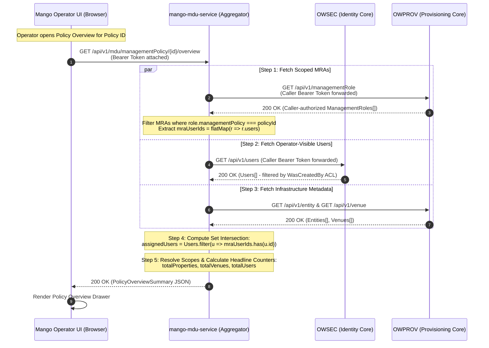

# Users & Access Technical Specification

**Document Status:** Normative Technical Specification  
**System Layer:** Mango Cloud Operator UI (Users & Access Feature Area)  
**Authoritative Downstream Services:** OpenWifi Security Service (`OWSEC`), OpenWifi Provisioning Service (`OWPROV`), Mango MDU Service (`mango-mdu-service`)  
**Target Path:** `mango-operator-ui/docs/Users_and_Access_Technical_Specification.md`  
**Architecture Reference:** Pragmatic Hybrid Architecture (Direct Upstream OpenWifi CRUD + Targeted MDU Service Aggregation)

---

## 1. Purpose

This document provides the definitive, production-grade technical specification for the **Users & Access** module of the Mango Cloud Operator UI.

The Users & Access module delivers administrative management of platform users, operational management policies, and fine-grained, hierarchy-scoped access assignments across multi-tenant Property and Venue infrastructure.

The Mango Operator UI operates on a **Pragmatic Hybrid Integration Architecture**:
1. **Direct Upstream OpenWifi Integration (Native CRUD & Session Discovery):**
   * Aligned with `ra-wlan-cloud-owprov-ui`, the UI performs session authentication and dynamic service endpoint discovery directly against **OpenWifi Security Service (`OWSEC`)** via `GET /api/v1/systemEndpoints`.
   * Standard administrative CRUD operations hit authoritative OpenWifi microservices directly using standard JWT Bearer token authentication (`Authorization: Bearer <token>`):
     - **`OWSEC` (Security):** User identity lifecycle, credentials, coarse platform roles, account suspension/reactivation/deletion, avatars, administrative notes, and MFA resets.
     - **`OWPROV` (Provisioning):** Management Policies, Management Role Assignments (MRAs), Entity (Property) metadata, and Venue hierarchies.
2. **Targeted MDU Service Aggregation (`mango-mdu-service`):**
   * For complex multi-service queries and heavy cross-service joins—specifically the **Policy Overview** inspection—the browser does not perform multi-step HTTP joins across microservices. Instead, the UI invokes a dedicated aggregation endpoint on `mango-mdu-service` (`GET /api/v1/mdu/managementPolicy/{id}/overview`), passing the caller's JWT Bearer token.
   * `mango-mdu-service` performs server-side orchestration between `OWPROV` and `OWSEC`, executes an authoritative **Set Intersection** between MRA assignees and operator-visible users, resolves scope metadata, and returns a consolidated overview payload efficiently in a single round trip.

---

## 2. Scope

This specification strictly governs:
- **Session & Endpoint Discovery:** Dynamic discovery of OpenWifi service base URLs via `OWSEC` `GET /api/v1/systemEndpoints` executed directly by the browser client at session initialization.
- **User Identity Management (Direct OWSEC):** Listing, filtering, searching, paginating, viewing, creating, updating, suspending, reactivating, and deleting platform users directly against `OWSEC`.
- **User Security Operations (Direct OWSEC):** Resetting Multi-Factor Authentication (`resetMFA`), sending password reset emails (`forgotPassword`), and resending verification emails (`email_verification`) directly from the user context menu.
- **Self-Account Exclusion:** Filtering out the currently logged-in operator's own record from the administrative directory to prevent accidental self-tampering, delegating personal account configuration to the top-navigation Profile view.
- **Avatar Lifecycle Management (Direct OWSEC):** Binary retrieval, multipart upload, deletion, client-side memory caching, and initials fallback matching `owprov-ui`.
- **Administrative Notes (Direct OWSEC):** Timestamped internal audit notes history in the User Details drawer with append popover capabilities.
- **User Creation Options (Direct OWSEC):** Support for manual password creation as well as invitation email verification flows (`email_verification=true`), alongside force-password-change flags (`changePassword=true`). Explicit selection of operational roles with no preselected default, and strict exclusion of the `subscriber` role.
- **Scoped Access Control (Direct OWPROV):** 1:1 backend MRA representation in a card-based list layout under "Access Assignments", policy-only card editing, single-item MRA revocation, and inline expandable assignment forms with batch multi-venue scoping (`venueIds: []`).
- **MRA Scope Immutability:** Strict enforcement that Property (`entity`), Venue (`venue`), and Assigned User (`users`) are immutable on existing MRAs; changing spatial scope requires revoking the old assignment and creating a new one.
- **Management Policy Administration (Direct OWPROV):** Inspecting, creating, updating, and deleting operational Management Policies directly against `OWPROV`.
- **Auto-Seeded Default Policies & Root Mutation Authority:** Initial baseline policies are auto-seeded by `OWPROV` during service startup, contain no hardcoded or fixed permissions, and can be fully modified and customized by `root` operators (`userRole === 'root'`). Non-root operators retain read-only and scoping capabilities.
- **Policy Overview Aggregation (via `mango-mdu-service`):** Aggregated overview drawer displaying headline KPI summary cards (Total Properties, Total Venues, Total Users), an interactive CRUD permission matrix visualizer, bound infrastructure scopes, and the **Set Intersection** of MRA assignees and operator-visible users.
- **Contracts, Mappings, Validation, and Verification:** Authoritative REST API contracts, TypeScript data mappings, validation rules, error handling, test scenarios, acceptance criteria, and architectural decisions.

---

## 3. Out of Scope

The following areas are explicitly outside the boundary of this document:
- **Other UI Modules:** Dashboard, Fleet Device Inventory, Device Telemetry, Live Gateway Deployment, Gateway Default Configurations, VariableBlock Configuration Profiles, Firmware Management, and Tenant Operator Creation workflows.
- **Authorization Enforcement Computation:** The Mango Operator UI does not compute permissions, evaluate hierarchy inheritance trees, or calculate policy precedence. All authorization decisions are strictly enforced by upstream microservices (`OWSEC` for user access; `OWPROV` for operational entity/venue access).
- **Proactive MRA Cleanup on User Deletion:** In accordance with downstream OpenWifi behavior, deleting a user in `OWSEC` does not initiate cascading MRA deletions in `OWPROV`.
- **Billing & Reseller Subscriptions:** Billing accounts, invoicing, payment gateways, and commercial reseller tiers.
- **Phase 2 Subscriber Self-Service:** Resident self-service captive portals, end-user Wi-Fi credentials, personal SSIDs, and PPSK/MPSK key generation.

---

## 4. Terminology

| Term | Definition |
| :--- | :--- |
| **User** | A human operator, administrative engineer, or support personnel registered in the identity store (`OWSEC`). Identified uniquely by a UUID and email address. |
| **Platform Role (`userRole`)** | A coarse platform classification stored in `OWSEC` (e.g., `root`, `admin`, `csr`, `noc`, `installer`). Governs top-level service visibility in `OWSEC` (e.g., only `root` and `admin` can list or create users). In the UI, it determines access to the Policy editor (strictly `root`). |
| **Management Policy (`managementPolicy`)** | An authoritative operational permission ruleset stored in `OWPROV`. Defines allowed API actions (`CREATE`, `READ`, `MODIFY`, `DELETE`, `FULL`) across system resources (`entity`, `venue`, `inventory`, `configuration`, `operator`, `subscriber`, `contact`, `location`). Policies are global templates (`entity: ""`, `venue: ""`). |
| **Default Seeded Policy** | Baseline management policies auto-seeded into the database by `OWPROV` during service startup (`service up`) as starting templates (e.g., Administrator, CSR, NOC, Installer). **These policies are not immutable and have no hardcoded permissions; root operators have full authority to modify them.** |
| **Management Role Assignment (MRA)** | A scoped binding record stored in `OWPROV` (`managementRole`). Binds a User (`users: [userId]`) to a Management Policy (`managementPolicy: policyId`) across an explicit administrative Scope (`entity` with optional `venue`). |
| **Property (`entity`)** | A customer top-level organizational boundary modeled in `OWPROV` (`entity`). Serves as the root anchor for physical Venues, managed inventory, and entity-wide role assignments. |
| **Venue (`venue`)** | A physical subdivision within a Property (e.g., building, tower, floor, common area) modeled in `OWPROV` (`venue`). |
| **Assignment Scope** | The spatial boundary of an MRA. An assignment is either **Property-wide** (`entity` set, `venue` empty) or **Venue-specific** (`entity` set, `venue` set to a child venue ID). |
| **Multi-Venue Assignment** | The workflow where the UI submits an MRA payload containing `venueIds: [id1, id2, ...]`, triggering `OWPROV` backend to generate individual venue-scoped MRAs in a single batch. |
| **Targeted MDU Aggregator** | The backend service (`mango-mdu-service`) that provides specialized BFF endpoints for cross-service multi-system aggregation (e.g., Policy Overview) while standard CRUD routes hit OpenWifi services directly. |

---

## 5. High-Level Architecture

The Mango Operator UI implements a **Pragmatic Hybrid Integration Architecture**:

```
+-----------------------------------------------------------------------------------+
|                            Mango Operator UI (Browser)                            |
|                                                                                   |
|  1. Session & Endpoint Discovery: Directly against OWSEC GET /systemEndpoints     |
|  2. Direct OpenWifi Native CRUD:                                                  |
|     - Users (/users)              -> Direct REST to OWSEC                         |
|     - Scoped Access (/managementRole) -> Direct REST to OWPROV                    |
|     - Policies (/managementPolicy)    -> Direct REST to OWPROV                    |
|  3. Complex Aggregations:                                                         |
|     - Policy Overview Drawer      -> Direct REST to mango-mdu-service             |
+-----------------------------------------------------------------------------------+
        |                                 |                                 |
        | Direct HTTPS                    | Direct HTTPS                    | Direct HTTPS
        | (Bearer JWT)                    | (Bearer JWT)                    | (Bearer JWT)
        v                                 v                                 v
+------------------+             +------------------+             +------------------+
|      OWSEC       |             |      OWPROV      |             | mango-mdu-service|
| (Identity Core)  |             | (Provision Core) |             |  (BFF Aggregator)|
|------------------|             |------------------|             |------------------|
| • Login / Auth   |             | • MRAs (CRUD)    |             | • Policy Overview|
| • systemEndpoints|             | • Policies (CRUD)|             |   Aggregation:   |
| • Users (CRUD)   |             | • Entities/Venues|             |   - MRA fetch    |
| • Avatars/Notes  |             +------------------+             |   - User fetch   |
| • MFA / Resets   |                      ^                       |   - Intersection |
+------------------+                      |                       |   - Scope join   |
        ^                                 |                       +------------------+
        |                                 |                                 |
        +---------------------------------+---------------------------------+
                         (Internal server-to-server calls)
```

### Architectural Guarantees
1. **Dynamic Service Discovery:** The browser initializes by querying `OWSEC` `GET /api/v1/systemEndpoints` to acquire the active endpoints for `owsec`, `owprov`, and related core services.
2. **Direct CRUD Efficiency:** Standard administrative workflows (creating a user, assigning an MRA, editing policy permissions) execute directly against the authoritative OpenWifi microservices, avoiding unnecessary intermediary proxies.
3. **Targeted Server-Side Aggregation:** Complex cross-service joins requiring multi-query coordination (Policy Overview) are delegated to `mango-mdu-service`. The backend executes upstream queries over internal service links and delivers a pre-calculated, tenant-filtered payload to the client.
4. **Unified Authentication:** The browser attaches the single JWT Bearer token acquired from `OWSEC` login to all requests across `OWSEC`, `OWPROV`, and `mango-mdu-service`. Upstream services authoritatively validate the token and enforce RBAC.

---

## 6. Source of Truth / Data Ownership

| Data Domain | Authoritative Service | Storage Entity | UI Access Path | UI Client |
| :--- | :--- | :--- | :--- | :--- |
| **Service Endpoints** | `OWSEC` | Internal config | `GET /api/v1/systemEndpoints` | Direct `axiosSec` |
| **User Identity & Credentials** | `OWSEC` | `Users` table | `GET /api/v1/users`, `/api/v1/user/{id}` | Direct `axiosSec` |
| **Coarse Platform Role** | `OWSEC` | `userRole` column | `user.userRole` | Direct `axiosSec` |
| **User Avatars** | `OWSEC` | User avatar binary | `GET /avatar/{id}`, `POST /avatar/{id}` | Direct `axiosSec` |
| **User Administrative Notes** | `OWSEC` | `notes` array in User | `PUT /api/v1/user/{id}` | Direct `axiosSec` |
| **Management Policies** | `OWPROV` | `ManagementPolicies` table | `GET /api/v1/managementPolicy` | Direct `axiosProv` |
| **Scoped Access Grants (MRAs)** | `OWPROV` | `ManagementRoles` table | `GET /api/v1/managementRole` | Direct `axiosProv` |
| **Property & Venue Metadata** | `OWPROV` | `Entities`, `Venues` tables| `GET /api/v1/entity`, `/api/v1/venue` | Direct `axiosProv` |
| **Policy Overview Aggregation** | `mango-mdu-service` | Aggregated view | `GET /api/v1/mdu/managementPolicy/{id}/overview` | Direct `axiosMdu` |

---

## 7. Users Feature

The Users feature provides complete administration of operator, engineering, and support identities directly through `OWSEC`.

### 7.1 Users List
The UI displays a responsive table of platform identities populated via `useGetUsers`.
- **Self-Account Exclusion:** The table automatically filters out the currently authenticated operator's own account (`user.id !== currentSession.userId`). An operator never sees their own account in the administrative management table, preventing accidental self-suspension, self-deletion, or self-role tampering. Operators view and manage their personal identity exclusively through their User Profile settings (`/profile`).
- **Columns:**
  - `User`: Circular avatar thumbnail (with initials fallback), Full Name (primary text), and Email Address (secondary text).
  - `Status`: Badge indicator (`Active` [Green] vs. `Suspended` [Red]).
  - `Platform Role`: Badge showing the coarse `userRole` (`root`, `admin`, `csr`, `noc`, `installer`). `subscriber` is strictly excluded from operator user lists.
  - `Assigned Scopes`: Badge showing the count of active MRAs for the user. Clicking opens the Scoped Access drawer.
  - `Last Login`: Formatted timestamp (e.g., `Oct 14, 2026, 10:24 AM`) or `Never`.
  - `Actions`: Action context menu (`...`) exposing administrative actions:
    - *Manage Scoped Access* (Opens Scoped Access drawer).
    - *View Details / Edit User* (Opens User Details drawer with metadata, notes, and avatar controls).
    - *Reset MFA* (Calls `PUT /api/v1/user/{id}?resetMFA=true` to clear MFA secret).
    - *Send Password Reset Email* (Calls `PUT /api/v1/user/{id}?forgotPassword=true`).
    - *Resend Verification Email* (Calls `PUT /api/v1/user/{id}?email_verification=true`).
    - *Suspend User* / *Reactivate User* (Calls `PUT /api/v1/user/{id}` with `{ "suspended": boolean }`).
    - *Delete User* (Calls `DELETE /api/v1/user/{id}` with email confirmation prompt).

### 7.2 User Search & Filtering
- **Search:** Client-side filtering over fetched users (targets `name`, `email`, `description` with case-insensitive substring matching).
- **Status Filter:** `All`, `Active` (`suspended: false`), `Suspended` (`suspended: true`).
- **Platform Role Filter:** Multi-select dropdown filtering by coarse role (`root`, `admin`, `csr`, `noc`, `installer`).
- **Assignment Scope Filter:** Toggle between `All Users`, `With Scoped Access`, and `Without Scoped Access`.

### 7.3 User Details Drawer & Administrative Notes
Accessed by selecting "View Details / Edit User" from the user context menu:
- **Left Column / Top Panel — Avatar & Identity:**
  - Large circular avatar display.
  - **Upload Avatar:** File picker accepting JPEG/PNG images ≤ 2MB. Submits `POST /avatar/{userId}` as `multipart/form-data`.
  - **Delete Avatar:** Trash button calling `DELETE /avatar/{userId}`. Reverts to initials fallback.
  - Cache-busting parameter `?cache={timestamp}` is attached to image URLs to prevent stale browser caches.
- **Center Panel — Metadata Overview:**
  - Read-only and editable fields: User ID, Name, Email Address, Description, Platform Role, Created timestamp, Modified timestamp, MFA Enabled status (`user.mfa.enabled`).
- **Right Column / Bottom Panel — Administrative Notes History:**
  - Displays a reverse-chronological list of administrative audit notes (`Note[]` sorted descending by `created` timestamp).
  - Each note entry renders: Note text, formatted creation date/time, and author (if available).
  - **`+ Add Note` Popover:** An inline popover containing a textarea for adding a new note. Submitting appends the new note to the user profile via `PUT /api/v1/user/{id}` with `{ "notes": [{ "note": noteText, "created": 0 }] }`.

### 7.4 Create User Workflow
User creation is strictly separated from role assignment. Users are created first; scoped roles are assigned subsequently.
- **Access Rule:** Only operators with `root` or `admin` roles in `OWSEC` can create users.
- **Form Fields:**
  - `Name` (Required, string 1–128 chars): Full user display name.
  - `Email` (Required, string, valid email format): Unique across `OWSEC`.
  - `Description` (Optional, string): Account purpose or organizational unit.
  - `Platform Role` (Required, dropdown):
    - **No preselected default role.** The dropdown placeholder displays `"Select a role..."`.
    - **Exclusively operational roles:** `admin`, `csr`, `noc`, `installer` (plus `root` if created by a root operator).
    - **No Subscriber Role:** End-user resident accounts (`subscriber`) are strictly excluded from this administrative dropdown.
  - **Credential & Invitation Options:**
    - *Option A — Manual Password:* Text input for `currentPassword` with complexity indicator.
    - *Option B — Email Invitation:* Toggle switch for `Send Email Invitation` (`emailValidation: true`). When enabled, the password field is optional/auto-generated, and the request is sent with `?email_verification=true`.
    - *Force Password Change:* Checkbox for `Must change password on first login` (`changePassword: true`).
- **Submission:**
  - API Call: `POST /api/v1/user/0` directly against `OWSEC` (appended with `?email_verification=true` if email invitation is toggled).
  - On success: Cache invalidation for `['users']`, toast notification, modal closes. User can now be selected in Scoped Access.

### 7.5 Edit User Workflow
- Allows updating user profile metadata (`name`, `description`).
- Changing `userRole` or modifying user credentials follows strict backend validation.
- API Call: `PUT /api/v1/user/{id}` directly against `OWSEC`.

### 7.6 Account Suspension & Reactivation
- **Suspension:** Operator selects "Suspend User". Confirmation modal warns that the user will be immediately rejected at login and API token validation.
  - API Call: `PUT /api/v1/user/{id}` with payload `{ "suspended": true }`.
- **Reactivation:** Operator selects "Reactivate User".
  - API Call: `PUT /api/v1/user/{id}` with payload `{ "suspended": false }`.
- On success: Invalidate `['users']` and `['users', id]`.

### 7.7 User Deletion Workflow
- Operator clicks "Delete User".
- A confirmation dialog requires the operator to type the user's email address to confirm deletion.
- **Deletion Behavior:** The UI calls `DELETE /api/v1/user/{id}` directly on `OWSEC`.
- **MRA Handling:** In alignment with downstream OpenWifi behavior, deleting a user in `OWSEC` does not perform proactive cascading cleanup of MRAs in `OWPROV`. The UI gracefully handles orphaned MRAs if encountered.

### 7.8 Tenancy & Visibility Rules in OWSEC
- Built into `OWSEC`'s core `ACLProcessor`:
  - **`root` User:** Can list all users across the entire system and create users with any role.
  - **`admin` User:** When calling `GET /api/v1/users`, `OWSEC` automatically filters results to return **only users created by that specific admin** (`WasCreatedBy` check). Admins can only create users assigned to their ownership.
  - **Other Roles (`csr`, `noc`, `installer`):** Receive `403 Forbidden` from `OWSEC` if attempting to call user management endpoints.

---

## 8. Scoped Access (Management Role Assignments)

Scoped Access is the authoritative mechanism in OpenWifi that grants a user operational permissions over specific physical infrastructure. It is managed directly via `OWPROV`'s `managementRole` resource.

### 8.1 Management Role Assignment (MRA) Model
An MRA binds:
$$\text{MRA} = \langle \text{User ID}, \text{Property (Entity ID)}, \text{Venue ID (Optional)}, \text{Management Policy ID} \rangle$$

In `OWPROV`, `managementRole` records are stored as:
```json
{
  "id": "uuid",
  "name": "Generated or custom role name",
  "description": "Optional description",
  "managementPolicy": "policy-uuid",
  "users": ["user-uuid-1"],
  "entity": "entity-uuid",
  "venue": "venue-uuid-or-empty"
}
```

### 8.2 Scope Levels
1. **Property-Wide Scope:**
   - `entity`: Valid Property UUID.
   - `venue`: `""` (empty string) or omitted.
   - Grants the policy over the entire Property and all existing and future child venues.
2. **Venue-Specific Scope:**
   - `entity`: Valid Property UUID.
   - `venue`: Valid Venue UUID.
   - Restricts policy permissions exclusively to the specified venue within the property.

### 8.3 Multi-Venue Batch Assignment
When scoping an operator across multiple venues within a property, the UI submits `venueIds: string[]` in a single `POST` request directly to `OWPROV`:
```json
{
  "entity": "entity-uuid-1234",
  "venueIds": ["venue-uuid-001", "venue-uuid-002", "venue-uuid-003"],
  "managementPolicy": "policy-uuid-5678",
  "users": ["user-uuid-9999"]
}
```
`OWPROV` backend receives `venueIds`, loops through the array, and creates/upserts individual MRA records for each venue in a single batch operation.

### 8.4 Access Assignments Card Layout & UI Specification
The Scoped Access drawer provides a dedicated, card-based interface matching the production reference design (`media_1788951154890.png` and `media_1788951207514.png`).

- **Header Section:** Displays the target User's Full Name, Email Address, and Platform Role.
- **Access Assignments Section:**
  - **Section Title:** `"Access Assignments"` with an adjacent count badge (e.g., `(2)`).
  - **1:1 Backend MRA Representation:** Each `managementRole` record returned by `OWPROV` is rendered directly as an individual card. Cards are not artificially merged or collapsed client-side, ensuring deterministic synchronization with backend endpoints.
  - **Assignment Cards:** Each active MRA is rendered as a clean, rounded, border-contained card:
    - **Building Icon:** Displayed on the left (`Building` icon) as the physical infrastructure anchor.
    - **Property / Entity Name:** Bold primary label (e.g., `"Sunrise Apartments"`), resolved client-side from `role.entity` via cached entities (`useGetEntities`).
    - **Venue Scope Subtitle:** Muted secondary label underneath the property name:
      - When `venue === ""` or empty: Displays `"All venues"` (Property-wide access).
      - When `venue` is a specific UUID: Displays the resolved Venue Name (e.g., `"Building A"`).
    - **Policy Pill Badge:** Pill-shaped badge displaying the assigned policy name (e.g., `"Network Operator"`, `"Read Only"`, `"CSR"`).
      - **Dynamic Policy Ingestion:** The UI dynamically resolves the policy name by matching `role.managementPolicy` against `useGetManagementPolicies()`. All policies returned by `OWPROV` are supported without client-side hardcoding.
    - **Edit Action (Pencil Icon):** Inline icon button allowing an operator to switch the assigned policy for this scope.
    - **Revoke Action (Trash Bin Icon):** Inline icon button to trigger single-item revocation.

- **Policy-Only Card Editing & Scope Coordinate Immutability:**
  - Clicking the pencil icon on an assignment card switches the card into an inline edit state.
  - **Locked Fields:** The Property (`entity`) and Venue (`venue`) fields are permanently locked/read-only because altering infrastructure boundaries represents a different scoping grant.
  - **Editable Field:** The Policy dropdown is editable, allowing the operator to select a new policy.
  - **Contextual Helper Hint:** The UI displays helper text: *"To change property or venue scope, revoke this assignment and create a new one."*
  - Submitting saves via `PUT /api/v1/managementRole/{id}` with `{ "entity": entityId, "venue": venueId, "managementPolicy": newPolicyId, "users": [userId] }`.
  - On success: Invalidates `['managementRoles', userId]`, shows a success toast, and updates the card badge.

### 8.5 MRA Attribute Mutability Matrix
To prevent frontend/backend interpretation differences, the mutability boundary for existing Management Role Assignments is formally specified:

| MRA Field | Mutable In-Place (`PUT`)? | Requires Revoke & Re-create (`DELETE` + `POST`)? | Enforcement & Technical Rationale |
| :--- | :---: | :---: | :--- |
| **`managementPolicy`** | **YES** | **No** | **Primary In-Place Mutable Field.** Represents privilege escalation, de-escalation, or tuning for the existing user on their established physical boundary. Backend updates foreign key in-place. |
| **`name` / `description`** | **YES** | **No** | Non-authoritative administrative metadata; does not alter security or spatial boundaries. |
| **`notes`** | **YES** | **No** | Administrative audit history (`notes: Note[]`); appended in-place. |
| **`entity` (Property)** | **NO (IMMUTABLE)** | **YES** | **Physical Tenant Anchor.** An MRA's existence is anchored to an organizational Entity. Moving properties requires revoking old access and provisioning new access to preserve audit logs and multi-tenant partition boundaries. |
| **`venue` (Venue Scope)** | **NO (IMMUTABLE)** | **YES** | **Spatial Perimeter Anchor.** An assignment is either Property-wide (`venue: ""`) or pinned to a specific physical Venue (`venue: venueUuid`). Changing venue coordinates alters the spatial perimeter and backend uniqueness keys `(entity, venue, user)`. Requires new assignment. |
| **`users` (Assigned Operator)** | **NO (IMMUTABLE)** | **YES** | **Identity Anchor.** In the User Scoped Access view, the card belongs exclusively to that operator (`users: [userId]`). Scoped access cannot be transferred between operators in-place on the same MRA UUID. |

- **Single-Item Revocation:**
  - Revocation is handled strictly on an individual card basis via the Trash Bin icon.
  - Clicking Trash displays a confirmation prompt: `"Revoke access for [User Name] on [Property Name - Venue Scope]?"`.
  - On confirmation, executes `DELETE /api/v1/managementRole/{roleId}` directly against `OWPROV`.
  - On success: Invalidates `['managementRoles', userId]` and removes the card.

- **Inline Expandable Assignment Form (`+ Assign access`):**
  - Displayed directly beneath the assignment cards as a full-width button with a dashed border.
  - Clicking this button expands the **Inline Assignment Form** (`media_1788951207514.png`):
    - **`Entity *` (Dropdown, Required):** Populated via `useGetEntities()` (`GET /api/v1/entity`). Displays all available Properties.
    - **`Venues` (Dropdown, Optional):** Populated via `useGetVenues()` and filtered to show venues under the selected Entity. Leaving unselected creates a Property-wide scope (`"All venues"`, `venue: ""`). Selecting specific venues enables single or multi-venue batch assignment (`venueIds: []`).
    - **`Policy *` (Dropdown, Required):** Dynamically populated from `OWPROV` `GET /api/v1/managementPolicy`. Lists all available policies returned by the backend. Includes an info icon `(i)` with a tooltip describing the policy.
    - **Form Controls:**
      - **`Save` (Button, Solid Blue):** Validates required selections and submits `POST /api/v1/managementRole/{uuid}` directly to `OWPROV`.
      - **`Cancel` (Button, Plain Text):** Resets form state and collapses the inline assignment view.

---

## 9. Policies Feature (Management Policies)

Management Policies are authoritative permission templates defined in `OWPROV` that establish fine-grained operational access across OpenWifi system resources.

### 9.1 Policy Model
A Management Policy is defined as:
```json
{
  "id": "uuid",
  "name": "Network Operator Policy",
  "description": "Grants operations and telemetry capabilities",
  "entity": "",
  "venue": "",
  "entries": [
    {
      "resources": ["inventory", "device"],
      "access": ["READ", "MODIFY"]
    },
    {
      "resources": ["configuration"],
      "access": ["READ"]
    }
  ]
}
```

### 9.2 Global Policy Template Architecture
- Policies are stored in `OWPROV` with `entity: ""` and `venue: ""`.
- Policies operate as global, reusable permission blueprints.
- Physical boundaries (properties and venues) are bound to policies exclusively through Management Role Assignments (MRAs).

### 9.3 Auto-Seeded Default Policies & Root Mutation Authority
- **Auto-Seeded on Service Up:** During `OWPROV` service initialization (`service up`), default baseline management policies (e.g., Administrator, CSR, NOC, Installer) are automatically seeded into the database as starting templates.
- **No Hardcoded or Fixed Permissions:** These auto-seeded policies do **not** have fixed or immutable permission sets. They are standard `managementPolicy` records stored in the database.
- **Root Mutation Authority:** Operators authenticated with the `root` platform role (`userRole === 'root'`) have full authority to **edit, customize, and modify any management policy**, including the auto-seeded default policies, via `PUT /api/v1/managementPolicy/{id}` directly on `OWPROV`.
- **Non-Root Protection:** Non-root operators (`admin`, `csr`, `noc`, `installer`):
  - Retain full read-only visibility to inspect policies and permission matrices.
  - Can assign any policy to users via Scoped Access.
  - Are strictly prevented from creating, editing, or deleting policies (mutation buttons are hidden/disabled in the UI, and direct API mutations are rejected by `OWPROV` with `403 Forbidden`).

### 9.4 Policies List View & Presentation
The Policies tab operates as a centralized **Policy Definition Catalog and Permission Matrix Viewer**, while providing one-click access to deep operational usage insights.
- **Columns:**
  - `Policy Name`: Name of the policy.
  - `Description`: Summary text explaining operational privileges.
  - `Assigned Scopes`: Badge displaying the total number of physical property/venue scopes currently governed by this policy (derived from `managementRoles.filter(r => r.managementPolicy === policy.id).length`).
  - `In Use`: Status badge (`In Use` vs `Unassigned`), derived from active assignments to gate root deletion.
  - `Actions`: `View Overview` (Opens Policy Overview drawer), `Edit Policy` (Root only), `Delete Policy` (Root only, unassigned policies only).

### 9.5 Policy Overview & Inspection: Assigned Infrastructure & Users
Clicking on any policy row or selecting "View Overview" opens the **Policy Overview Drawer**, powered by the dedicated aggregation endpoint in `mango-mdu-service` (`GET /api/v1/mdu/managementPolicy/{id}/overview`):
- **Header Section & KPI Stat Badges:**
  - Policy Identity: Policy Name, Description, and Creation/Modification timestamps.
  - **Headline KPI Metric Summary Cards:**
    - 🏢 **Total Properties (Entities):** Count of distinct properties currently bound to this policy (`totalProperties`).
    - 📍 **Total Venues:** Count of distinct venues assigned under this policy (`totalVenues`), with indicator if property-wide ("All venues") scopes are present.
    - 👥 **Total Users:** Total count of distinct operators holding this policy (`totalUsers`), computed via the mathematical set intersection between active MRA assignees and operator-visible users.
- **Tab 1 — Permission Matrix Visualizer:**
  - Renders an interactive, read-only matrix of system resource categories against access verbs:
    - Resources: `entity`, `venue`, `configuration`, `inventory`, `operator`, `subscriber`, `contact`, `location`.
    - Access Actions: `CREATE`, `READ`, `MODIFY`, `DELETE`, `FULL`.
  - Checkmarks clearly designate granted capabilities.
- **Tab 2 — Assigned Properties & Venues (Infrastructure Scope):**
  - Tab header badge displays total scope count: `Assigned Properties & Venues (${assignedScopes.length})`.
  - Renders a responsive data table of all physical infrastructure where this policy is currently bound:
    - `Property (Entity)`: Resolved Property Name with building icon and direct navigation link.
    - `Venue Scope`: Badge indicating `"All venues"` (Property-wide grant) or specific resolved `Venue Name`.
    - `Active Operators Count`: Number of individual technicians or administrators assigned to this scope.
    - `Actions`: Quick-action link to navigate to the Property Details view.
- **Tab 3 — Assigned Users (Set Intersection Model):**
  - Tab header badge displays total unique users count: `Assigned Users (${assignedUsers.length})`.
  - Displays the complete, deduplicated list of all platform operators who hold active assignments under this policy (computed server-side by `mango-mdu-service`):
    - `User`: Circular avatar thumbnail, Full Display Name, and Email Address.
    - `Platform Role`: Coarse role badge (`root`, `admin`, `csr`, `noc`, `installer`).
    - `Assigned Scopes Summary`: Count and names of specific properties/venues assigned under this policy.
    - `Account Status`: Badge indicating `Active` or `Suspended`.
  - **No Synthetic Role Mapping:** Operators whose `userRole` happens to correspond to the policy (e.g. `admin`) but who hold no active MRA bindings are **excluded**.
  - **No Source Pills:** Eliminates artificial "Platform Role", "Scoped Access", or "Both" pill tags. Every listed user is an authentic operational assignee.
  - Includes a quick-search filter allowing operators to search assigned users by name or email.

### 9.6 Create / Edit Policy Workflow (Root-Only)
- **Create:**
  - Root clicks "Create Policy".
  - Generates a new UUID client-side (or uses `00000000-0000-0000-0000-000000000000`).
  - Form captures `name`, `description`, and permission matrix entries.
  - `entity` and `venue` are set to `""`.
  - API Call: `POST /api/v1/managementPolicy/{uuid}` directly against `OWPROV`.
- **Edit:**
  - Root clicks "Edit Policy" on any policy (including auto-seeded default policies).
  - Form populates existing entries and allows editing resource permissions.
  - API Call: `PUT /api/v1/managementPolicy/{id}` directly against `OWPROV`.
- On success: Invalidate `['managementPolicies']`.

### 9.7 Delete Policy Workflow (Root-Only)
- Policies can only be deleted if their active assignment count is `0`.
- If active MRAs exist, the delete button is disabled with a tooltip: `"Cannot delete policy: Currently assigned to active infrastructure scopes."`.
- API Call: `DELETE /api/v1/managementPolicy/{id}` directly against `OWPROV`.

---

## 10. Data Orchestration, Caching & Aggregation Architecture

The Mango Operator UI operates on a **Pragmatic Hybrid Integration Architecture** combining direct browser-to-microservice CRUD with targeted backend aggregation:

1. **Direct Microservice Operations (`OWSEC` & `OWPROV`):**
   - **Endpoint Discovery:** At session initialization, the browser directly queries `OWSEC` `GET /api/v1/systemEndpoints` to discover dynamic microservice base URIs (matching `ra-wlan-cloud-owprov-ui`).
   - **Native CRUD:** User identity lifecycle (`OWSEC`), avatar uploads/retrieval (`OWSEC`), administrative notes (`OWSEC`), user security actions (`OWSEC`), management role assignments (`OWPROV`), and policy definitions (`OWPROV`) are called directly by the browser with standard Bearer JWT authentication.
   - **Client Cache Management:** TanStack Query (React Query) manages in-memory caching, stale-time invalidation, and optimistic state updates for all direct microservice queries.

2. **Targeted Backend Aggregation (`mango-mdu-service`):**
   - **Policy Overview Aggregation:** Rather than forcing the browser to issue multiple parallel HTTP queries across ports and perform heavy joins client-side, the UI calls `mango-mdu-service` (`GET /api/v1/mdu/managementPolicy/{id}/overview`).
   - The MDU service executes upstream requests over internal service connections, performs the authoritative **Set Intersection** between MRA assignees and operator-visible users from `OWSEC`, resolves infrastructure scopes, and returns a single unified payload.

```
+-----------------------------------------------------------------------------------+
|                        TanStack React Query Cache Layer                           |
|                                                                                   |
|  ['systemEndpoints']                 -> Base service URIs from OWSEC              |
|  ['users']                           -> Direct user directory from OWSEC          |
|  ['managementRoles', userId]         -> Direct user MRAs from OWPROV              |
|  ['managementPolicies']              -> Direct global policies from OWPROV        |
|  ['entities']                        -> Direct property metadata from OWPROV      |
|  ['venues']                          -> Direct venue hierarchy from OWPROV        |
|  ['policyOverview', policyId]        -> Aggregated overview from mango-mdu-service|
+-----------------------------------------------------------------------------------+
```

### 10.1 User Directory & Avatar Query Flow (Direct OWSEC)
1. **Fetch Users:** Call `axiosSec.get('users?offset=0&limit=500&withExtendedInfo=true')`.
2. **Self-Account Exclusion:** Automatically filter out the authenticated operator (`user.id !== currentSession.userId`).
3. **Fetch Avatars:** For each user with an avatar ID, asynchronously request arraybuffer image data via `GET /avatar/{userId}?cache={timestamp}` and cache as base64 data URIs.
4. **MRA Count Enrichment:** In the main users table, MRA counts can be lazy-loaded on row expansion or prefetched for visible rows using `useGetManagementRoles(user.id)` from `OWPROV`.

### 10.2 Scoped Access Client Resolution Flow (Direct OWPROV)
When the Scoped Access drawer opens for a user:
1. UI executes `useGetManagementRoles(userId)` -> direct call to `OWPROV` `GET /api/v1/managementRole?userId={id}`.
2. UI reads `['entities']` from cache (or triggers `useGetEntities()`) to map `role.entity` -> `Entity.name`.
3. UI reads `['venues']` from cache (or triggers `useGetVenues()`) to map `role.venue` -> `Venue.name`.
4. UI reads `['managementPolicies']` from cache (or triggers `useGetManagementPolicies()`) to map `role.managementPolicy` -> `ManagementPolicy.name`.
5. The table renders fully resolved, human-readable records directly using cached metadata.

### 10.3 Policy Overview Aggregation via `mango-mdu-service` (Server-Side Intersection)
Instead of forcing the browser to orchestrate multiple HTTP queries across ports and services, the Policy Overview is executed by `mango-mdu-service` on the backend.

#### Multi-Service Orchestration Flow


#### Step-by-Step Server-Side Pipeline:
1. **Step 1 — Scoped Role Filtering (`OWPROV`):**
   - Fetches MRAs visible and authorized for the caller from `OWPROV` (forwarding caller's Bearer token) and filters assignments matching `policyId`:
     $$\text{filteredMRAs} = \{ r \in \text{Caller-Authorized ManagementRoles} \mid r.\text{managementPolicy} = \text{policyId} \}$$
   - Collects distinct user UUIDs assigned to this policy:
     $$\text{mraUserIds} = \text{Set}\left( \bigcup_{r \in \text{filteredMRAs}} r.\text{users} \right)$$
2. **Step 2 — Operator-Visible Users Query (`OWSEC`):**
   - Calls `OWSEC` `GET /api/v1/users` forwarding the calling operator's JWT Bearer token.
   - `OWSEC` authoritatively applies its internal `WasCreatedBy` ACL filter, returning strictly the subset of users that the calling operator is permitted to see.
3. **Step 3 — Mathematical Set Intersection (True Policy Users):**
   - Computes the strict set intersection:
     $$\text{Assigned Policy Users} = \{ u \in \text{OWSEC Visible Users} \mid u.\text{id} \in \text{mraUserIds} \}$$
   - **Guarantees:**
     - Only authentic assignees holding active MRAs for this policy are included.
     - Synthetic platform-role mappings are completely eliminated.
     - Calling operators never see users from other tenants or administrators outside their authorization hierarchy.
4. **Step 4 — Infrastructure Scope Resolution & Headline Counters:**
   - Aggregates unique Property UUIDs (`entity`) and Venue UUIDs (`venue`) from `filteredMRAs`.
   - Resolves display names via `OWPROV` entity and venue tables.
   - Computes headline summary metrics:
     $$\text{totalProperties} = |\text{distinctEntityIds}|, \quad \text{totalVenues} = |\text{distinctVenueIds}|, \quad \text{totalUsers} = |\text{Assigned Policy Users}|$$
5. **Step 5 — Response Delivery & Client Caching:**
   - Returns the consolidated [`PolicyOverviewSummary`](#13-data-mapping--type-definitions) response.
   - The UI caches this result under `['policyOverview', policyId]` with a 5-minute stale time.

### 10.4 Policy In-Use Determination Flow
To determine whether a policy is active (to gate root deletion and display the `In Use` status badge):
1. The UI evaluates `filteredMRAs.length > 0` directly from cached management roles (`['managementRoles']`).
2. This calculation is evaluated client-side from cached state. Policies marked `isPolicyInUse === true` have their delete button disabled with a tooltip: `"Cannot delete policy: Currently assigned to infrastructure scopes."`

### 10.5 Cache Invalidation Strategy
| Mutation Action | Target Service & Endpoint | Invalidated React Query Keys |
| :--- | :--- | :--- |
| **Create User** | `POST OWSEC /api/v1/user/0` | `['users']` |
| **Update User** | `PUT OWSEC /api/v1/user/{id}` | `['users']`, `['users', id]` |
| **Suspend / Reactivate User** | `PUT OWSEC /api/v1/user/{id}` | `['users']`, `['users', id]` |
| **Delete User** | `DELETE OWSEC /api/v1/user/{id}` | `['users']` |
| **Assign Scoped Access** | `POST OWPROV /api/v1/managementRole/{uuid}` | `['managementRoles']`, `['managementRoles', userId]`, `['policyOverview']` |
| **Update Scoped Access** | `PUT OWPROV /api/v1/managementRole/{id}` | `['managementRoles']`, `['managementRoles', userId]`, `['policyOverview']` |
| **Revoke Scoped Access** | `DELETE OWPROV /api/v1/managementRole/{id}` | `['managementRoles']`, `['managementRoles', userId]`, `['policyOverview']` |
| **Create Policy** | `POST OWPROV /api/v1/managementPolicy/{uuid}` | `['managementPolicies']` |
| **Update Policy** | `PUT OWPROV /api/v1/managementPolicy/{id}` | `['managementPolicies']`, `['policyOverview', policyId]` |
| **Delete Policy** | `DELETE OWPROV /api/v1/managementPolicy/{id}` | `['managementPolicies']` |

---

## 11. Downstream Service Dependencies

### 11.1 Service Discovery (`OWSEC`)
- **Endpoint:** `GET /api/v1/systemEndpoints`
- Executed by the browser at session initialization directly against `OWSEC`.
- Discovers dynamic base URIs for `owsec`, `owprov`, `owfms`, and `owgw`.

### 11.2 OWSEC Service Contract (Security)
- Direct client access for User identity lifecycle, authentication, platform roles, avatar images, and administrative notes.
- Base path: `/api/v1`

### 11.3 OWPROV Service Contract (Provisioning)
- Direct client access for Management Roles (MRAs), Management Policies, Entities (Properties), and Venues.
- Base path: `/api/v1`

### 11.4 Mango MDU Service Contract (`mango-mdu-service`)
- Backend aggregation service for cross-service overviews and composite analytics.
- Base path: `/api/v1/mdu`

---

## 12. API Contracts

### 12.1 System Endpoints Discovery (Direct OWSEC)
`GET /api/v1/systemEndpoints`
- **Headers:** `Authorization: Bearer <token>`
- **Response `200 OK`:**
  ```json
  {
    "endpoints": [
      {
        "id": 1,
        "type": "owsec",
        "uri": "https://sec.openwifi.example.com:16001",
        "authenticationType": "sec"
      },
      {
        "id": 2,
        "type": "owprov",
        "uri": "https://prov.openwifi.example.com:16004",
        "authenticationType": "sec"
      }
    ]
  }
  ```

### 12.2 OWSEC User APIs (Direct OWSEC)

#### 12.2.1 Get Users
`GET /api/v1/users?offset={offset}&limit={limit}&withExtendedInfo=true`
- **Response `200 OK`:**
  ```json
  {
    "users": [
      {
        "id": "user-uuid-1",
        "name": "Alex Smith",
        "email": "alex.smith@example.com",
        "description": "Lead Tier 3 Support Engineer",
        "userRole": "admin",
        "suspended": false,
        "avatar": "avatar-uuid-1",
        "notes": [
          {
            "note": "Onboarded for West Coast property deployment",
            "created": 1718000000
          }
        ],
        "created": 1710000000,
        "modified": 1715000000
      }
    ]
  }
  ```

#### 12.2.2 Create User
`POST /api/v1/user/0` (or `POST /api/v1/user/0?email_verification=true`)
- **Request Body:**
  ```json
  {
    "name": "Jane Doe",
    "email": "jane.doe@example.com",
    "description": "Field Installer Technician",
    "userRole": "installer",
    "currentPassword": "InitialPassword123!",
    "emailValidation": false,
    "changePassword": true
  }
  ```
- **Response `200 OK`:** Returns created `User` object.

#### 12.2.3 Update User
`PUT /api/v1/user/{id}`
- **Request Body:**
  ```json
  {
    "name": "Jane Doe Updated",
    "description": "Senior Field Technician"
  }
  ```
- **Response `200 OK`:** Returns updated `User` object.

#### 12.2.4 Suspend / Reactivate User
`PUT /api/v1/user/{id}`
- **Request Body:** `{ "suspended": true }` (or `false`)
- **Response `200 OK`:** Returns updated `User` object.

#### 12.2.5 Delete User
`DELETE /api/v1/user/{id}`
- **Response `200 OK`:** `{}`

#### 12.2.6 Administrative Security Actions
- **Reset MFA:** `PUT /api/v1/user/{id}?resetMFA=true`
- **Send Password Reset Email:** `PUT /api/v1/user/{id}?forgotPassword=true`
- **Resend Verification Email:** `PUT /api/v1/user/{id}?email_verification=true`

#### 12.2.7 Append Administrative Note
`PUT /api/v1/user/{id}`
- **Request Body:**
  ```json
  {
    "notes": [
      {
        "note": "Completed site certification for Building A",
        "created": 0
      }
    ]
  }
  ```
- **Response `200 OK`:** Returns updated user with note persisted and timestamped.

#### 12.2.8 Avatar APIs
- **Get Avatar:** `GET /avatar/{id}?cache={cacheKey}`
  - **Headers:** `Accept: image/*`
  - **Response `200 OK`:** Binary image data (rendered as Data URI).
- **Upload Avatar:** `POST /avatar/{id}`
  - **Headers:** `Content-Type: multipart/form-data`
  - **Payload:** `file: <binary image>`
  - **Response `200 OK`:** `{}`
- **Delete Avatar:** `DELETE /avatar/{id}`
  - **Response `200 OK`:** `{}`

### 12.3 OWPROV Management Role APIs (Direct OWPROV)

#### 12.3.1 Get Management Roles
`GET /api/v1/managementRole` or `GET /api/v1/managementRole?userId={userId}`
- **Response `200 OK`:**
  ```json
  {
    "roles": [
      {
        "id": "mra-uuid-1",
        "name": "Sunset Heights - CSR",
        "description": "Property-wide support access",
        "managementPolicy": "policy-uuid-1",
        "users": ["user-uuid-1"],
        "entity": "entity-uuid-1",
        "venue": ""
      }
    ]
  }
  ```

#### 12.3.2 Create Scoped Access (Batch Multi-Venue Support)
`POST /api/v1/managementRole/{uuid}`
- **Request Body:**
  ```json
  {
    "entity": "entity-uuid-1",
    "venueIds": ["venue-uuid-1", "venue-uuid-2"],
    "managementPolicy": "policy-uuid-1",
    "users": ["user-uuid-1"]
  }
  ```
- **Response `200 OK`:** Returns created `ManagementRole` record(s).

#### 12.3.3 Update Scoped Access (Policy-Only Editing & Scope Immutability)
`PUT /api/v1/managementRole/{id}`
- **Mutability Constraint:** Scope coordinates (`entity`, `venue`) and assigned user identity (`users`) are strictly **immutable**. Only `managementPolicy`, `name`, `description`, and `notes` can be updated.
- **Request Body:**
  ```json
  {
    "entity": "entity-uuid-1",
    "venue": "venue-uuid-1",
    "managementPolicy": "new-policy-uuid",
    "users": ["user-uuid-1"],
    "name": "Updated Role Name",
    "description": "Updated Role Description"
  }
  ```
- **Response `200 OK`:** Returns updated `ManagementRole`.
- **Response `400 Bad Request` (Scope Immutability Enforcement):** If `payload.entity !== existing.entity` or `payload.venue !== existing.venue` or `payload.users !== existing.users`, `OWPROV` rejects the request (implemented in `ra-wlan-cloud-owprov/src/RESTAPI/RESTAPI_managementRole_handler.cpp#L445-L466`):
  ```json
  {
    "ErrorCode": 400,
    "ErrorDescription": "Entity ID, Venue ID, and User ID are immutable. To change scope, delete the existing role and create a new role."
  }
  ```

#### 12.3.4 Revoke Scoped Access
`DELETE /api/v1/managementRole/{id}`
- **Response `200 OK`:** `{}`

### 12.4 OWPROV Management Policy APIs (Direct OWPROV)

#### 12.4.1 Get Management Policies
`GET /api/v1/managementPolicy`
- **Response `200 OK`:**
  ```json
  {
    "managementPolicies": [
      {
        "id": "policy-uuid-1",
        "name": "Administrator",
        "description": "Full operational management privileges",
        "entity": "",
        "venue": "",
        "entries": [
          {
            "resources": ["entity", "venue", "inventory", "configuration", "operator", "subscriber"],
            "access": ["READ", "CREATE", "MODIFY", "DELETE", "FULL"]
          }
        ]
      }
    ]
  }
  ```

#### 12.4.2 Create Management Policy (Root Only)
`POST /api/v1/managementPolicy/{uuid}`
- **Request Body:**
  ```json
  {
    "name": "Support Tier 1",
    "description": "Read-only inventory and subscriber support",
    "entity": "",
    "venue": "",
    "entries": [
      {
        "resources": ["inventory", "subscriber"],
        "access": ["READ"]
      }
    ]
  }
  ```

#### 12.4.3 Update Management Policy (Root Only)
`PUT /api/v1/managementPolicy/{id}`
- **Request Body:** Matches policy structure with updated permissions entries.

#### 12.4.4 Delete Management Policy (Root Only)
`DELETE /api/v1/managementPolicy/{id}`
- **Response `200 OK`:** `{}`

### 12.5 Scope Metadata APIs (Direct OWPROV)
- `GET /api/v1/entity`: Returns `{ "entities": [ { "id": "uuid", "name": "Property Name" } ] }`
- `GET /api/v1/venue`: Returns `{ "venues": [ { "id": "uuid", "name": "Venue Name", "entity": "entity-uuid" } ] }`

### 12.6 Mango MDU Aggregation APIs (`mango-mdu-service`)

#### 12.6.1 Get Policy Overview (Aggregated View)
`GET /api/v1/mdu/managementPolicy/{id}/overview`
- **Headers:** `Authorization: Bearer <token>`
- **Behavior:** `mango-mdu-service` fetches caller-authorized MRAs from `OWPROV` (forwarding caller's Bearer token and filtering by `managementPolicy === policyId`), queries `OWSEC` for caller-visible users, executes the **Set Intersection**, resolves Property and Venue display names, and returns the aggregated summary.
- **Response `200 OK`:**
  ```json
  {
    "policy": {
      "id": "policy-uuid-1",
      "name": "Administrator",
      "description": "Full operational management privileges",
      "entity": "",
      "venue": "",
      "entries": [
        {
          "resources": ["entity", "venue", "inventory", "configuration", "operator", "subscriber"],
          "access": ["READ", "CREATE", "MODIFY", "DELETE", "FULL"]
        }
      ]
    },
    "totalProperties": 4,
    "totalVenues": 12,
    "totalUsers": 5,
    "assignedScopes": [
      {
        "entityId": "entity-uuid-1",
        "entityName": "Sunrise Apartments",
        "venueId": "",
        "venueName": "All venues",
        "scopeLevel": "property",
        "assignedOperatorsCount": 3
      }
    ],
    "assignedUsers": [
      {
        "id": "user-uuid-1",
        "name": "Alex Smith",
        "email": "alex.smith@example.com",
        "avatar": "avatar-uuid-1",
        "userRole": "admin",
        "suspended": false,
        "assignedScopesCount": 2,
        "scopes": [
          { "entity": "entity-uuid-1", "venue": "" }
        ]
      }
    ]
  }
  ```

---

## 13. Data Mapping & Type Definitions

```typescript
// --- User Identity (OWSEC) ---
export type UserRole = 'root' | 'admin' | 'csr' | 'noc' | 'installer';

export type Note = {
  note: string;
  created?: number;
};

export type User = {
  id: string;
  name: string;
  email: string;
  description?: string;
  userRole: UserRole;
  suspended: boolean;
  avatar?: string;
  notes?: Note[];
  mfa?: {
    enabled: boolean;
    method?: string;
  };
  created: number;
  modified: number;
  lastLogin?: number;
};

// --- Scoped Access (OWPROV) ---
export type ManagementRole = {
  id: string;
  name: string;
  description?: string;
  managementPolicy: string; // UUID of ManagementPolicy
  users: string[];          // UUIDs of assigned Users
  entity: string;           // UUID of Property (Entity)
  venue: string;            // UUID of Venue (empty string = Property-wide)
  venueIds?: string[];      // Used for batch multi-venue creation
  notes?: Note[];
  created?: number;
  modified?: number;
};

// --- Management Policies (OWPROV) ---
export type PolicyEntry = {
  resources: string[];
  access: string[]; // 'READ' | 'CREATE' | 'MODIFY' | 'DELETE' | 'FULL'
};

export type ManagementPolicy = {
  id: string;
  name: string;
  description: string;
  entity: string;   // Always ""
  venue: string;    // Always ""
  entries: PolicyEntry[];
};

// --- Scope Metadata (OWPROV) ---
export type EntityInfo = {
  id: string;
  name: string;
};

export type VenueInfo = {
  id: string;
  name: string;
  entity: string;
};

// --- Aggregated Policy Overview Types (mango-mdu-service) ---
export type PolicyAssignedUser = {
  id: string;
  name: string;
  email: string;
  avatar: string;
  userRole: UserRole;
  suspended: boolean;
  assignedScopesCount: number;
  scopes: { entity: string; venue: string }[];
};

export type PolicyAssignedScope = {
  entityId: string;
  entityName: string;
  venueId: string;
  venueName: string; // "All venues" if venueId is empty
  scopeLevel: 'property' | 'venue';
  assignedOperatorsCount: number;
};

export type PolicyOverviewSummary = {
  policy: ManagementPolicy;
  totalProperties: number; // count of distinct entities bound
  totalVenues: number;     // count of distinct venues bound
  totalUsers: number;      // count of distinct operators (intersection of MRA users and visible OWSEC users)
  assignedScopes: PolicyAssignedScope[];
  assignedUsers: PolicyAssignedUser[];
};

// --- Endpoint Discovery (OWSEC) ---
export type EndpointApiResponse = {
  id: number;
  type: string;
  uri: string;
  authenticationType: string;
  vendor?: string;
};
```

---

## 14. Validation Rules

### 14.1 User Form Validation
- **`name`:** Required, 1–128 characters, trimmed.
- **`email`:** Required, valid RFC 5322 email syntax, max 255 characters. Must be unique across `OWSEC`.
- **`userRole`:** Mandatory selection from dropdown. **No default value permitted.** Must be one of `admin`, `csr`, `noc`, `installer` (plus `root` if created by root). The `subscriber` role is strictly excluded.
- **`currentPassword`:** Mandatory if manual password mode is selected. Minimum 8 characters, containing uppercase, lowercase, digit, and special character. Optional if email invitation mode is toggled.

### 14.2 Scoped Access (MRA) Form Validation
- **Creation Mode (`POST`):**
  - **`entity` (Property):** Required. Must be a valid UUID corresponding to an existing Property.
  - **`venues`:** Optional. If empty, creates a Property-wide scope (`venue: ""`). If selected, must be valid child venue UUIDs of the selected Entity. Multi-venue selection passes `venueIds: string[]`.
  - **`managementPolicy`:** Required. Must be a valid UUID corresponding to a policy returned by `GET /api/v1/managementPolicy`.
  - **`users`:** Array containing at least one valid user UUID (`[userId]`).
- **Update Mode (`PUT`):**
  - **`managementPolicy`:** Required. Must be a valid, active policy UUID.
  - **`entity` & `venue`:** Must strictly match the existing record. The UI enforces read-only state; the backend validates equality and rejects alterations with `400 Bad Request`.
  - **`users`:** Must strictly match the existing record.

### 14.3 Management Policy Form Validation (Root-Only)
- **`name`:** Required, 1–64 characters. Must be unique across all policies in `OWPROV`.
- **`description`:** Optional, max 255 characters.
- **`entries`:** Must contain at least one valid resource permission block.
- **`entity` / `venue`:** UI enforces empty string `""` values to guarantee global template status.

---

## 15. Authorization Boundary

### 15.1 UI Presentation Guards
- **Create / Edit / Delete Policy:** Mutation buttons are conditionally rendered or enabled strictly for `userRole === 'root'`. Non-root users see read-only matrices and the Policy Overview drawer.
- **Delete Policy In-Use Guard:** Custom and seeded policies currently bound to any active MRA (`filteredMRAs.length > 0`) have the delete action disabled with a tooltip explaining that active assignments exist.
- **Self-Account Action Guard:** The main `/users` table filters out `user.id === currentSession.userId` to eliminate self-deletion or self-demotion risks.

### 15.2 Downstream Microservice Enforcement
- If an operator bypasses UI controls, downstream microservices independently validate the caller's JWT:
  - `OWSEC` rejects unauthorized user creation or role elevation with `403 Forbidden`.
  - `OWPROV` rejects policy creation or updates by non-root callers with `403 Forbidden`.
  - `mango-mdu-service` preserves and forwards the caller's Bearer token to `OWSEC` and `OWPROV`, inheriting their respective ACL restrictions.

---

## 16. Error Handling

### 16.1 Error Response Structure
`OWSEC`, `OWPROV`, and `mango-mdu-service` return standard error payloads:
```json
{
  "ErrorCode": 409,
  "ErrorDescription": "A user with this email address already exists"
}
```

### 16.2 Error Mapping Matrix
| HTTP Status | Downstream Scenario | UI Error Presentation |
| :--- | :--- | :--- |
| `400 Bad Request` | Missing required fields, invalid complexity, or attempted scope alteration | Inline field errors or toast error |
| `401 Unauthorized` | Expired or invalid JWT Bearer token | Session termination toast; redirect to login |
| `403 Forbidden` | Non-root operator attempting policy mutation | Error toast: `"Access Denied: Root privileges required."` |
| `404 Not Found` | Target user, policy, or entity not found | Error toast: `"Resource not found."` |
| `409 Conflict` | Duplicate email address in `OWSEC` or duplicate scope | Inline field error: `"Email address is already in use."` |
| `500 Server Error` | Downstream service internal error | Error toast: `"Service temporarily unavailable. Please retry."` |

---

## 17. UI States

### 17.1 Loading States
- **Users Table:** Renders animated Chakra/Tailwind skeleton rows while `useGetUsers` is resolving.
- **Scoped Access Drawer:** Displays card skeleton loaders while fetching active MRAs, entities, and venues.
- **Policy Overview Drawer:** Skeleton loaders are displayed across all three tabs while `useGetPolicyOverview(policyId)` resolves from `mango-mdu-service`.

### 17.2 Empty States
- **No Users Found:** Displays search illustration with text: `"No users found matching '[search term]'."`
- **No Access Assignments:** Displays empty card banner: `"No scoped access assigned. Click '+ Assign access' to grant permissions."`
- **Unassigned Policy:** Overview tabs display `"No properties currently assigned to this policy"` and `"No users currently assigned to this policy."`

### 17.3 Error States
- Failed queries display a warning card with an explicit "Retry" button calling React Query's `refetch()`.

---

## 18. Security Posture & Client Hardening

This specification defines the frontend security boundaries and hardening requirements governing the Mango Operator UI. Backend security controls (such as microservice middleware authentication, database transaction isolation, server-side CORS headers, and database cascade triggers) are managed authoritatively within the respective backend services (`OWSEC`, `OWPROV`, `mango-mdu-service`).

### 18.1 Non-Authoritative UI & Presentation Guards
- **Presentation Layer Only:** UI controls (such as hiding Root-only Policy Edit/Delete buttons or filtering out the current operator's record) are designed strictly for user experience, operational clarity, and error prevention. They do **not** constitute an authorization boundary.
- **Authoritative Upstream RBAC:** The downstream microservices (`OWSEC`, `OWPROV`, `mango-mdu-service`) remain the sole authoritative enforcement engines for authentication, tenant isolation, and RBAC rules.
- **Graceful Error Handling:** The UI shall never assume client-side checks are sufficient. It shall gracefully catch and present upstream `401 Unauthorized` (clearing credentials and redirecting to login) and `403 Forbidden` (rendering localized inline permission warnings) on any API operation.

### 18.2 Content Sanitization & Stored XSS Prevention
- **Strict Text Rendering:** All user-controlled text strings retrieved from downstream databases—including administrative notes (`user.notes`), display names (`user.name`), descriptions (`user.description`, `policy.description`), and role names—shall be rendered strictly as raw text nodes in the React DOM.
- **Zero Raw HTML Injection:** The UI shall **never** use `dangerouslySetInnerHTML` or unescaped HTML injection for any user-supplied content. If markdown rendering is ever enabled for administrative notes in future revisions, it must pass through an authoritative, strict sanitizer (such as `DOMPurify`) with script and iframe tags strictly stripped.

### 18.3 Credential Hygiene & Zero-Leak Logging
- **Header Redaction:** Axios interceptors and application logging utilities shall strictly redact the HTTP `Authorization` Bearer token header in production builds. Bearer tokens shall never be printed to `console.log`, `console.error`, or browser debug consoles.
- **Sanitized Error Presentation:** User-facing error notifications, banners, and toast alerts shall extract only human-readable error descriptions (`error.response.data.ErrorDescription` or standardized status code messages). The UI shall never display or dump raw HTTP request payloads, internal stack traces, or authorization headers into user-visible components or crash reporting logs.

### 18.4 Client-Side File Upload Hardening
- **File Type Restrictions:** The avatar file input component shall enforce `accept="image/png, image/jpeg"`.
- **SVG & Script Rejection:** Scalable Vector Graphics (`.svg`), HTML, executable binaries, and script-containing polyglot files shall be explicitly rejected client-side before any upload request is initiated.
- **Size Pre-Validation:** The UI shall inspect file size prior to dispatching `POST /avatar/{id}` and immediately reject files exceeding 2MB with a descriptive validation error, preventing unnecessary network bandwidth consumption. Authoritative file validation and MIME inspection remain enforced server-side by `OWSEC`.

### 18.5 Destructive Operation Friction
- **Explicit Confirmation Modals:** Destructive or high-impact actions shall require explicit user confirmation to eliminate accidental data loss:
  - **Delete User:** Triggers a modal dialog requiring the operator to review the target identity and explicitly confirm the action (e.g., verifying the target user's email address).
  - **Delete Policy:** Displays a modal explaining that policy deletion is irreversible, verifying that active infrastructure assignments are zero (`isPolicyInUse === false`).
  - **Revoke Scoped Access:** Displays an explicit confirmation popover or dialog on the specific MRA card before issuing `DELETE /api/v1/managementRole/{id}` to `OWPROV`.

---

## 19. Functional Requirements

### 19.1 Users (FR-USR)
- **FR-USR-01:** The UI shall display all platform users returned by `OWSEC` `GET /api/v1/users`.
- **FR-USR-02:** The UI shall allow searching users by name, email, or description with input debouncing (e.g., 300ms).
- **FR-USR-03:** The UI shall filter users by status (`Active`, `Suspended`), coarse platform role, and scoped assignment status.
- **FR-USR-04:** The UI shall separate user creation from policy assignment. Policy assignment shall occur after user creation.
- **FR-USR-05:** The User Creation form shall not preselect any default role. The role dropdown shall list exclusively operational roles (`admin`, `csr`, `noc`, `installer`, plus `root` if creator is root) and shall strictly exclude `subscriber`.
- **FR-USR-06:** The User Creation form shall support both manual password entry and invitation email verification (`emailValidation: true`, `?email_verification=true`).
- **FR-USR-07:** The User Creation form shall provide a checkbox to force password change on first login (`changePassword: true`).
- **FR-USR-08:** The UI shall allow updating user display name and description via `PUT /api/v1/user/{id}` directly on `OWSEC`.
- **FR-USR-09:** The UI shall allow suspending and reactivating user accounts via `PUT /api/v1/user/{id}` with `{ "suspended": boolean }`.
- **FR-USR-10:** The UI shall allow direct deletion of users via `DELETE /api/v1/user/{id}` without requiring cascading MRA cleanup.
- **FR-USR-11:** The UI shall respect `OWSEC` tenancy rules where `admin` operators only see users they created, and `root` operators see all users.
- **FR-USR-12:** The UI user context menu shall provide administrative security actions: Reset MFA (`?resetMFA=true`), Send Password Reset Email (`?forgotPassword=true`), and Resend Verification Email (`?email_verification=true`).
- **FR-USR-13:** The UI shall explicitly filter out the currently authenticated operator's user account from the Users management table (`user.id !== currentSession.userId`).
- **FR-USR-14:** The UI shall support avatar display (with user initials fallback), avatar image uploading via `POST /avatar/{userId}` (`multipart/form-data`), and avatar deletion via `DELETE /avatar/{userId}`.
- **FR-USR-15:** The UI shall support administrative notes in the User Details view, displaying chronological notes history (`notes: Note[]`) and enabling operators to append new notes via `PUT /api/v1/user/{id}` with `{ "notes": [{ "note": string, "created": 0 }] }`.

### 19.2 Scoped Access (FR-SCA)
- **FR-SCA-01:** The UI shall display all MRAs for a selected user in a card-based list layout under "Access Assignments", including building icon, property name, venue scope ("All venues" or specific venue), policy pill badge, and edit/revoke icons.
- **FR-SCA-02:** The UI shall resolve human-readable Property names (`entity`) and Venue names (`venue`) using cached OpenWifi metadata directly from `OWPROV`.
- **FR-SCA-03:** The UI shall dynamically resolve the policy pill badge name by matching `role.managementPolicy` against policies fetched from `useGetManagementPolicies()`.
- **FR-SCA-04:** The UI shall support Property-wide assignments where `venue` is empty string (`""`).
- **FR-SCA-05:** The UI shall support Venue-specific assignments where `venue` contains a valid venue UUID.
- **FR-SCA-06:** The UI shall support batch assignment across multiple child venues by submitting `venueIds: []` to `POST /api/v1/managementRole/{uuid}` directly on `OWPROV`.
- **FR-SCA-07:** The UI shall provide an inline expandable assignment form triggered by the `+ Assign access` dashed button.
- **FR-SCA-08:** The UI shall render each backend MRA record 1:1 as an individual card directly in the list, without client-side grouping into synthetic cards.
- **FR-SCA-09:** The UI shall permit editing exclusively the assigned policy on an MRA card, keeping property and venue scopes permanently locked, and persisting changes via `PUT /api/v1/managementRole/{id}`.
- **FR-SCA-10:** The UI shall handle scoped access revocation strictly on a single-item basis via the trash bin icon on individual cards calling `DELETE /api/v1/managementRole/{id}`.

### 19.3 Policies (FR-POL)
- **FR-POL-01:** The UI shall display all management policies returned by `OWPROV` `GET /api/v1/managementPolicy`.
- **FR-POL-02:** The UI shall acknowledge that default baseline management policies (e.g., Administrator, CSR, NOC, Installer) are auto-seeded by `OWPROV` during service startup and have no immutable or fixed permissions.
- **FR-POL-03:** The UI shall allow operators with `userRole === 'root'` to edit any policy, including auto-seeded default policies, via `PUT /api/v1/managementPolicy/{id}` directly on `OWPROV`.
- **FR-POL-04:** The UI shall hide or disable policy creation, modification, and deletion controls for all non-root operators (`admin`, `csr`, `noc`, `installer`).
- **FR-POL-05:** The UI shall render an interactive Permission Matrix Visualizer displaying resource categories against standard CRUD access verbs (`CREATE`, `READ`, `MODIFY`, `DELETE`, `FULL`).
- **FR-POL-06:** The UI shall enforce that all created or edited policies have `entity: ""` and `venue: ""` to ensure global template architecture.
- **FR-POL-07:** The UI shall gate policy deletion based on whether the policy is currently in use (`filteredMRAs.length > 0`), disabling the delete action with a tooltip when active assignments exist.
- **FR-POL-08:** The UI shall display a Policy Overview drawer powered by `GET /api/v1/mdu/managementPolicy/{id}/overview` on `mango-mdu-service`.
- **FR-POL-09:** The Policy Overview drawer shall display headline KPI summary cards for Total Properties, Total Venues, and Total Users.
- **FR-POL-10:** The Policy Overview "Assigned Users" tab shall display the deduplicated set intersection between MRA assignees and operator-visible users from `OWSEC`, without synthetic platform-role mapping or artificial source pills.

### 19.4 Security Hardening (FR-SEC)
- **FR-SEC-01:** The UI shall render all user-controlled text strings (notes, names, descriptions) strictly as safe text nodes without HTML interpretation (zero `dangerouslySetInnerHTML`).
- **FR-SEC-02:** Axios logging and error handling shall redact HTTP `Authorization` Bearer tokens from production console output and toast notifications.
- **FR-SEC-03:** The avatar file uploader shall restrict file selection to JPEG/PNG, explicitly reject `.svg` files, and enforce a client-side file size limit of 2MB.
- **FR-SEC-04:** Destructive operations (Delete User, Delete Policy, Revoke Scoped Access) shall require explicit confirmation modals or popovers before dispatching mutation requests.
- **FR-SEC-05:** The UI shall treat client-side visibility controls as presentation conveniences, handling upstream `401 Unauthorized` and `403 Forbidden` errors gracefully on every API interaction.

---

## 20. Test Scenarios

### 20.1 User Identity Tests
- **TC-USR-001 (List Users):** Authenticate as `root`, navigate to `/users`, verify all users are rendered with avatar, name, email, platform role badge, and active scope count.
- **TC-USR-002 (Admin Visibility Filter):** Authenticate as `admin-1`, verify only users created by `admin-1` are visible in the table.
- **TC-USR-003 (Self-Account Exclusion):** Log in as `admin-1`, verify `admin-1`'s own account does not appear in the `/users` table.
- **TC-USR-004 (Create User Manual Password):** Fill create user form with name, email, select role `noc` (no default), enter manual password, check `changePassword`, submit. Verify `POST /api/v1/user/0` directly to `OWSEC` and table update.
- **TC-USR-005 (Create User Email Invite):** Fill create user form, toggle `Send Email Invitation`, select role `csr`, submit. Verify call to `POST /api/v1/user/0?email_verification=true` on `OWSEC`.
- **TC-USR-006 (Role Dropdown Excludes Subscriber):** Open Create User modal, inspect role dropdown options. Verify `admin`, `csr`, `noc`, `installer` are present, and `subscriber` is absent.
- **TC-USR-007 (Administrative Notes History):** Open User Details for a user, verify existing notes render reverse-chronologically. Click `+ Add Note`, submit new text. Verify `PUT /api/v1/user/{id}` directly on `OWSEC` with note payload and immediate list update.
- **TC-USR-008 (Avatar Upload & Delete):** In User Details, upload a valid PNG avatar. Verify `POST /avatar/{id}` is sent as multipart form-data to `OWSEC`. Delete avatar and verify `DELETE /avatar/{id}` and fallback to initials.
- **TC-USR-009 (Administrative Security Actions):** Click context menu (`...`) on a user row. Trigger "Reset MFA", "Send Password Reset Email", and "Resend Verification Email". Verify respective query parameters on `PUT /api/v1/user/{id}` directly on `OWSEC`.

### 20.2 Scoped Access Tests
- **TC-SCA-001 (1:1 MRA Card Rendering):** Open Scoped Access for a user with 2 distinct MRA records. Verify 2 separate cards render with building icon, property name, venue subtitle, and dynamic policy badge.
- **TC-SCA-002 (Property-Wide Scoping):** Expand `+ Assign access`, select Entity `"Sunrise Towers"`, leave Venues empty, select Policy `"Network Operator"`, save. Verify `POST /api/v1/managementRole/{uuid}` directly to `OWPROV` with `entity` set and `venue: ""`.
- **TC-SCA-003 (Multi-Venue Batch Scoping):** Expand `+ Assign access`, select Entity, select 3 Venues, select Policy, save. Verify `POST /api/v1/managementRole/{uuid}` directly to `OWPROV` with `venueIds: [id1, id2, id3]`.
- **TC-SCA-004 (Policy-Only Card Edit & Scope Immutability):** Click edit icon on an assignment card. Verify Entity and Venue are locked. Select new policy from dropdown, click save. Verify `PUT /api/v1/managementRole/{id}` with updated policy UUID and unchanged scope UUIDs. Verify backend rejects changed entity/venue with `400 Bad Request`.
- **TC-SCA-005 (Single-Item Revocation):** Click trash icon on an individual assignment card, confirm prompt. Verify `DELETE /api/v1/managementRole/{id}` directly on `OWPROV` and card removal.

### 20.3 Policy Administration Tests
- **TC-POL-001 (Root Policy Mutation Authority):** Log in as `root`, navigate to `/policies`. Verify "Create Policy" button is visible, and edit/delete actions are enabled on policy rows.
- **TC-POL-002 (Root Edit Auto-Seeded Policy):** Log in as `root`, click "Edit Policy" on the auto-seeded "Administrator" policy. Adjust resource permissions in the matrix and save. Verify `PUT /api/v1/managementPolicy/{id}` on `OWPROV` succeeds and changes persist.
- **TC-POL-003 (Non-Root Read-Only Enforcement):** Log in as `admin`, navigate to `/policies`. Verify "Create Policy" button is hidden, edit/delete actions are hidden/disabled, and policy rows can only be viewed in read-only mode.
- **TC-POL-004 (In-Use Deletion Gate):** Log in as `root`. Attempt to delete a policy that has $\ge 1$ active MRA. Verify delete button is disabled with tooltip indicating active infrastructure assignments.
- **TC-POL-005 (Policy Overview via MDU Aggregator & Set Intersection):** Click "View Overview" on a policy. Verify:
  - UI calls `GET /api/v1/mdu/managementPolicy/{id}/overview` on `mango-mdu-service`.
  - Header displays headline KPI cards: Total Properties, Total Venues, Total Users.
  - Tab 1 displays the CRUD permission matrix.
  - Tab 2 displays assigned properties, venue scopes, and operator counts.
  - Tab 3 displays the deduplicated list of assigned operators computed via Set Intersection, with avatar, platform role, and assigned scopes (no synthetic platform-role mapping or artificial source pills).

### 20.4 Security & Hardening Tests
- **TC-SEC-001 (Stored XSS Mitigation):** In User Details, append an administrative note containing `<script>alert('XSS')</script><b>Bold Note</b>`. Verify the note renders strictly as plain literal text in the DOM and that zero scripts execute.
- **TC-SEC-002 (Bearer Token Redaction):** In a production build, inspect network error handling and toast notifications. Verify that no `Authorization` Bearer tokens are printed to console or displayed in UI alerts.
- **TC-SEC-003 (Avatar File Validation):** Attempt to select an `.svg` file and an oversized 5MB `.png` file in the avatar uploader. Verify client-side rejection before network dispatch.
- **TC-SEC-004 (Destructive Confirmation Modals):** Trigger Delete User, Delete Policy, and Revoke Access. Verify that confirmation dialogs appear and that clicking Cancel aborts the operation without issuing network requests.
- **TC-SEC-005 (Graceful Upstream 403 Handling):** Simulate an unauthorized API mutation. Verify the UI catches the upstream `403 Forbidden` response and displays an appropriate inline notification without application crash.

---

## 21. Acceptance Criteria

- [ ] **Endpoint Discovery directly via OWSEC:** UI dynamically discovers OpenWifi service endpoints at session start via `GET /api/v1/systemEndpoints` directly against `OWSEC`, matching `owprov-ui`.
- [ ] **Direct Native OpenWifi CRUD:** User CRUD and identity operations hit `OWSEC` directly; Management Policy and Management Role (MRA) operations hit `OWPROV` directly.
- [ ] **Targeted MDU Aggregation:** Policy Overview drawer retrieves its consolidated data from `mango-mdu-service` via `GET /api/v1/mdu/managementPolicy/{id}/overview`.
- [ ] **Policy Overview Set Intersection Model:** Assigned users in Policy Overview are resolved strictly as the intersection between MRA assignees and operator-visible users from `OWSEC`. Synthetic role mappings and artificial source pills are completely excluded.
- [ ] **Policy Overview KPI Metrics:** Policy Overview drawer header prominently displays headline KPI metric summary cards for Total Properties, Total Venues, and Total Users.
- [ ] **Self-Account Exclusion:** Operators never see their own account in the administrative management table (`user.id !== currentSession.userId`).
- [ ] **No Subscriber in Operator Directory:** Administrative user creation dropdown strictly offers `admin`, `csr`, `noc`, `installer` (plus `root` if created by root), and explicitly excludes `subscriber`.
- [ ] **No Default Role on Creation:** Role selection in User Creation requires explicit operator choice with no preselected default.
- [ ] **Dual Credential Onboarding:** Supports both manual password entry and email invitation verification flows directly via `OWSEC`.
- [ ] **User Details & Administrative Notes:** User Details drawer presents full metadata overview, avatar management, and reverse-chronological administrative notes with append functionality directly via `OWSEC`.
- [ ] **Administrative Security Actions:** User context menu (`...`) provides Reset MFA (`?resetMFA=true`), Send Password Reset Email (`?forgotPassword=true`), and Resend Verification Email (`?email_verification=true`).
- [ ] **1:1 Backend MRA Representation:** Scoped access assignments are rendered 1:1 from backend records in a card-based list titled `"Access Assignments"`.
- [ ] **Policy-Only Card Editing:** Editing an MRA card allows updating exclusively the assigned Policy; Property and Venue fields remain locked.
- [ ] **MRA Scope Immutability:** Backend `PUT /api/v1/managementRole/{id}` rejects attempts to mutate `entity`, `venue`, or `users` with `400 Bad Request`.
- [ ] **Single Revocation Model:** Revocation is strictly single-item via the card's Trash Bin icon calling `DELETE /api/v1/managementRole/{id}` directly on `OWPROV`.
- [ ] **Dynamic Policy Ingestion:** Policy dropdowns dynamically ingest all policies returned from `OWPROV` `GET /api/v1/managementPolicy`.
- [ ] **Multi-Venue Batch Scoping:** Assigning multiple venues sends `venueIds: []` directly to `OWPROV` in a single batch request.
- [ ] **Auto-Seeded Default Policies & Root Mutation:** Default policies auto-seeded on service up are fully mutable by `root` operators (`userRole === 'root'`) directly via `OWPROV`. No fixed or hardcoded permissions are enforced.
- [ ] **Non-Root Read-Only Boundary:** Policy creation, modification, and deletion are strictly hidden/disabled for non-root users.
- [ ] **Direct User Deletion:** Deleting a user calls `DELETE /api/v1/user/{id}` in `OWSEC` without cascading MRA cleanup.
- [ ] **Strict Text Rendering & XSS Protection:** Notes, descriptions, and user names are rendered strictly as safe text nodes with zero `dangerouslySetInnerHTML`.
- [ ] **Bearer Token Redaction:** Production logging and error alerts strictly redact the `Authorization` header.
- [ ] **Avatar Upload Pre-Validation:** UI enforces `image/png, image/jpeg`, blocks `.svg`, and pre-validates file sizes $\le 2\text{MB}$.
- [ ] **Destructive Action Friction:** Explicit modal confirmations are required for User Deletion, Policy Deletion, and Access Revocation.
- [ ] **Non-Authoritative UI & RBAC Resilience:** UI presentation guards gracefully catch and handle upstream `401` and `403` status codes across all features.

---

## 22. Assumptions and Constraints

1. **Service Availability:** `OWSEC`, `OWPROV`, and `mango-mdu-service` must be accessible with valid CORS headers.
2. **Unified Bearer Token:** A single JWT Bearer token issued by `OWSEC` is accepted across `OWSEC`, `OWPROV`, and `mango-mdu-service`.
3. **Internal Service Network:** `mango-mdu-service` communicates with `OWSEC` and `OWPROV` over internal network connections without public routing overhead.
4. **Session Endpoint Discovery:** The UI caches discovered service endpoints in memory for the duration of the operator session.

---

## 23. Architectural Decisions Log

### Decision 1: Pragmatic Hybrid Architecture (Direct OpenWifi CRUD + Targeted MDU Service Aggregation)
- **Decision:** The Mango Operator UI communicates directly with `OWSEC` and `OWPROV` for native CRUD operations and session endpoint discovery (`GET /api/v1/systemEndpoints`), mirroring `ra-wlan-cloud-owprov-ui`. Multi-service composite analytics and heavy joins (specifically Policy Overview) are delegated to `mango-mdu-service` (`GET /api/v1/mdu/managementPolicy/{id}/overview`).
- **Rationale:** Avoids creating redundant pass-through proxy code for standard OpenWifi operations that already work seamlessly in the browser with bearer JWT authentication, while leveraging `mango-mdu-service` as a specialized BFF aggregator where server-side join performance is genuinely needed.

### Decision 2: Decoupled User Creation and Role Assignment
- **Decision:** User creation and policy assignment are two distinct, sequential workflows rather than a combined modal wizard.
- **Rationale:** Prevents multi-service transaction failures (e.g., user created in `OWSEC` but MRA failing in `OWPROV`), allowing independent retry and clearer administrative responsibility.

### Decision 3: No Default Role & Strict Exclusion of Subscriber Role
- **Decision:** The User Creation form does not preselect any default role. The dropdown contains exclusively operational roles (`admin`, `csr`, `noc`, `installer`, plus `root` if created by root). The end-user `subscriber` role is strictly excluded.
- **Rationale:** Prevents accidental high-privilege account creation and maintains clean domain separation between operator identities (`OWSEC` users) and resident subscribers (`OWSUB` subusers).

### Decision 4: Dual Credential Onboarding
- **Decision:** Support both manual password entry and invitation email verification flows (`emailValidation: true` / `?email_verification=true`), alongside force-change-password flags (`changePassword: true`).
- **Rationale:** Accommodates enterprise environments where technicians are provisioned directly with temporary credentials, as well as remote operator onboarding via email verification.
- **Reference:** `ra-wlan-cloud-owprov-ui/src/hooks/Network/Users.ts` (`createUser`).

### Decision 5: Direct User Deletion without Cascading MRA Cleanup
- **Decision:** User deletion calls `DELETE /api/v1/user/{id}` in `OWSEC`. Proactive MRA cleanup in `OWPROV` is deferred.
- **Rationale:** Aligns with downstream OpenWifi behavior and user feedback. The UI gracefully handles orphaned MRAs without blocking deletion.

### Decision 6: Auto-Seeded Default Policies & Root Mutation Authority
- **Decision:** Default baseline policies (e.g., Administrator, CSR, NOC, Installer) are automatically seeded by `OWPROV` during service startup (`service up`) as initial templates. There are no hardcoded or fixed permissions. Root operators (`userRole === 'root'`) have full authority to edit, modify, or customize any policy, including auto-seeded defaults, via `PUT /api/v1/managementPolicy/{id}` directly on `OWPROV`. Non-root users are restricted to read-only inspection and role assignment.
- **Rationale:** Avoids artificial frontend locks, accommodates enterprise-specific permission tuning, and respects `OWPROV`'s native RBAC model where root possesses authoritative configuration privileges.

### Decision 7: Multi-Venue Batch Assignment (`venueIds`)
- **Decision:** Multi-venue assignment within a property passes `venueIds: string[]` to `POST /api/v1/managementRole/{uuid}`, delegating iteration and role generation to `OWPROV`.
- **Rationale:** Reduces network overhead from $N$ separate HTTP calls to a single batch request, matching `owprov`'s internal batch expansion logic.
- **Reference:** `ra-wlan-cloud-owprov-ui/src/hooks/Network/ManagementRoles.ts`.

### Decision 8: Policy Overview Aggregation via MDU Service & Set Intersection Model
- **Decision:** Policy Overview data is retrieved via `GET /api/v1/mdu/managementPolicy/{id}/overview` on `mango-mdu-service`. The backend executes upstream queries to `OWPROV` (fetching active MRAs) and `OWSEC` (fetching visible users under `WasCreatedBy` ACL rules), resolves scope names, and computes the strict **Set Intersection** between MRA assignees and visible users.
- **Rationale:** Server-side aggregation eliminates multiple cross-origin browser queries and heavy client-side joins. The Set Intersection model guarantees that only authentic operational assignees of that policy are displayed, while naturally preserving `OWSEC` tenant boundaries. Synthetic platform-role mappings and artificial source badge tags are completely eliminated.

### Decision 9: Card-Based Access Assignments Layout & Inline Expansion Form
- **Decision:** Scoped Access is presented as a card-based list titled `"Access Assignments"` with building icon, property name, venue scope subtitle (`"All venues"` or specific venue name), dynamic policy badge, edit icon, and trash bin icon. New assignments are created via an expandable dashed button (`+ Assign access`) containing inline dropdowns (`Entity *`, `Venues`, `Policy *`) and Save/Cancel buttons.
- **Rationale:** Matches the approved product reference designs (`media_1788951154890.png` and `media_1788951207514.png`), providing a visually intuitive, hierarchy-aware scoping experience without nested modal friction.

### Decision 10: Dynamic Policy Ingestion in Scoped Access
- **Decision:** The Policy dropdown in the Access Assignments inline form dynamically fetches all policies returned by `OWPROV` `GET /api/v1/managementPolicy` (`useGetManagementPolicies`). The UI does not hardcode or filter policy templates.
- **Rationale:** Allows root operators to introduce custom policies or modify existing profiles without requiring frontend code changes or redeployments.

### Decision 11: Administrative Security Actions in User Context Menu
- **Decision:** The user row context menu (`...`) exposes dedicated actions for Reset MFA (`?resetMFA=true`), Send Password Reset Email (`?forgotPassword=true`), and Resend Verification Email (`?email_verification=true`).
- **Rationale:** Directly leverages `OWSEC` user lifecycle APIs to support enterprise security operations and troubleshooting from a single interface.
- **Reference:** `ra-wlan-cloud-owprov-ui/src/hooks/Network/Users.ts`.

### Decision 12: Single-Item MRA Revocation Model
- **Decision:** Scoped access revocation is strictly handled on a single-item basis via the trash icon on individual assignment cards (`DELETE /api/v1/managementRole/{id}`). Bulk revocation is intentionally excluded for Phase 1.
- **Rationale:** Simplifies error boundaries and prevents accidental broad de-provisioning of operational access.

### Decision 13: Self-Account Exclusion from User Management Table
- **Decision:** The main Users table (`/users`) filters out the currently logged-in operator's own identity (`user.id !== currentSession.userId`).
- **Rationale:** Prevents operators from inadvertently disabling, deleting, or altering their own platform role, permissions, or credentials from within the directory. Personal profile configuration (password, MFA, avatar) is accessed through the top navigation bar Profile menu (`/profile`).

### Decision 14: Policy-Only Scoped Access Card Editing & Scope Coordinate Immutability
- **Decision:** MRA in-place editing via `PUT /api/v1/managementRole/{id}` permits modifying exclusively the assigned `managementPolicy`, `name`, `description`, and `notes`. Scope coordinates (`entity`, `venue`) and operator identity (`users`) are strictly immutable. Attempting to change property or venue requires revoking (`DELETE`) the old MRA and creating (`POST`) a new one.
- **Rationale:** Directly enforced by `OWPROV` backend (`ra-wlan-cloud-owprov/src/RESTAPI/RESTAPI_managementRole_handler.cpp#L445-L466`), returning `400 Bad Request` if coordinates are changed. Moving an operator across properties is an authorization lifecycle event (revoking access at Property A and granting access at Property B), not an in-place edit. Preserves multi-tenant isolation, audit trail integrity, and backend indexing.

### Decision 15: 1:1 Backend MRA Card Representation
- **Decision:** Each `managementRole` record fetched from `OWPROV` is rendered as an individual card directly in the Access Assignments list, without client-side merging or grouping into synthetic cards.
- **Rationale:** Guarantees deterministic state synchronization, transparent auditing, and direct mapping between UI card actions (edit, delete) and backend UUID endpoints.

### Decision 16: Avatar Lifecycle and Binary Caching
- **Decision:** Support full avatar management matching `owprov-ui`: binary retrieval (`GET /avatar/{id}?cache={cacheKey}`), multipart file upload (`POST /avatar/{id}`), and deletion (`DELETE /avatar/{id}`). Avatars are cached in memory as base64 Data URIs with initials fallback.
- **Rationale:** Delivers consistent visual identity across the operator interface while minimizing network roundtrips via cache-busting timestamp keys.

### Decision 17: Timestamped Administrative Notes in User Details
- **Decision:** The User Details drawer features an Administrative Notes section displaying chronological audit notes (`notes: Note[]`) and an inline `+ Add Note` popover that appends new notes via `PUT /api/v1/user/{id}` with `{ "notes": [{ "note": string, "created": 0 }] }`.
- **Rationale:** Preserves internal operational history (e.g., onboarding notes, technician certifications, property assignment reasons) directly within the OpenWifi identity store without requiring auxiliary databases.

### Decision 18: Client-Side Security Posture & Hardening Boundaries
- **Decision:** The UI enforces strict client-side defense-in-depth: raw text rendering (zero `dangerouslySetInnerHTML`), token redaction from production logs and error toasts, pre-upload file constraints (JPEG/PNG only, $\le 2\text{MB}$, SVG rejection), explicit confirmation friction on destructive operations, and non-authoritative presentation guards that gracefully handle upstream 401/403 responses.
- **Rationale:** Prevents stored XSS from user-controlled notes/descriptions, avoids token leakage in logs/toasts, prevents accidental high-impact de-provisioning, and maintains clear separation of concerns by delegating authoritative authorization to `OWSEC`, `OWPROV`, and `mango-mdu-service`.

